# Curse of the Azure Bonds 中文化／Remake

這是 SSI《Curse of the Azure Bonds》（青色枷的詛咒）的反組譯、繁體中文化與 remake 研究專案。目前是**可執行的初步 prototype**，不是完整重製版；GitHub 上的每輪提交都保留可測試的成果與驗證邊界。

## 目前成果

以下圖片由原始 `curseoftheazurebonds.zip`，透過專案目前的 DAX／GFX／GEO parser 離線產生，證明圖像資料管線已經接通：

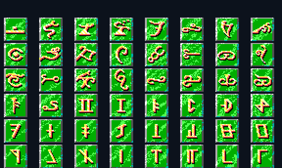

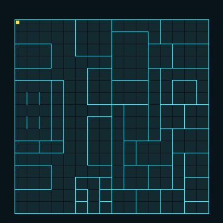

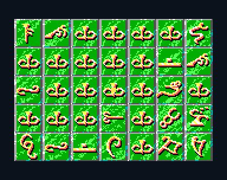

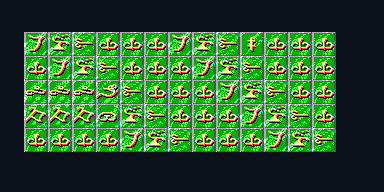

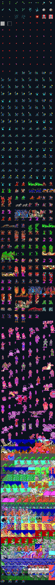

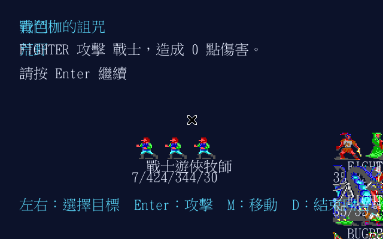

上圖是目前 remake 使用原始 MON1CHA／CPIC 素材進入可操作戰鬥的實際畫面（headless
Xvfb capture）；它是可重現的 `-encounter` vertical slice，不代表完整玩家流程已完成。

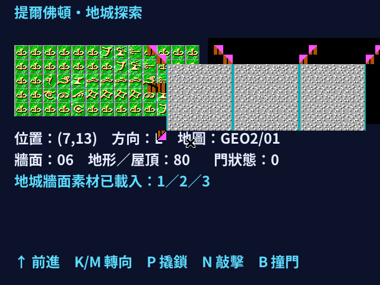

上圖由 `-opening` 走過真實 block `0x01` 的兩段 Continue 後擷取：使用 TTC 24px
繁中字型、原始 TILES／GEO2 block 1／WALLDEF／8X8D 素材，位置 `(7,13)`、面東。

本重製版以 `640×480` 為固定邏輯畫布：原版像素圖片採 nearest-neighbor
整數倍放大，繁中則獨立使用 24px 高解析字型（緊湊欄位可用 16×15），不把
320×240 的 8px 英文字格直接套給中文，因此小人仍保留原味、中文字也能清楚排版。

目前已完成的垂直切片包括：

- DAX 容器／RLE、ECL bounded VM trace 與跨 ECL1–ECL6 block context。
- `cmd/azure-bonds -entry-smoke` 可逐一 bounded 執行 ECL1–ECL6 每個 block 的五個 initialization entries，保留每個入口的錯誤與 COMBAT／menu／PROGRAM 結果，方便後續反組譯收斂。
- 火刀據點首領房已接通原始 PICTURE 12、手札 11、20 名火刀加 1 名首領的正式戰鬥；
  勝利後依序播放公主解除枷印、手札 54／53 與四張主人面孔的 BIGPIC 夢境。
  2,000 gold、3,000 platinum、8 gems、4 jewelry 與兩件隨機物品只在勝利後入池，
  不會因原 ECL 在 COMBAT 前建立 treasure packet 而提前發放。
- 首領章後已能由 BIGPIC 121 的提爾佛頓城外繼續旅程；衛兵會依放逐劇情阻止入城。
  選擇阿沙本福德山徑會在提爾隘口遭遇八隻使用原始 icon `0x51` 的「鷹馬」，
  戰勝後由原 ECL world bytes 正式抵達阿沙本福德，而非 renderer 假造跳轉。
- 阿沙本福德 PICTURE 80 的旅店、商店、訓練場、神殿與河畔酒館已接入；酒館
  RELAX 會直接顯示手冊 Tavern Tale 28 的繁中內容。離城後可經 Shadow Gap
  擊敗六名偽裝巡邏兵的火刀，抵達立石群並取得灰袍人的主線提示：
  「往南方尋找紅色之人」。
- 立石群已能繼續前往艾森布拉與哈普；`PATROL FOREST` 複合選項不再造成
  顯示與 branch 錯位。往哈普途中會建立三隻原版 MON1 `0x35`「黑龍」與
  icon `0x35` 小人，勝利後恢復同一份 ECL session，以 world value `9`
  抵達哈普村外。
- 哈普村外 `ENTER CITY` 現已正式切入 Area 5／ECL5 block `0x31`，載入
  map pieces `12,FF,FF` 並顯示 640×480 繁中荒村入口。terrain `0x84`
  的民宅會顯示原版 PICTURE 50；玩家可選擇離開或繼續交談，村民逃走後
  返回同一份可探索 runtime，visited flag 不會遺失。
- 哈普 terrain `0x80` 的黑暗精靈巡邏已可玩：正式 ENCOUNTER menu 提供
  戰鬥／等待／撤退／接近；選戰鬥後由 MON5 `0x31–0x33` 產生戰士、法師與
  牧師。本輪可重現流程為三名戰士加一名法師，使用原版 icon `0x31/0x32`；
  勝利會累加 `4C47` 並回到哈普村探索。
- 哈普 terrain `0x88` 的伊弗利特頭目戰已接通：1 名伊弗利特率領 6 名
  黑暗精靈法師與 6 名牧師，全部使用 MON5 原版 record／icon。勝利後取得
  村莊與洞穴地圖、播放 PICTURE 50 解放歡呼，並從長老得知下一站是附近法師塔。
- 哈普 terrain `0x8A` 現可遇見並招募 38 歲、五級魔法師阿卡巴；原版
  MON5 裝備與 11 個已知法術一併載入。中文顯示名與 DOS script name 分離後，
  解放哈普時會正確追加他所知道的法師塔祕密商路。畫面維持 640×480，
  原圖整數倍 nearest-neighbor 放大，繁中正文以 24×24 級字形重繪。
- 解放哈普後可循伊弗利特身上的地圖前往古老熔岩洞（ECL5 block `0x32`）；
  入口伏擊由四隻原版 icon `0x39` 火蜥蜴與三名黑暗精靈組成。跨地圖的 exit
  work byte 已正確清除，戰勝後會留在熔岩洞繼續探索。

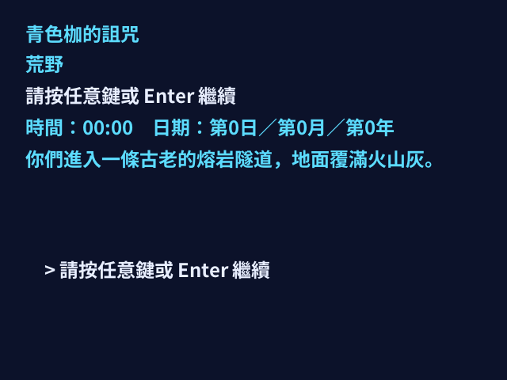

畫面可用 `-lava-tube` 從真實 ECL initial entry 重現。中文直接以 24px 字形
繪製在 640×480 畫布；後續戰鬥小人仍使用原始像素並採整數倍率 nearest-neighbor。
- 原始 ECL1–ECL6 的 25 blocks／125 個 initialization entries 現已納入 real-image regression，全部可抵達正常 EXIT、menu、COMBAT、PROGRAM 或 NEWECL boundary，沒有 unsupported-opcode stop；這仍不代表所有 menu／random 劇情分支已完成。
- `BlockSession` 會跨 `NEWECL` 保留並合併 `LOAD FILES`、`PICTURE`、`SPELL`／`PROTECTION` 等 renderer／state-neutral signals，避免事件換 block 後遺失請求。
- ECL `DAMAGE` 已依公開 CoAB reference 保存五欄 raw request（flags／dice／bonus／save flags）並跨 `NEWECL` aggregation；party target、saving throw、random roll 與 HP mutation 已接入 party／State adapter。
- ECL `PARTYSTRENGTH (0x1D)` 與 `PARTY SURPRISE (0x22)` 已依 reference 消費 word destinations；`ecl.PartyContext` 會由 State 注入 roster／fighter 的 HP、AC、attack bonus、cleric／magic-user／ranger metadata，計算結果寫回 shared ECL memory，並跨 `NEWECL` continuation 保存。完整 AC internal scale 與 multi-class rule table 仍待逐欄驗證。
- ECL `CHECKPARTY (0x1E)` 已接入 `0xA5..0xAC` thief skill、`0x9F` movement 與 `8001` active-affect branches；State context 會寫回 min／max／average／found 四個 destination，未知 selector 維持 unresolved。
- ECL `WHO (0x39)` 現在會在 interactive State 停住並顯示繁中隊伍角色選單；選擇後由同一個 ECL session resume，並保存 selected player ID，不會誤用普通 menu semantics。
- ECL `LOAD CHARACTER (0x0A)` 現在依真實阿卡巴搜尋子程序解碼 zero-based player selector，接回 persistent `partyRoster` 與 selected player ID；bit 7 restore/redraw flag 與完整 DOS record/string side effects 仍保留明確 boundary。
- `LOAD CHARACTER` 後續的 `0x7C00` selected-player name string 已接到 ECL runtime；真實 script 的 `COMPARE`／`IF` 可依 roster 姓名分支，其他 DOS memory regions 仍維持 evidence boundary。
- ECL `FIND ITEM (0x32)` 現在會查詢全隊 persistent roster 的 raw item types，正確設定 `=`／`<>` compare flags；同一 script 的 `DESTROY ITEMS` 後續查詢也會立即反映已毀狀態。
- ECL `FIND SPECIAL (0x3F)` 現在會查目前 selected player 的 active effects；LOAD CHARACTER 與可恢復 WHO 共用同一 selected-player runtime state，並正確驅動 `IF =／<>`。
- ECL `DUMP (0x3E)` 現在依 reference 移除 selected party member，同步 persistent roster／combat fighter，並選取前一位角色；真實 ECL5 Akabar 離隊 opcode 已納入 regression。
- ECL `PROGRAM 0/3/8/9` 已接到共用 State adapter：返回標題、隊伍全滅、勝利全隊恢復／存檔選擇與 CAMP；戰鬥後 continuation 不再吞掉勝利 routine。
- ECL `CALL 0x2E10/0xC01E/0xB200` 已依 reference 接到地城 redraw、無碰撞強制前移（16×16 wrap）與 default sound-A；ECL3 block 16 real CALL 已納入 regression。
- 公會戰的四名 QuickFight THIEF 已標成一次性友軍，戰後不再污染隊伍；後續半身人、犬舍戰、猴籠、訪客簿與黏液門均已繁中化，真實 ECL2 block 2 也能由南側邊界進入 block 3 下水道。
- `State` 現在會一次性保存／消費 ECL `DAMAGE` pending requests，確保事件／選單 pause 不會遺失 script effect；random target／`CanHitTarget` 已接入 resolver，`DamageOutcome` 也會保存 unconscious／dying／dead health state；active combat 會同步 Battle status 並結束勝負流程，`ResolveDeathEffects` 可接入已解出的 recovery／troll regeneration side effects。
- DOS player `saveVerse` `0xDF–0xE3` 與 signed `field_186 @ 0x186` 已保存到角色；ECL `DAMAGE` 的 selected／whole-party／random-target branches 可透過注入骰點寫回 roster／fighter HP，default resolver 已投影 AC 並套用 invisibility -4、action-delay-aware blink，以及 displace consumed-bit；active combat 倒下時會清理已驗證的 combat-only effects、移除戰鬥位置、清空 `CombatAction` 並發出 `DeathOverlay`，team party 另標記 `DownedCorpse` 對應 `Tile_DownPlayer=0x1F`；Cure Light Wounds 現可治療可復原的倒下隊員，但只清除 skull flash、不恢復戰鬥 placement；明確 `CombatHealAllowed` 的 affect_63 recovery 會以保存座標呼叫 `RestoreCombatant` 站起。若是目前 turn 也會清除 State 施法／移動／檢視 selection；`NewBattle` 對 save／encounter 初始 HP=0 fighter 也套用同一正規化，因此不會進入 turn 或佔用碰撞格。Ebiten 已在原座標以原版 `COMSPR 0x8B`／`0x19` 交替顯示九次死亡小圖後轉為 corpse marker，enemy 則完全移除名稱／HP render，另可由明確 context 觸發 affect_63／TrollRegen／dragon-slayer。其他 Death routine 仍保留邊界。
- 繁中開場、暗影谷／阿沙本福德／匕首瀑布城市 routing、荒野／場所狀態、角色建立、可恢復的 remake game JSON 存檔，以及可操作戰鬥 prototype。
- 真實 ECL2 block 3 entry 3 已用 `MON2CHA.DAX` 建立可操作 Battle；`-encounter -encounter-block 3 -encounter-start 688 -encounter-monster-member MON2CHA.DAX` 可重現此 encounter slice。
- `MON*CHA` 的 raw spell-list slots（`0x33..0x6A`）與 magic-user level-use counts（`0xB5..0xB7`）已保存到 enemy fighter；目前依 reference 接入第一個敵方法術 Magic Missile（`0x0F`），一級單枚、2–5 傷害，施放後回到敵方 physical-turn fallback。
- `MON1SPC`–`MON6SPC` 已依同一 monster ID 載入並掛到 enemy fighter 的 raw `MonsterAffects`；目前只保存九-byte effects，不宣稱已完成隱形／加速／睡眠等規則投影。
- 已依 reference `CanHitTarget` 將 active monster affect `0x19`／`0x47` 投影為目標 AC +4；其餘 `MON*SPC` effects 仍保留 raw-only boundary。
- 已解析 `MON*CHA[0xA1]` monster base attacks count；active Haste `0x27`／Slow `0x2A` 會依 reference 加倍／減半目前 enemy 的每回合攻擊次數（保留至少一攻）。
- 已接入 reference `Player.IsHeld`：active `helpless／snake charm／paralyze／sleep`（`0x1F／0x33／0x34／0x35`）的 enemy 會跳過回合，且被 held target 的攻擊必定命中；中文訊息已接入。
- ECL `CLOCK (0x34)` 已依 reference 解碼兩個 operand（timeStep／timeSlot），跨 ECL session 聚合後接到 State 七-slot game-time adapter；因此 ECL 事件與 REST 共用 effect timeout 時鐘，完整 time-triggered event table 仍待驗證。
- 遊戲啟動會載入 `MON1CHA`–`MON6CHA`，State 依全域 ECL block namespace 選擇章節對應的 monster table，避免跨章節同 ID 誤解析。
- 已以原始 image 驗證 ECL1 block `0x50` 的 `NEWECL 0x03` 可切換到 ECL2 block `3`；target 後續若遇未支援 routine 仍會保留 transition boundary。
- `TILES.DAX`／`8X8D*.DAX` indexed pictures、`WALLDEF*.DAX`、EGA16 palette 與 `GEO2–GEO6` geometry parser。
- 原版 `SetupWildernessFloor` 的 50×25 野外遭遇戰鬥地面生成規則，以及 background entry → combat tile mapping；它不是世界地圖。
- GEO2 wall／door fields → dungeon background composition → TILES pixel art 的可見 slice（`D` 預覽）。
- dungeon table／chair decoration 已依 GEO `terrain & 0x40` 與原版 seeded dice pass 接入。
- Ebiten 原始 tile gallery、GEO wall viewport 與依 GEO wall bytes 驗證的游標移動。
- 已從 `CPIC1.DAX`–`CPIC6.DAX` 抽出 156 張透明背景戰鬥小人 PNG；完整索引在 [`assets/sprites/README.md`](assets/sprites/README.md)。
- Ebiten 戰鬥畫面已載入 repo 內 CPIC PNG，並依 ECL monster `IconBlock` 顯示敵方小人；無對應 block 時有 deterministic fallback。
- `SPRIT1.DAX`–`SPRIT6.DAX` 的 frame stream 也已解析並抽出 138 個逐幀 PNG，manifest 同時記錄 delay／尺寸／座標。
- 戰鬥 renderer 會依 ECL `SETUP MONSTER` 的 SPRIT block 與原始 delay 循環播放逐幀 PNG，缺圖時退回 CPIC 靜態圖。
- 戰鬥畫面已依當前 active character 套用 CombatMap camera transform；較大的 reference placement 座標會先轉成 viewport 座標再繪製。
- SPRIT manifest 的 frame `x/y` placement 也已接入戰鬥 renderer，播放時會依原始 frame canvas offset 顯示。
- PIC1–PIC6 的 PIC/FINAL-style XOR frame delta 也已解碼並抽出 152 張 PNG；SPRIT 與 PIC 兩種 payload 語意在 parser 中明確分流。
- ECL `PICTURE` request 已接到繁中事件畫面：game state 保存 block、Ebiten 播放對應 PIC frames，Enter 可返回原流程。
- Ebiten remake 的邏輯畫布與預設視窗已擴為 `640×480`；88px PIC／人物圖採 nearest-neighbor 3×、304×120 BIGPIC 採 2× 整數像素放大，繁中文字則直接以 24px 高解析字型重繪。新增的垂直空間用於三行敘事與獨立操作提示，避免中文字覆蓋原圖。
- 火刀據點第一個機關房已由 ECL2 block 4 terrain `0x99` 驗證：旋轉刀刃、
  `闖入刀刃／等待／撤退` 三項繁中選單及安全等待後刀刃消散分支均保留原始
  script index；事件沿用 640×480、24px 中文與整數倍像素圖分層。
- 「闖入刀刃」現會依原始 `DAMAGE 0xE0,8d8,0,0` 對全隊套用同一包無豁免
  8d8 傷害，角色資料與畫面 fighter HP 同步，之後接回刀刃消散 continuation；
  非全隊自動傷害仍保留給選角／豁免／命中判定 adapter。
- 火刀據點 terrain `0x9A` 的定身房也已可玩：`撤退／審問／殺死` 保留原始
  menu index；審問會在火刀恢復行動前繳械並解鎖手札 26，說明入侵牧師為營救
  南方首領房的囚犯而來。三分支都依 `4CFE & 0x40` 成為一次性事件。
- 地城正式加入 `S：搜索`。火刀辦公室 `(14,11)` 首訪只顯示房間；搜索才會找到
  花梨木書桌文件、解鎖圖像手札 9，並取得 500 金幣、500 白金幣、3 顆寶石、
  2 件珠寶與 2 件隨機物品。寶物 UI 結束後正確返回 640×480 地城，而非誤開戰鬥。
- 火刀據點後半 terrain `0x9C–0xA0` 已完整繁中化：煙味走廊、由隱形僕人復原的
  臥室、焚毀圖書館、烈焰摧毀的實驗室，以及標示「待復活／待埋葬」的覆屍房。
  圖書館取得焦屍保住的紙張後才解鎖手札 29，揭露烈焰之主與泰蘭索斯的線索。
- 字型 loader 同時支援單一 TTF/OTF 與 TTC collection；Noto Sans CJK `.ttc` 可直接以
  24px 渲染，不會因 collection parse 失敗退回 ASCII bitmap font。
- 真實 ECL1 JOURNEY ON／STORE 路徑已驗證 `PICTURE → Enter → COMBAT opcode →
  CityShop` continuation；這裡的 `COMBAT` 是原版 engine service dispatcher，不是戰鬥。
- ECL `COMBAT (0x24)` 現在會保存 next-PC；可玩戰鬥勝利後，State 會恢復同一個 ECL runtime，繼續跑原版的文字、menu、picture 或 `NEWECL`，不再丟回 stale wilderness menu。
- 已依 reference `seg044`／`Resource.resx` 保存 9 個 PC WAV sound assets，`internal/sound` 建立原版 selector mapping；Ebiten 目前在標題開始、荒野／dungeon 移動，以及 State 發出的戰鬥命中、未命中、擊倒、免費反擊與已實作法術 intent 播放對應音效；背景音樂仍待接入。
- PICTURE block `>= 0x78` 已分流到 BIGPIC 靜態大圖；目前從 BIGPIC1／2／6 抽出 4 張原始大圖並在事件畫面置中顯示。
- 一般場景人物的 `HEAD2–6`／`BODY2–6` 也已抽出並依 reference body `y+5` 合成 30 張 PNG，後續城鎮／事件 renderer 可直接載入。
- PICTURE 的 Area2 head sentinel 分支也已接入：有 head block 時改顯示 HEAD/BODY scene composite，無 head block 時維持 PIC／BIGPIC。
- Area2 `HeadBlockId @ 0x5C2` 已接入 binary codec；載入 raw area 後會自動驅動上述 HEAD/BODY 分支。
- 戰鬥畫面已改用 tile-derived formation placement，並建立 reference 八方向 delta contract；真實 CombatMap position／camera data 仍待解碼，但 active-character camera transform 已接入 renderer。
- `combat.Fighter`／game battle state 已保存 CombatMap position／size；外部真實座標優先，缺少時才使用 deterministic formation fallback。
- 已封裝 reference 的 encounter team origin／facing：`combat.EncounterTeamStart`；實際 `mapDirection`、occupancy 與候選格排序仍待 Area／Player record 解碼。
- reference `try_place_combatant` 的 position formula 已建立可測試 adapter，待 team／occupancy inputs 解碼後即可取代 fallback。
- 已從 `CHEAD.DAX`＋`CBODY.DAX` 合成六組 normal／attack party combat icon，Ebiten party fighter 會依 fighter icon state 顯示小人；合成、透明、方向 flip 規則與跨 Gold Box 知識整理在 [`docs/knowledge/gold-box-graphics.md`](docs/knowledge/gold-box-graphics.md)。
- 新建角色的玩家 icon default 已依原作 race switch 建立：矮人／侏儒／半身人 small，其餘 normal；head／weapon 初值為 block 0。
- Area1／Area2 已知欄位已有 `0x800` bytes binary round-trip codec，未知 bytes 會保留。
- 原始 `ITEMS` 已解析為 128 筆 base-item descriptor；`cmd/azure-bonds -base-items` 可列出裝備欄位／傷害／可用職業與目前繁中名稱 catalog。
- item `NameNumbers` 現依 reference hidden flag 組合已確認的 `+1`、防護、偏移、屠龍者等繁中名稱；未知 name number 保留 raw，不會被 UI 臆測改寫。
- 原始 `ITEM1.DAX`～`ITEM6.DAX` 已載入 treasure item block；ECL `TREASURE` 的 deterministic loot 可解析成 pending item，選定角色後寫入 party equipment，金錢／寶石／珠寶也會保留。
- `TREASURE` 的 `0x80+n` random branch 已依 reference d100 table 接入 seeded resolver；事件畫面會讓玩家選物品與收下角色，未載入素材的 headless path 仍保留 raw request 並繼續 ECL control flow。
- 若原始 ECL 同一結果同時包含 TREASURE 與 COMBAT，現在會先戰鬥、勝利後再恢復 loot menu，不會因 loot UI 跳過原版遭遇。
- 已新增 `Character.FighterWithEquipment`：已知 `ITEMS` descriptor 的 readied 武器／護甲可投影到戰鬥 fighter；舊 party JSON 與未帶 equipment 的角色行為不變。
- party inventory 已有 `EquipItem`／`UnequipItem` contract，會驗證 class usability、雙手／副手衝突與最多兩枚戒指。
- `RemoveItem` 已支援 Count stack decrement、readied protection 與 cursed equipment lock，供後續商店／treasure mutation 使用。
- `UseConsumable` 已支援卷軸 stack、藥水單次移除與魔杖 charge decrement，回傳繁中化 UI／後續法術 engine 可用的 effect signal。
- ECL `SPELL`／`PROTECTION` 已由 bounded VM 回傳 `SpellSearches`／`ProtectionRequests` signal；party ordered lookup 已有 adapter，完整 slot writeback／效果 engine 仍待接入。
- ECL `SPELL`／`PROTECTION` request 現在會由 State 保存並提供一次性 consume API；party／rules adapter 可取得原始順序與位址，但不會被 State 擅自套用未知副作用。
- party roster 已有 ordered `SpellSlots` first-match resolver，且 game bootstrap 會載入原始 `ITEMS`，讓角色建立／party load 的 readied equipment 影響 fighter projection。
- 已加入 bounded DOS player record spell parser：`.SAV`／`.GUY` 的 memorized slots 與 known-spell flags 可接到 `Character.ApplyDOSSpellRecord`；完整 DOS save/import container 尚未完成。
- 已加入 `ParseDOSPlayerRecord`：可將已解壓的單職業 `.SAV`／`.GUY` 核心欄位（姓名、能力、HP、等級、head／weapon／icon_id／size、金幣與法術）投影到 party／戰鬥；`.SWG` inventory、`.FX` effects 與多職業仍待完成。
- DOS party icon 現在依 reference `icon_size` 將 small CHEAD/CBODY raw slot 映射到 `+0x40` block namespace，並在缺少預合成圖時由 extracted CHEAD／CBODY layer 合成；direction-specific placement 與 recolor runtime 仍待完成。
- DOS party attack icon 也會依 reference 使用 normal block `+0x80` 的 attack layer，再由 CHEAD／CBODY on-demand 合成；完整 direction-specific placement、recolor 與 animation cache 仍待完成。
- 戰鬥小人方向現在依 reference `HalfDirToIso={7,2,3,6}` 設定 party／enemy opposite facing，供 normal／attack 水平翻轉使用；完整 CombatMap direction source 與 placement 仍待完成。
- 已加入 `.SWG` inventory 匯入：連續 `0x3F` item records 可接到 `DOSPlayerRecord.Inventory`／`Character.Equipment`，readied 基本裝備可沿用既有 fighter projection；pointer resolution 與 `.FX` effects 仍待完成。
- 已加入 `.FX` effects 匯入：連續 9-byte effects 可保存到 `DOSPlayerRecord.Effects`／`Character.Effects`，並提供常見效果繁中名稱；effect gameplay tick／解除仍待完成。
- `.FX` duration／strength 欄位已依原始格式修正：16-bit 分鐘與 `255=永久`，並提供 `AdvanceEffects` duration tick；effect-specific gameplay 仍由後續 rules layer 處理。
- State 已接入 reference `timeScales` 七-slot clock；`AdvanceGameTime` 會依 slot 換算 elapsed minutes，同時到期 party／active battle finite effects，保留 `255=永久`；Area1 `0x18C..0x198` 七個 raw clock words 也已接回 SAVGAM codec。
- 遊戲一般畫面與荒野地圖現在顯示 reference clock 的繁中 HUD：`時間：HH:MM　日期：第D日／第M月／第Y年`；raw clock 與 renderer-neutral display contract 分離，方便後續 Gold Box 共用。
- remake JSON 存檔版本 5 已保存七-slot game clock 與 age-cycle overflow；舊版 1–4 仍可載入，會以零時鐘開始。
- DOS player `.SAV/.GUY` 的 signed age `0x76` 已接入匯入、slot-6 年齡增加與 SAVGAM player-record writeback；Pool/Rad `0x30` 變體與 age-based ability modifiers 仍待獨立驗證。
- 原版五段 race age bracket 與六項 ability delta 已整理為明確的 `Abilities.WithAgeEffects`；既有 DOS 匯入不會重複套用，角色建立 UI 已接入目前可驗證種族／職業限制。
- 原版 `race_ages` 的 single-class `base_age + dice` 已由 `RollStartingAge` 重現，並在加入隊伍時對 copied character 套用 age ability effects；22 個已驗證單職業選項已接入建立選單，完整原版建立／修改流程仍待擴充。
- 角色建立選單現在列出 40 個由 reference `RaceClasses` 與目前 class validation 驗證的單／多職業組合（含 18 個 multi-class），Ebiten 以五列捲動顯示；多職業完整 rules／alignment／建立副作用仍待接入。
- DOS `.SAV/.GUY` player import 現在也保存 reference `thief_skills[8]`（含 `open_locks`），可供後續 locked-door pick transaction 使用；skill 重算與完整 door action 仍待完成。
- DOS player import 現在接受 reference multi-class IDs `8..16`，保存 `ClassLevel[8]`／`multiclassLevel` 並可回寫；`HasClass` 已接入裝備 class mask、CAMP MAGIC 與 combat spell gate，完整 THAC0／生命骰／高等級 spell table 與 serializer 仍待逐欄驗證。規格見 [`docs/spec/262-multiclass-rules-projection.md`](docs/spec/262-multiclass-rules-projection.md)。
- `cmd/azure-bonds -set-age <signed-int16> -character-record <file> -out-record <new-file>` 現在可安全修改單一 DOS `.SAV/.GUY` 的年齡（`0x76..0x77`）；輸入檔不覆寫、未知 bytes 保留。這是 raw-preserving player patch，不代表完整 SAVGAM slot transaction。
- 新增 `ParseDOSPlayerFiles`：將必要的 `.SAV/.GUY` 與可選 `.FX/.SWG` sidecars 組成可用的 party `Character`，並保存 gold/gems/jewelry；`LoadSAVGAMSlot`／`SaveSAVGAMSlot` 已依 reference 命名載入與回寫 slot，回寫只改已證實欄位並保留未知 `.sav` bytes。
- CLI 可用 `-import-character -character-record <file> [-character-effects <file>] [-character-inventory <file>] -out-party <json>` 將原版角色匯入 remake party JSON；不會修改原始檔案。
- `cmd/azure-bonds-game` 也支援 `-dos-character-record`（及 optional `.FX/.SWG`）直接以原版單一角色啟動 remake；`-party-load` 與此模式互斥。
- `cmd/azure-bonds-game` 支援 `-savgam-dir <dir> -savgam-slot A` 直接載入 reference `savgama.dat` 與 `CHRDATA1.sav`／optional `.fx/.swg` party bundles；此模式與 remake JSON／單角色 import 互斥，且 F5／CAMP SAVE 會回寫同一個 slot。
- imported active Bless／Curse／Blind／Bestow Curse／friendly Prayer effects 會投影到 fighter attack／AC（可確認的修正為 +1、-1、Blind -4/+4 AC、Bestow Curse -4、Prayer +1）；需要目標或戰鬥 phase 的 effects 仍待 rules layer。
- 城市 `INN` 已接成安全休息場所：恢復 party roster 與畫面 fighter 的 HP，並以繁中訊息返回場所選單；CAMP 的 SAVE／VIEW／MAGIC／ALTER／FIX 與 BAR Tavern Tale 窄 service 已逐步接入，買酒價格／其他城市的 rest encounter table 與完整原版日曆規則仍待完成。
- 已建立商店 Buy／Sell／ID 的 party transaction contract：價格由後續 shop stock 提供，ID fee 為 200 GP；目前繁中 Shop Menu 已可購買、販售、鑑定、查看、集中／分配金幣與估價，完整原版 stock／ID result data 仍待接入。
- 城市 `STORE` 已接入繁中 Shop Menu（購買／販售／鑑定／查看／取出／集中／分配／估價／離開）；尚未載入 stock 的 action 會明確提示並可返回選單。
- 已接入 injected shop offers 與 party money pool：可集中／提取／平均分配金幣，並由 pool 購買指定 offer；價格仍由城市／ECL data 提供。
- `STORE → 購買` 現在會列出繁中商品與 GP 價格，選取後扣 pool 金幣並加入未裝備物品；目前 active shop character 預設為第一位。
- `STORE → 販售` 現在可選角色與物品，依 item record 已證實 `Value` 取得 GP；已裝備或詛咒物品會被保護，不會被移除。
- `STORE → 鑑定` 現在可選角色與物品，依手冊收取 200 GP；不臆測尚未解碼的魔法名稱／效果，會以繁中訊息明確標示資料邊界。
- `STORE → 查看` 現在會列出角色 HP／金幣與繁中裝備摘要，選取後可返回 Shop Menu。
- `STORE → 取出金幣` 現在可選角色與 1／10／100／全部金額，更新 party pool 與角色金幣後返回 Shop Menu。
- `STORE → 估價` 現在可選角色與寶石／珠寶，接受外部注入報價後清除財寶並將 GP 加入 party pool。
- APPRAISE 現在會先顯示「接受／拒絕／返回」確認；拒絕報價會保留財寶與 party pool。
- 荒野 `CAMP` 現在會進入繁中 `SAVE／VIEW／MAGIC／REST／ALTER／FIX／EXIT` 選單；`REST` 可返回 CAMP Menu，`EXIT` 返回荒野選單，`ALTER → ORDER` 可重排隊伍順序，`ALTER → DROP` 具二次確認並同步移除角色，`ALTER → RENAME` 可輸入最多 15 bytes 的 DOS 名稱並同步 roster／fighter，F5／SAVGAM writer 會保留角色 ID 與未知 raw bytes 寫回新名稱。
- `ALTER → PICS` 現在可切換怪物遭遇圖片與動畫；圖片關閉會略過事件圖片 renderer，動畫關閉會使用事件／戰鬥動畫首幀。
- `ALTER → SPEED` 現在可調整 1–5 級訊息速度，Ebiten 事件訊息會依設定逐字顯示繁中內容。
- `ALTER → ICON` 現在可選擇已抽出的 CHEAD／CBODY 頭部與身體圖層，並同步角色與戰鬥畫面小人。
- `CAMP → VIEW` 現在可選角色查看職業、HP、金幣、寶石、珠寶與裝備摘要，並可返回 CAMP Menu。
- 已接入已裝備弓／飛鏢的 RuleBook 多次攻擊：ITEMS RateOfFire raw `4/6` 分別投影為每回合 2/3 次攻擊；目標倒下時會依 target cursor 改攻下一個存活敵人。
- 已建立彈藥 transaction：保存武器 raw `AmmunitionType`，由資料層注入 raw code→inventory type mapping 後，CombatAct 會 atomic 扣除本回合箭／弩矢／飛鏢數量；未注入 mapping 時不臆測對應。
- 戰鬥中按 `D` 可執行 RuleBook `DONE`，不攻擊、不消耗彈藥，直接結束目前角色回合並進入敵方／下一位隊友回合。
- 戰鬥結束時 battle fighter 的 HP 會同步回 party roster，CAMP `VIEW/FIX/SAVE` 與原版 slot writeback 不會再讀到戰鬥前的舊 HP。
- 戰鬥結果按 Enter 返回荒野時，會重建繁中 `進入城市／繼續旅程／紮營` 主選單，不會把戰鬥前的 ECL menu 留在輸入狀態。
- `CAMP → MAGIC` 現在提供原版已證實的 `CAST／MEMORIZE／SCRIBE／DISPLAY／REST／EXIT` command menu；`CAST` 已能選施法者、已記憶 Cure Light Wounds 與受傷目標，消耗 slot、擲 `1d8` 並同步 party／戰鬥 HP；`DISPLAY`、`MEMORIZE` 與 `REST` 也已接入，SCRIBE、其他法術與完整 slot／時間規則仍待接入。
- `CAMP → SAVE` 在一般模式寫入 configured versioned remake party save；在 `-savgam-dir/-savgam-slot` 模式則回寫 staged prefix／`.sav`／`.swg`／`.fx` bundle，F5 也使用相同目標；隊伍縮編時會清理該 slot 的舊 `CHRDAT` 檔，並以 backup/rollback 保護替換流程。
- `State.LoadSAVGAMPrefix`／`SaveSAVGAMPrefix` 已將固定前綴接到已解碼的 Area／map state，並保留未知 raw records；`LoadSAVGAMSlot`／`SaveSAVGAMSlot` 再處理已證實的 CHRDAT player fields 與 sidecars，不取代目前 F5 remake JSON。
- `CAMP → FIX` 現在會依已記憶的 Cure Light Wounds 對受傷隊員施放固定 `1d8` 治療，並同步 roster／戰鬥 HP；戰鬥中 S／H／C／W／P／G 會先進入施法目標選擇，左右鍵切換、Enter 確認、Esc 取消，B 進入 Bless 無目標確認，再分別施放 Magic Missile／Cure Light Wounds／Curse／Cause Light Wounds／Protection from Evil／Protection from Good；牧師與魔法師的職業分表 spell ID `7` 會正確分流。
- ECL encounter menu 的 `FLEE` 現在會進入繁中撤退事件並返回荒野；`PARLAY` 會提供 `傲慢／狡猾／謙卑／友善／威嚇` 五種談判策略。戰鬥中 `V` 可開啟不消耗回合的繁中角色檢視。怪物速度、追擊、speaker／reaction 與完整對話 script 仍待反組譯。
- 戰鬥按 `M` 可進入 MOVE，方向鍵移動當前角色一格；目前已同步 CombatMap 座標與 occupancy，移入敵方格會觸發攻擊、離開敵人鄰接範圍會觸發免費反擊；地形、負重與完整 facing 仍待反組譯。
- MOVE 已依 RuleBook 接入護甲移動上限：皮甲 12 格、中／重甲依表限制 9 或 6 格；方向鍵會逐格扣除 allowance，負重、地形與 FLEE 邊界仍待反組譯。
- 戰鬥已接入 missile 近身限制：已辨識的弓／弩／投石索不可攻擊相鄰目標，飛鏢保留 RuleBook 的 thrown exception；完整射程與 line-of-sight 仍待反組譯。
- 攻擊已加入不擲骰的 preflight：無效的相鄰 missile 攻擊會在彈藥 transaction 前拒絕，不消耗箭／弩矢。
- 敵方若有已驗證的多次攻擊 profile，也會沿用相同的 RateOfFire attack sequence。
- 敵方回合現在依 reference `find_target`／`BuildNearTargets` 的 bounded contract，從存活
  party 中以 seeded RNG 選擇目標；同一回合多次攻擊維持同一目標，不再固定攻擊隊伍第一人。
- 玩家戰鬥輸入若違反射程／彈藥／目標規則，會顯示繁中錯誤並留在戰鬥畫面，不會結束遊戲主迴圈。
- ECL `ADD NPC` 已修正為 ID＋morale 兩 operands，並依 `load_npc` 從 chapter-local
  MON*CHA／SPC／ITM 建立 NPC、指派 icon slot、control morale 並加入 roster／fighter。
  真實 ECL1 block `0x52` demo 現可加入 RUSTLE、CYNTHIA、GRENDEL，播放完整展示序列；
  11 段原文已逐行翻成繁中。reference 證明此 block 僅供 demo，不會加入正常玩家隊伍。
- 正式角色建立完成後會 reset 到 global ECL block `0x01`，顯示繁中「小房間醒來、
  裝備與記憶消失」及 PIC 0x0A 的青色印記事件；圖片後的 Continue menu 不再遺失。
  沒有隊伍時在標題按 Enter 會直接開角色建立，完成後自動進入這條正式流程。
- 正式 block `0x01` 的第二次 Continue 後已依真實 `EXIT` 進入提爾佛頓室內 GEO1；
  script 寫入的 `0xC04B/0xC04C/0xC04D = 7/13/1` 會還原起點 `(7,13)`，並將
  half-direction `1` 轉成 renderer 的東向 `2`，不再返回 remake 自造選單。
- 正式流程會自動打開 GEO／WALLDEF／8X8D 3D 畫面，不需再按 `D` 進 debug preview；
  ↑ 前進、K/M 轉向。成功前進會同步 `C04B..C04F` 並依序執行 per-turn／SearchLocation
  ECL entries，讓地點文字、選單、圖片與戰鬥回到原版 lifecycle。
- 提爾佛頓地城按 `E` 會先執行原版 PreCampCheck 再開 CAMP；安全起點可休息，unsafe
  cell 會依 script 的 `1/100` 在第一小時中斷，執行 CampInterrupted 皇家巡邏事件，
  Continue 後返回原 3D 座標。一般繁中事件已改為 24px 五行自動換行。
- 正式起點轉身往西一格，GEO2 selector `0x86` 現會經原版
  `GETTABLE → ON GOTO` 進入 Windlord's Inn：顯示原始 PICTURE 3、兩段繁中旅店對話，
  並在劇情提到 Journal Entry 31 時，直接把 PDF 手札的中文全文解鎖到遊戲內 `J` 手札；
  Continue 完成後返回同一個地城格，不必另外翻閱紙本說明書。

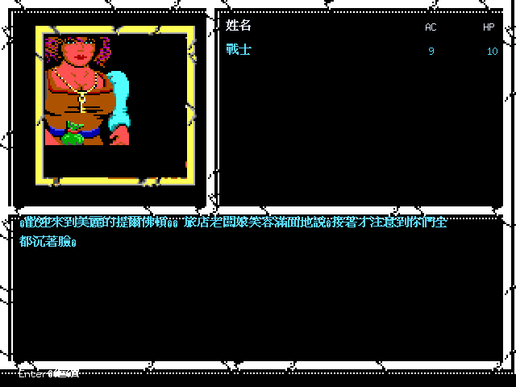

上圖由 `-inn` 重現正式角色建立後的序幕，從 `(7,13)` 往西走一格，經原版
GEO／ECL dispatch 抵達旅店；低解析原圖以整數倍放大，事件人物由 HEAD3／BODY3
原始像素素材合成，繁中文字則以 24px 高解析字型在 640×480 畫面重新排版。
- GEO2 `(6,5)` selector `0x8A` 的賢者菲拉妮事件也已接回正式 ECL。PICTURE 5
  顯示 HEAD5／BODY5 原始人物；回答「是 → 如實相告」會執行原版 `ROB 1,50,0`，
  將全隊 Copper／Silver／Electrum／Gold／Platinum 各自減半，再把 PDF/TXT 的
  Journal Entry 38 繁中全文以三個 24px 手札頁解鎖，最後返回同一地城格。

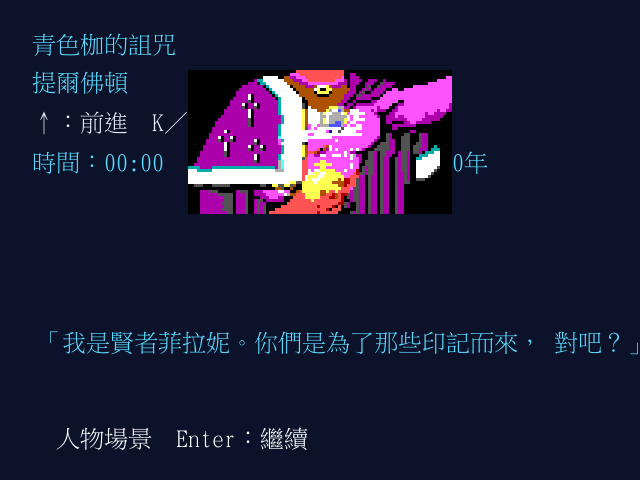

這條主線可用 `-filani` 重現；原始像素人物維持整數倍 nearest-neighbor 放大，
繁中對話在 640×480 畫布獨立以高解析字型排版。
- GEO2 `(2,12)` selector `0x84` 的「科米爾武器店」已接回正式 ECL：
  PICTURE 4／YES 後由 `COMBAT` opcode 依 `EnterShop` 旗標進入原版 CityShop，
  商品取自 `ITEM2.DAX` block 5。價格、角色五種硬幣優先付款、共用金幣 fallback、
  購買 clone 且庫存不耗盡，以及離店後續跑原 ECL 都依 reference 重現。

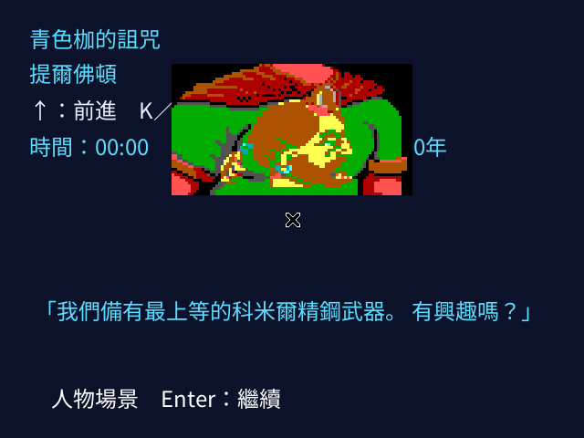

上圖可用 `-weapon-shop` 從正式序幕 transaction 重現。HEAD4／BODY4 原始像素圖採
nearest-neighbor 整數倍放大；繁中以 24px 字型直接畫在 640×480 畫布，因此不會把
低解析英文字格硬塞成難辨識的中文字。
- GEO2 `(0,7)` 的剛德祭壇已接通 PICTURE 6 → EnterTemple → Temple service。
  十種治療依 reference 使用固定價格、原版 healing dice／effect 清理，以及角色五種
  typed coins 優先付款；離開後恢復同一條 ECL 並返回原地城格。

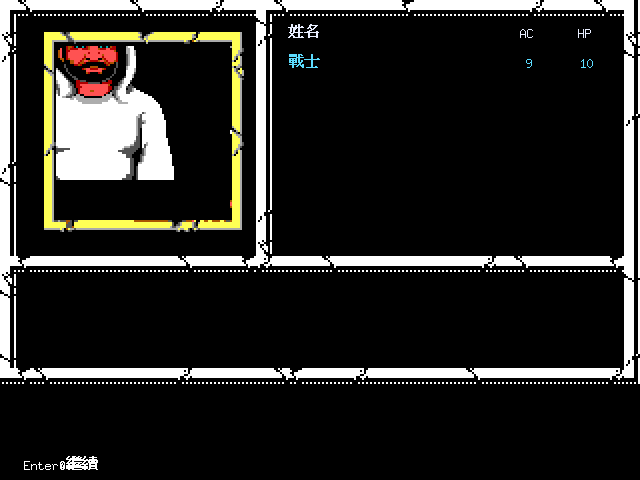

這個事件證明 HEAD／BODY selectors 並不必同號。素材產生器現在會建立可擴張畫布，
先把 BODY 放在 `y+5`，再以 masked HEAD 覆蓋；因此神官頭像不再被裁切或落入缺圖
fallback。畫面仍採原始像素 3× nearest-neighbor，中文字維持 24px 高解析排版。
- GEO2 `(5,2)` 的訓練場已接通 PICTURE 4 → `PROGRAM 0` 特定場所服務。角色會依
  DOS `0x127` 的 32-bit XP 與六職業原版門檻判定，確認後由該角色支付 1000 GP，
  提升 class level 並按 hit die／Constitution 增加 HP；一般 `PROGRAM 0` 仍返回標題。

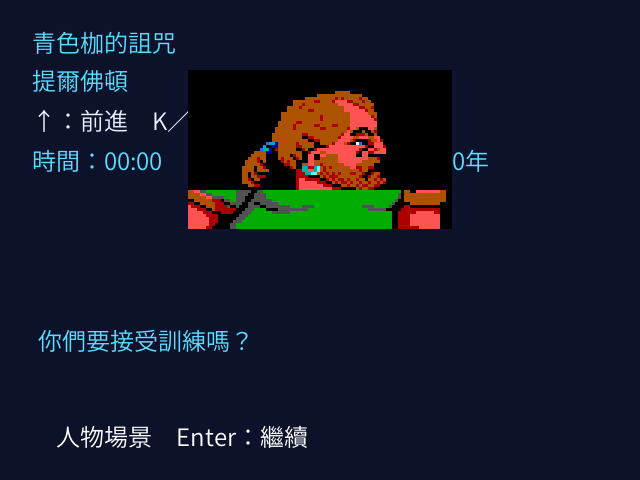

原始人物像素維持 nearest-neighbor 整數倍放大，中文提示則以 24px 字型直接重繪；
訓練流程已由正式角色建立一路驗證到同格返回；高等級 fixed HP、種族／職業等級上限
與多職業 Constitution 計算也已依 reference 接通。dual-class 會在新職業尚未超過
舊職業等級時抑制 HP 成長，超過後恢復。魔法師與 9 級以上遊俠升級時，會按原版
spellCastCount 容量列出尚未學會的繁中法術，選一個寫入 spell book。
- GEO2 `(6,10)` 的真實酒館流程已接通：喝檸檬水後可追查繫紫色腰帶的女子，在側巷
  找到華麗火焰形匕首，事件發生時才把原 Adventure Journal 的插圖線索整理成遊戲內
  「手札條目 17」。

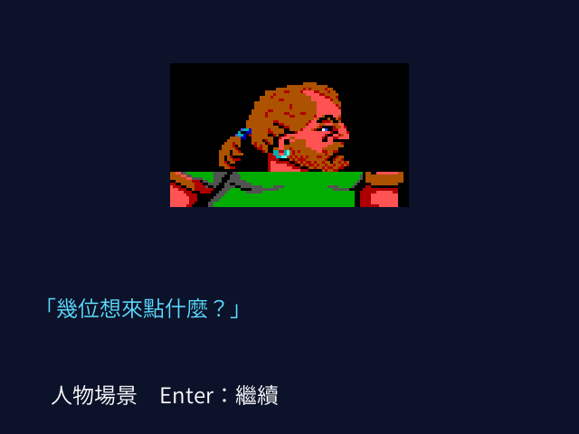

事件模式使用獨立的 640×480 版面，避免日期 HUD 與 3× 人物圖重疊。原始 88px
HEAD／BODY 合成圖採 nearest-neighbor 放大；中文則在輸出畫布以 24px CJK 字型重繪，
保留未來改用約 16×15 緊湊字級的空間，不受原版 8×8 英文字格限制。
- GEO2 `(1,10)` 的高階祭司主線已接通。玩家說明青色枷的遭遇後，祭司施展移除詛咒
  仍遭印記的藍焰反擊；此時才解鎖使用者提供 Adventure Journal PDF 的手札條目 19。

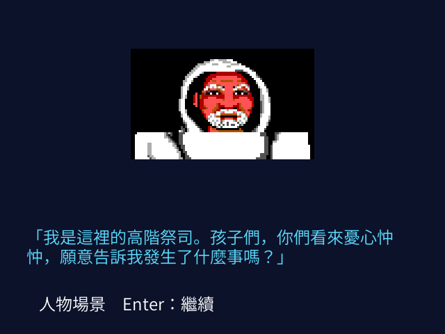

事件字幕已改成每行 22 個 Unicode 字元，不再沿用 34 個英文字元的寬度假設；24px
繁中可完整留在 640px 畫布內，原始人物像素仍保持 nearest-neighbor 3×。
- Tilverton 主線現在能從 Weaponers、Filani 與第一次城門警告，正式觸發皇家馬車。
  國王聲音令青色枷強迫隊伍攻擊，接著建立五名皇家衛兵的真實 MON2 戰鬥；勝利後可
  投降、入獄，由盜賊歸還裝備並帶往 Thieves' Guild，最後切換到 ECL block 2。

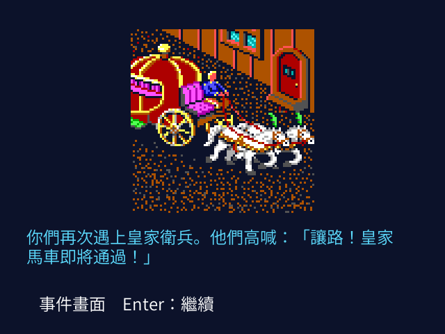

`-carriage` 並非直接指定圖片：bootstrap 會在同一 resumable ECL memory 跑完必要場所
與第一次 gate state，再停在第二次 PICTURE 11。馬車原始像素採 nearest-neighbor 3×，
繁中敘事維持 24px／每行 22 Unicode 字元。
- Thieves' Guild 開場戰已解出原版的混合陣營迴圈：4 名 THIEF 是我方
  `QuickFight` 友軍，敵方則是 2 FIRE KNIFE 與 11 THIEF。勝利後公會首領留下
  下水道地圖，遊戲內立即解鎖 Adventure Journal Entry 4。

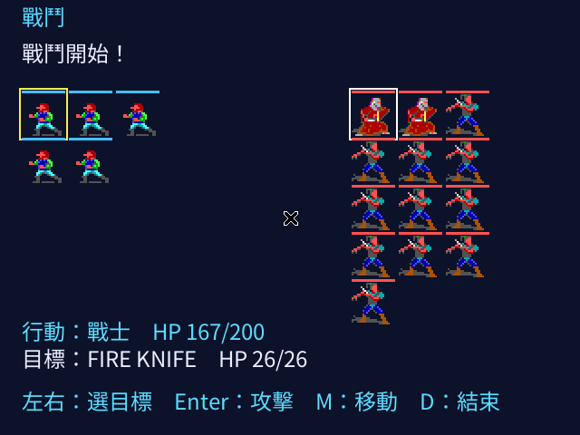

戰鬥小人維持原始 24×24 素材並以 nearest-neighbor 放大為 48×48；藍線是我方、
紅線是敵方，黃框標示目前行動者。角色名稱與 HP 移至下方 24px 中文資訊列，
不再把十八組文字疊在懷舊小人上。`-guildmaster` 仍會完整跑過 Weaponers、Filani、
皇家馬車、衛兵戰、投降與牢房，並非直接拼裝測試戰場。
- 正式流程現已繼續進入 ECL2 block 3／GEO2 block 3 的提爾佛頓下水道。入口會顯示
  低矮、濕滑環境的繁中說明；抵達 terrain `0x81` 火刀檢查哨後可拒絕投降，與
  5 名 FIRE KNIFE 作戰，勝利後藏起屍體並回到同一份 ECL 探索狀態。
- 檢查哨戰後可在 `(13,10)` 遇見迷斯卓諾騎士。三個效忠選項已繁中化；選擇
  「娜卡西亞公主」會得到「別殺拿戰鎚的牧師」提示並建立原版友善／已訪狀態，
  重訪同一 terrain 不會重播事件。
- 下水道 E2 `(8,15)` 已接通原版 boundary sentinel 與 `NEWECL 4`。正式流程會由
  ECL 自行調整到 GEO2 block 4 `(6,1,S)`，載入 `LOAD PIECES 1,2,4`，並顯示
  「你們進入了火刀據點」；不是 renderer 直接指定下一張地圖。
- ECL `LOAD PIECES` 現在會保存三個 map-piece selectors 並繼續執行；State request 會由 `WALLDEF{area}`／`8X8D{area}` raw adapter 消費，完整地城／牆面／碰撞副作用仍待完成。
- `LOAD PIECES` 現在會依反組譯證據載入 `WALLDEF{area}.DAX`／`8X8D{area}.DAX` selector，套用三組 global symbol offset，並在 dungeon preview 顯示素材 adapter 已就緒；牆面拼圖與完整 3D renderer 仍待完成。
- dungeon preview 現在會從目前 GEO wall 找出一組 reference 3D viewport layout，顯示原始 8×8D wall stamp sample；完整方向遍歷、遮擋與 camera 仍待完成。
- dungeon preview 現在會依 party facing 執行 Far／Mid／Near GEO wall traversal，展開有順序的 8×8D wall stamps；dungeon context 已套用 reference 16×16 coordinate wrap，sky／roof、door、遮擋與 camera 仍待完成。
- dungeon preview 方向鍵現在會依 GEO 雙側 wall collision（含 wrapped edge）移動 map position，Q/E 依 reference 八方向順序轉動 facing，並重建 floor／Far/Mid/Near wall view；正式 Area camera、scroll、movement cost 與 encounter 仍待完成。
- remake game save version 4 現在會保存 dungeon preview 的 `(x,y)`、八方向 facing 與 reference map wall cache；v1/v2/v3 舊版 save 可載入並安全回到相容預設，F9／啟動載入後會重建 floor 與 wall view。
- dungeon preview 已依 Area1 `outdoor_sky_colour`／`indoor_sky_colour` 與 GEO roof high bit 選擇 reference EGA sky background，raw wall stamps 會疊在 sky layer 上；完整 roof geometry／door overlay 仍待完成。
- dungeon preview 會顯示目前 facing 的 reference `WallDoorFlags`／GEO `x3 detail` evidence；P/K/B action 已能解鎖雙側 GEO door，door symbol overlay 與完整 graphics 仍待完成。
- dungeon preview movement 已辨識 GEO detail `1` 的 unlocked doorway；detail `2/3` 會開啟 locked-door menu，並依 party capability 提供 Pick／Knock／Bash；完整 DOS 視窗樣式與劇情 entry 仍待完成。
- `CAMP → REST` 現在提供 `REST ADD SUBTRACT EXIT`，`REST_START` 依 reference 推進 slot-1 game time（每小時 60 分鐘），先處理 finite effect timeout，再每 24 小時不間斷休息自然恢復 1 HP；一級法術記憶會先檢查「4 小時最低準備 + 每個法術 15 分鐘」。地城休息已套用 ECL 設定的 period／percentage 遭遇檢查；完整高等級記憶時間仍待反組譯。
- `城市 → BAR` 現在可逐則閱讀前六則繁中 Tavern Tale，按 Enter 回到酒館再離開返回場所選單；買酒價格、城市條件與完整 ECL tale trigger 仍待反組譯。內容整理見 [`docs/manual/tavern-tales-zh-TW.md`](docs/manual/tavern-tales-zh-TW.md)。

執行遊戲需要原始素材與可顯示繁中的 TTF／OTF 字型：

```sh
go test ./...
go run ./cmd/azure-bonds -base-items
go run ./cmd/azure-bonds-game -font /path/to/chinese-font.ttf
# 可重現正式序幕／Windlord's Inn 640×480 繁中 vertical slice
go run ./cmd/azure-bonds-game -font /path/to/chinese-font.ttf -opening
go run ./cmd/azure-bonds-game -font /path/to/chinese-font.ttf -inn
go run ./cmd/azure-bonds-game -font /path/to/chinese-font.ttf -filani
go run ./cmd/azure-bonds-game -font /path/to/chinese-font.ttf -weapon-shop
go run ./cmd/azure-bonds-game -font /path/to/chinese-font.ttf -temple
go run ./cmd/azure-bonds-game -font /path/to/chinese-font.ttf -training
go run ./cmd/azure-bonds-game -font /path/to/chinese-font.ttf -tavern
go run ./cmd/azure-bonds-game -font /path/to/chinese-font.ttf -high-priest
go run ./cmd/azure-bonds-game -font /path/to/chinese-font.ttf -carriage
go run ./cmd/azure-bonds-game -font /path/to/chinese-font.ttf -guildmaster
go run ./cmd/azure-bonds-game -font /path/to/chinese-font.ttf -sewers
# 直接載入原版 slot；F5／CAMP SAVE 會回寫該 slot
go run ./cmd/azure-bonds-game -font /path/to/chinese-font.ttf -savgam-dir /path/to/save -savgam-slot A
# 例：選擇原始 GEO3 block 0x10 作為目前 map preview
go run ./cmd/azure-bonds-game -font /path/to/chinese-font.ttf -geo-set 3 -geo-block 0x10
# 重新由本地原始 ZIP 產生 sprites 與 README 截圖
go run ./scripts
```

遊戲內快捷鍵：`Enter` 開始、`C` 建立角色、`J` 冒險手札、`T` 圖塊預覽、`G` GEO 預覽、`D` dungeon floor 預覽、`F5/F9` 儲存／載入 remake game。

## 尚未完成

完整 ECL opcode／routine、三城市各自的副本與城鎮 floor／tile mapping、完整場所與劇情、AD&D 全規則、音效音樂，以及原版 DOS save/import 仍在反組譯與實作中。戰鬥小人素材、CHEAD/CBODY party icon、SPRIT frame timing 與 frame offset 已接入目前 Ebiten combat slice，但方向-specific placement、八方向 placement 與完整戰鬥 UI 仍未完成；設定 `Area.InDungeon` 後，ECL `LOAD FILES` 能驅動 GEO map preview。現有 remake save 已能恢復已實作的 game state，現在也包含 dungeon preview 位置／方向；`SAVGAM?.DAT` 已有 prefix、slot load、已知 player-field writeback 與縮編 stale-file cleanup，但未知欄位／多職業與完整原版 player serialization 仍未完成。

目前地城 preview 已提供 locked-door menu，以及 P 撬鎖、K Knock、B 撞門：依 detail 2/3 與隊伍能力過濾選項，成功後對 GEO 門雙側解鎖；完整 DOS 視窗樣式、door graphics 與從劇情抵達門的流程仍未完成。

更多證據與規格請見 [`CONTEXT.md`](CONTEXT.md)、[`docs/spec/`](docs/spec/)、[`docs/manual/`](docs/manual/)、[`docs/knowledge/`](docs/knowledge/)；可跨 Gold Box 沿用的 ECL 指令集整理見 [`gold-box-ecl-command-set.md`](docs/knowledge/gold-box-ecl-command-set.md)，存檔欄位與年齡修改邊界見 [`gold-box-save-format.md`](docs/knowledge/gold-box-save-format.md)，以及 [`docs/history.md`](docs/history.md)。
