# Curse of the Azure Bonds 中文化／Remake

這是 SSI《Curse of the Azure Bonds》（青色枷的詛咒）的反組譯、繁體中文化與 remake 研究專案。目前是**可執行的初步 prototype**，不是完整重製版；GitHub 上的每輪提交都保留可測試的成果與驗證邊界。

> 可重用引擎已拆分至
> [`wicanr2/golden-box-remake-engine`](https://github.com/wicanr2/golden-box-remake-engine)。
> 本 repo 現為 CoAB game pack、繁中資料、原始素材轉換、攻略及 real-image
> integration。新劇情旗標、座標、NPC 名稱與翻譯不得再寫入共用 Go engine。

## 目前成果

截至 2026-08-02 的完整「已完成／未完成／驗證方式」盤點見
[`docs/project-status.md`](docs/project-status.md)。本 milestone 的基底為
目前 GitHub `main`，依賴的獨立 engine 為 `3142ae0`；實際
最新版本以 GitHub `main`／本文件所在 commit 為準。這是可執行的多垂直切片 prototype，
尚未宣稱完整可通關。

第 430 輪已由 PC-98 原始 overlay 閉合毒雲術 raw effect `44h` 的獨立施法
中斷鏈：低 HD 角色被毒雲直接殺死時，現在會先中斷 pending spell、消耗正式
角色資料中第一個 matching memorized slot，再完成死亡 handoff；HD 7+ 與
豁免成功者不受影響。這是毒雲術 vertical slice，不代表沉默、麻痺、睡眠、
石化或全部戰鬥法術已完成。證據見
[`docs/spec/430-pc98-cloudkill-effect44-casting-interruption.md`](docs/spec/430-pc98-cloudkill-effect44-casting-interruption.md)。

第 431 輪進一步證明 held effects `1Fh／33h／34h／35h` 採用另一種政策：
它們會取消完整 Action、讓角色跳過回合，但不消耗 memorized spell slot。
remake scheduler 已按四個 raw IDs 接通，沒有把所有施法取消錯誤合併成毒雲術
規則；Sleep／Hold 等動態法術 writer 仍未完成。證據見
[`docs/spec/431-pc98-held-effects-clear-action-without-slot-consumption.md`](docs/spec/431-pc98-held-effects-clear-action-without-slot-consumption.md)。

第 432 輪已把動態 Sleep writer 向前推進到可重用規則：PC-98 全域法術
`15h` exact dispatch 到 overlay 22 entry 41，先擲 `4d4`，再按原候選順序
以 HD 成本 `1／2／4／6／10或20／20` 篩選，已有 effect `35h` 或容量不足者
略過但不中止後續掃描。獨立 engine 已保存這個作品中立 primitive；原版目標
幾何、豁免、duration、動畫／音效與正常玩家施法路徑仍未完成，因此 UI 尚不
會把睡眠術冒充完整可用。證據見
[`docs/spec/432-pc98-sleep-hd-capacity-filter.md`](docs/spec/432-pc98-sleep-hd-capacity-filter.md)。

第 433–436 輪已繼續關閉 Sleep 的 targeting 與 effect transaction：戰鬥
handler 由 overlay 31 `SCAN` 建立三 byte候選表；三欄 exact 是 combat
object ID、最短成功 LOS 加權距離低 byte、方向 sector。原版排序只按距離，
等距時套用 object ID 奇偶例外；方向不參與排序。獨立 engine 與 CoAB
stable-ID adapter 已保存這個順序，`CastSleepOrdered` 也完成 `4d4`／HD、
magic resistance 與 effect `35h` writer。第 436 輪再由 Borland
`TDEFTYPE／TACTICALMAP` 與 IDA raw table 接通 `LOS／SYM／XRAY／TD`、
2／3 加權距離、footprint strict minimum 與 terrain-aware producer；bounded
transaction 已可把排序後 stable IDs 交給 Sleep。第 437 輪又以 PC-98
`INARC` 全指令關閉八方向 inclusive 扇區，並由 Borland symbols 證明
`LASTOBJECT／OBJECTLIST` 的 72×4-byte 表格。combatant linked-list 到 stable
ID 的正式投影已於第 438 輪由 `CHARACTERLIST／IDLIST` pointer identity
閉合，並接成 stable fighter ID transaction。戰場 `TD/TDEF` frontend
projection、wall 實機、手動／Quick
施法、解除、存檔及演出當時仍未完成。最新 targeting 證據見
[`docs/spec/438-pc98-idlist-stable-fighter-projection.md`](docs/spec/438-pc98-idlist-stable-fighter-projection.md)。

使用者提供的 PC-9801 兩片 VFD 原始磁碟也已開始納入證據鏈。專案新增唯讀
`pc98-vfd-audit`，可驗證 VFD1.00 幾何、雜湊與 absent sectors，而不把未保存
資料靜默補零。目前 Disk 1 的缺口對應 `MSCDRV.EXE` 與 `CED3.DAX`，Disk 2
尾端也有 absent descriptors；NP2kai 又證實其中一個 sector 會被重讀四次，
簡單補零反而改變開機行為，因此它可能同時包含防拷／低階磁片語意。MAME
官方 FDI 身分雜湊、loader 順序與 runtime trace 已納入規格；尚不能宣稱
PC-98 音樂驅動已完整復原。殘存 bytes 已確認 YM2203 I/O 與 INT D2 hook；
`GAME.OVR` 的 36 段 TPOV code 已完整切出，另由 `GAME.EXE` 內嵌 Borland
symbol table 精確定位 `SOUNDFX`、`INITSOUND`、`MSCPLAY`、`MSCSTOP` 與
`BGMPLAY`。目前已由 writer／consumer 證明該 selector 輸入就是全域
`CURRENTECL`，並將 exact ECL block → selector／driver index 放進
game-pack JSON；engine `music_tracks`／`music_bindings` 也已可嚴格驗證與
選擇，`music_cues` 另把原始 `PICTURE` 訊號資料化為不透明場景情境；
遊戲規則層會在初始 ECL、block transition 與同 block 場景切換發出一次性
`MusicEvent`。Disk B 的無 BPB FAT12 配置與 PC-98 專用 DAX codec 已由
IDA Pro 及真實 24-block ECL corpus 驗證；四個 `WLDTWN` writer 又證明
selector 5 是區域／戶外導航、selector 6 是城鎮設施選單。阿沙本福德與
希爾斯法的正常 ECL 玩家路徑現已驗證同 block 內 `5→6→5`，同曲返回不會
重播。缺失 driver sector 與完整 SFX trace 仍未完成；十二首
中英文曲名已由 Hoot metadata 建立，正常配樂則在第 376 輪首次接成可播放
PCM。
第 364 輪另已證明 `MSCDRV.EXE` 直接安裝 IVT `7Eh → CS:0080`：
`AH=0/AL=track` 播放、`AH=1` 停止，再由內部 clients 接到低階
`INT D2h`。所有 bridge byte anchors 均早於 driver 的 `0x4000..0x43FF`
缺口；`cmd/pc98-music-audit` 可用原 executable 雜湊與 bytes 重現驗證。
第 365 輪再由 NEC 官方 PC-9800 BIOS 手冊證明 `CEE0` 是 Sound BIOS
固定介面表，並以 IDA＋raw bytes 命名本作 17 組 D2h client；auditor 也會
驗證 direct YM2203 `0x188/0x18A` helper。這仍不是曲目資料或可播放音樂。
第 366 輪進一步解出 `DS:0330` 十二筆 track descriptor 與 84 個 channel
stream：所有 sequence 最晚在 file `0x3C58` 結束，沒有碰到
`0x4000..0x43FF` 缺口。Hoot 的 Shift-JIS metadata 又補齊十二首
selector 的中英文曲名；game pack 現可從使用者媒體驗證並匯入七聲道
sequence。第 367 輪再由 IDA `sub_10410` 還原 FM／PSG 指令寬度、
`A0–A4` jump／call／loop 與 16-entry stack；84 組 stream 各完成
256 個 timed events 的有界驗證。第七個 timing channel 會略過控制 opcode
並讀過 descriptor 宣告尾端，auditor 已用獨立 read-through mode 忠實且
有界地處理。第 368 輪再把正常配樂路徑的 FM note、PSG period／envelope、
tempo、Sound BIOS volume／parameter intent 轉成 deterministic events；
十二首各跑 4,096 ticks，共驗證 68,291 events。第 369 輪用 IDA 修正音色表位址為
`seg003:0542`／file `0x45A2`，並依 NEC 官方 50-WORD 格式解析二十組
內嵌音色。第 370 輪再以 Hoot S98 v3 外部 register trace 交叉驗證十二首：
Sound BIOS 會反相 rate／level、重排 operator，並保留 signed DETUNE shift。
`20,21,23..27,58` 只在 descriptor 初始化時短暫載入，第一個 stream
`85h` 會先改回 `0..19`，之後才 key-on；因此二十組 bank 可覆蓋十二首
目前所有實際可聽音色。第 371 輪再以指定 IDA Pro 9.4 反組譯
`SOUND.ROM`，並用十二首共 72 組啟動序列證明
`TL=127-OUTPUT_LEVEL`、algorithm carrier `4→2→3→1` 及
`OPERATOR_MASK` key-on；正常配樂事件層不再固定寫 `F0h`。
第 372 輪再手動恢復 IDA 漏掉的 `SOUND.ROM` timer ISR 間接分支，
完成六種 signed 16-bit 軟體 LFO waveform、pitch 與 total-level 投影；
共用 engine 使用 `audio/s98`／`audio/ym2203`／`audio/pc98soundbios`。
第 373 輪把 selector 9 的 Hoot trace 延長至 45.01 秒，確認三個
parameter 3 聲道都 key-on 但 Hoot 仍未執行 ROM LFO；隨後以 Unicorn
直接執行 exact `SOUND.ROM` 80 次 Timer B path，動態證明 sync 8 在第
30 tick 首次輸出，至第 80 tick 共 51 組 pitch／TL。共用 engine 現有
Timer B scheduler，CoAB adapter 只映射 NEC waveform／sync／speed。
第 374 輪再由指定 IDA Pro 9.4 與 raw bytes 證明 MSCDRV 會接管 YM2203
硬體中斷，只在 Timer B 呼叫音序列 interpreter，且不鏈回 Sound BIOS
ISR；因此 CoAB 原版正常 BGM 本來就不執行該軟體 LFO，重製忠實模式也不會
擅自增加 modulation。
第 375 輪再由 45.01 秒 S98 證明 YM2203 clock 為 3,993,600 Hz、正常配樂
沒有 prescaler write；共用 engine 已依 Timer B 完整 count period 公式
建立有理數 PCM sample accumulator，可跨 tick 保留餘數而不累積 rounding
drift。`27h` reload 的 free-running divide-by-16 phase 仍未完成。
第 376 輪已固定 BSD 授權 `ymfm`，把 Sound BIOS 音色／音量 intent 展開成
原版 register order，再依 Timer B period 合成並以有理數 phase 重取樣為
44.1 kHz stereo PCM。遊戲可用
`-pc98-music-driver /path/to/MSCDRV.EXE`，由 game-pack track ID／selector
在場景切換時播放；`cmd/pc98-render-track` 也能在 Docker 內輸出本機 WAV。
selector 5 的兩次十秒輸出 SHA-256 均為
`fded75fe89d5e5af860e92e1541f83f14738c228fe7d792506c282c6bd5847c0`，
已證明非靜音且無 clipping。商業 driver 與 WAV 不進 repository。
第 377 輪進一步證明正常 `MSCPLAY` 不使用 driver fade：它先 stop，再經
Borland `DELAY(0x320)` 等待 800ms 才播放新曲。遊戲播放器現會輸出精確
35,280 frames 靜音且不推進音序列，之後才發聲；normal play 的 loop count
0 也已證明會轉為 `0xFF` 無限循環。driver 內另有 40-tick fade 與單聲道
FM SFX interpreter，但尚未找到正常 GAME 非零 request caller，因此不會
擅自接入。save/resume、類比 mixer gain、`27h` reload phase 與完整
PC-speaker／FM SFX mapping 仍未完成。
第 378 輪另把正常短音效與這條 dormant FM SFX 分開：IDA Pro 9.4 的
8086／16-bit 分析及 raw TPOV auditor 共同確認 `GAME.OVR` 有 42 個
`PUSH selector → CALL SOUNDFX` 直接 caller，涵蓋八個 Borland modules。
`MOVEMENT` 三處固定使用 selector 10，與 DOS `step.wav` 交叉確認為腳步。
`GAME.EXE` 的 no-op／公式／20-WORD 音序表和 PC-98 port `37h`
`06h/07h` pulse routine 已還原；`cmd/pc98-sfx-audit` 可從使用者本機
exact executable 匯入 typed pulse／delay，不提交商業音序 bytes。
第 379 輪再由 Borland exact symbols 證明 `CASTFX／MISSFX／
SPELLHITFX／DEADFX／WHISTLEFX／HITFX／LIGHTNINGFX／SWISHFX／PADFX／
FIREBALLFX／ARROWFX` 的 selector，並追到 `REALMOVE／ANYUNDEAD／
SHOWARROW／CASTSPELL／TWINKLE／SCAN` caller。State 現改發平台中立
sound intent，不再把 DOS WAV 與 PC-98 數字混用。共用 engine 新增
cycle duty-cycle PCM integrator；遊戲可用
`-pc98-sfx-game /path/to/GAME.EXE -pc98-sfx-clock 8000000`
播放 exact 音序重建的 one-shot。箭矢兩次 WAV hash 完全一致，正式
Docker／Xvfb 開場亦已載入 backend。8 MHz、無 wait、prefetch 模型仍標為
timing-reconstructed；原 WORD 不會誤稱為 Hz，原機時鐘、類比音量與濾波
尚待校準。
第 380 輪另以 IDA、raw bytes、動態 harness 與 NEC 官方表更正 V30
`LOOP` 為 taken 5／exit 13 clocks，並分離 routine 的四種 gate overhead；
第 379 輪舊 WAV 時長與 hash 已作廢，現行結果仍明確標為
timing-reconstructed。
第 381 輪再以版本化 direct probe 讓 NP2kai i286c/V30 core 執行 exact
routine；OUT 順序吻合，但 NP2kai `_loop` 使用 80286 taken 8／exit 4
clocks，故只作控制流 oracle，不拿 emulator clock 冒充原機時序。
第 382 輪再依版本化 ymfm 補上 Timer B reload 相位契約：
`(16×(256−B)−phase)×12×prescale`，共用 engine 可把 phase `0..15`
納入無漂移 PCM accumulator。CoAB ISR 的七聲道 interpreter 時長仍需
CPU／OPN 共時 trace，現行 phase 0 是明示模型邊界，不宣稱原機
cycle-exact。

第 383 輪回到最終章玩家路徑，修正 ECL session 第一次明確 `RunFrom`
會丟失預先載入劇情／存檔記憶體的缺陷。真實 `ECL1.DAX` 測試現在可保存
三個已解除主人旗標、算出 3，並重現灰袍人揭露自己是提朗瑟克斯、要求隊伍
前往 Myth Drannor 的事件。這是最終章解鎖條件，不代表 ECL6／GEO6、
最終神殿或結局已完成；證據見
[`docs/spec/383-standing-stone-myth-drannor-unlock.md`](docs/spec/383-standing-stone-myth-drannor-unlock.md)。

詳細證據與後續工作見
[`docs/spec/355-pc98-ecl-bgm-selector.md`](docs/spec/355-pc98-ecl-bgm-selector.md)
與
[`docs/spec/358-pc98-vfd-and-fm-audio-source.md`](docs/spec/358-pc98-vfd-and-fm-audio-source.md)，
Disk B／codec／場景語意則見
[`docs/spec/362-pc98-disk-b-dax-and-wldtwn.md`](docs/spec/362-pc98-disk-b-dax-and-wldtwn.md)，
7Eh／D2h bridge 則見
[`docs/spec/364-pc98-music-vector-bridge.md`](docs/spec/364-pc98-music-vector-bridge.md)，
Sound BIOS ABI 則見
[`docs/spec/365-pc98-sound-bios-d2-api.md`](docs/spec/365-pc98-sound-bios-d2-api.md)，
曲目表與 runtime import 則見
[`docs/spec/366-pc98-track-table-and-runtime-import.md`](docs/spec/366-pc98-track-table-and-runtime-import.md)，
音序列指令集則見
[`docs/spec/367-pc98-stream-bytecode.md`](docs/spec/367-pc98-stream-bytecode.md)，
OPN 事件 runtime 則見
[`docs/spec/368-pc98-opn-event-runtime.md`](docs/spec/368-pc98-opn-event-runtime.md)，
FM 音色庫與缺失索引則見
[`docs/spec/369-pc98-fm-parameter-bank.md`](docs/spec/369-pc98-fm-parameter-bank.md)，
S98／YM2203 執行期驗證則見
[`docs/spec/370-pc98-s98-ym2203-runtime.md`](docs/spec/370-pc98-s98-ym2203-runtime.md)，
總音量、載波與 key-on 則見
[`docs/spec/371-pc98-sound-bios-total-level-and-key-on.md`](docs/spec/371-pc98-sound-bios-total-level-and-key-on.md)，
軟體 LFO 核心與動態 trace 邊界則見
[`docs/spec/372-pc98-sound-bios-software-lfo.md`](docs/spec/372-pc98-sound-bios-software-lfo.md)，
Timer B cadence、sync 狀態機與 ROM 動態 harness 則見
[`docs/spec/373-pc98-sound-bios-lfo-timer-scheduler.md`](docs/spec/373-pc98-sound-bios-lfo-timer-scheduler.md)，
MSCDRV 的 Timer B 中斷所有權與 faithful BGM 邊界則見
[`docs/spec/374-pc98-mscdrv-timer-b-ownership.md`](docs/spec/374-pc98-mscdrv-timer-b-ownership.md)，
Timer B 完整週期與 PCM 有理數排程則見
[`docs/spec/375-pc98-ym2203-timer-b-clock.md`](docs/spec/375-pc98-ym2203-timer-b-clock.md)，
合成器、PCM 串流與遊戲播放器見
[`docs/spec/376-pc98-ym2203-synth-and-game-player.md`](docs/spec/376-pc98-ym2203-synth-and-game-player.md)，
正常換曲、loop 與未使用音效邊界見
[`docs/spec/377-pc98-music-transition-loop-and-sfx-boundary.md`](docs/spec/377-pc98-music-transition-loop-and-sfx-boundary.md)，
正常 GAME 短音效 selector、caller 與 port `37h` 程式見
[`docs/spec/378-pc98-game-soundfx-selector-and-speaker-program.md`](docs/spec/378-pc98-game-soundfx-selector-and-speaker-program.md)。
具名 Borland symbols、平台語意分離與 cycle PCM 見
[`docs/spec/379-pc98-soundfx-symbols-and-cycle-pcm.md`](docs/spec/379-pc98-soundfx-symbols-and-cycle-pcm.md)。
PC-98 配樂從 ECL cue、MSCDRV stream、YM2203 register 到 PCM 的完整繁中
知識庫見
[`docs/knowledge/pc98-gold-box-music-reconstruction.md`](docs/knowledge/pc98-gold-box-music-reconstruction.md)。
NP2kai 已能從保留缺 sector 的暫存 D88 進入 MEGDOS 0.25 loader；這張
[`啟動鏈實機證據`](docs/reference/original-pc98/megdos-loader-boot.png)
只證明磁碟與模擬器讀取路徑，並不是遊戲 GUI 或重製完成畫面。

最新畫面已依原版 DOS 截圖重新校正版面，並以 PC-9801 日文版校準中文資訊
密度，不再沿用先前置中的 prototype：

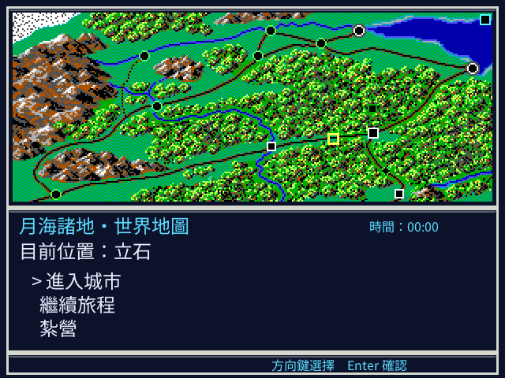

世界地圖不再誤用 WILDCOM 的 50×25 戰鬥地板。上圖直接解碼
`BIGPIC1.DAX` block `0x79`，以 2× nearest-neighbour 顯示 608×240 地圖，
並依 game-pack JSON 的 A–N world values 與 Clue Book 第 35 頁座標標示目前
位置；地名、目前位置與旅行選單以 24／16px 繁中在 640×480 畫布重繪。

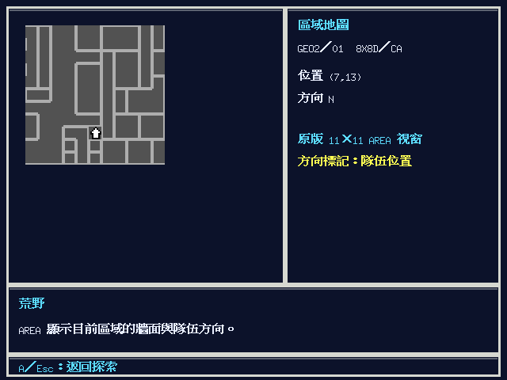

原版 `AREA` 指令是目前迷宮周遭的俯視阻礙圖，不是世界旅行圖，也不是
`WILDCOM` 戰鬥地板。上圖依原 routine 畫出邊界夾制的 11×11 視窗：
`GEO2.DAX/01` 每格的 N／E／S／W 牆形成 4-bit mask，直接選取全域
`8X8D1.DAX/CA` 的原始 8×8 灰牆 symbol，再以 2× nearest-neighbour 顯示；
白色箭頭同樣是原始四方向 symbol。原版刻意不顯示門與牆種類。中文使用倚天
`STDFONT.15` 的 16×15 點陣並水平加粗 1px；字型因著作權只從本機載入。

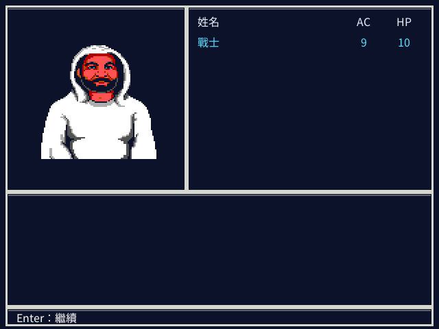

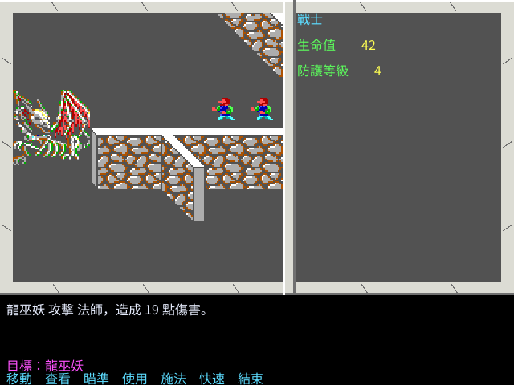

冒險畫面現在直接使用本機 DOS 320×200 runtime oracle 抽出的 cracked stone
透明邊框，不再用一般灰色矩形模擬。左上一般事件圖與第一人稱場景使用原版
灰色內框及 88×88 可見區；HEAD／BODY 人物則使用獨立黃色裂紋舞台，不走
一般場景的 cover 規則。IDA 已交叉驗證原作先畫 HEAD，再把 BODY 下移五個
8px 列後繪製；一般 PIC 則依灰色內框裁切並填滿 88×88 可見區，不再把小圖
置中而留下大片黑邊。右上隊伍／AC／HP、下方
敘事與最底命令列均保留；戰鬥畫面
恢復左側戰術格、右側角色狀態、下方訊息與命令列。原始像素素材維持 2×
nearest-neighbour，遊戲正文與 HUD 以粗體倚天 16×15 為主，24px 僅留給標題
或強調。HEAD／BODY 的
`row + 5` 也已修正為五個 8px 列（40px），人物頭像不再被錯貼進胸口。

戰鬥圖另經 DOS 原版截圖逐像素設計審查：上方沿用原生 320×184 的精確 2×
幾何，戰場是 `(16,16,336,336)`、中央石框 16px、右欄 256px。畫面不再顯示
非原版棋盤格、team bars 或右欄 target card；640×480 多出的 80px 只用來容納
中文戰鬥紀錄。原版 combat terrain atlas 已於下一段接入；完整 terrain-mode
selector、大型怪物 occupancy 與 RANDCOM decoration 已接通。戰鬥框目前以
DOS runtime 抽出的真實石框像素，依已量測的 320×184 combat geometry 重組；
因此是「材質 exact／layout reconstructed」，不再使用手繪 3px 暫代線，但在
取得本機 DOS 戰鬥 capture 前不宣稱整張 combat frame pixel-exact。

最新圖中的龍巫妖直接取自 MON5／CPIC5：`field_DE & 7 == 4` 被還原為 2×2
戰術佔格，選取框因此是 96×96；移動、復活、近戰鄰接與 camera 也使用同一份
footprint 規則，不再把大型怪物誤當單格小人。戰鬥 MOVE 亦已讀取原版
BackgroundTiles 的 movement cost／不可通行旗標；大型小人的每個目的格都要
通過，困難地形會消耗超過一點，點數不足時不會先移動再回滾。

戰場現已改讀真正的 combat atlas，而非一般 TILES 圖庫或假格線：

第一版戰鬥動作時間軸已把「按下攻擊後立即跳到最終結果」拆成 attack pose、
travel/contact、impact、commit、death 與 handoff。以下四張是同一套
renderer-neutral transaction 在固定 phase 的 Docker／Xvfb 實機 frame：

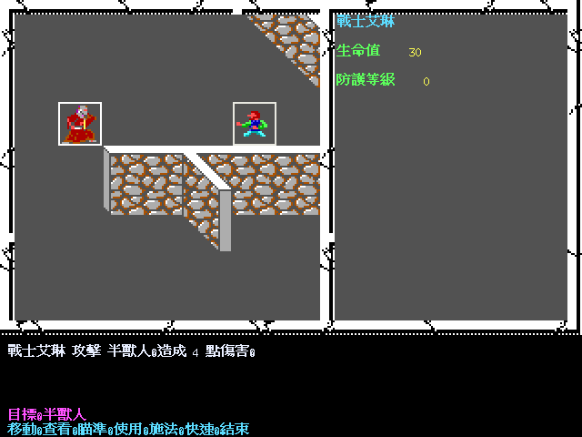

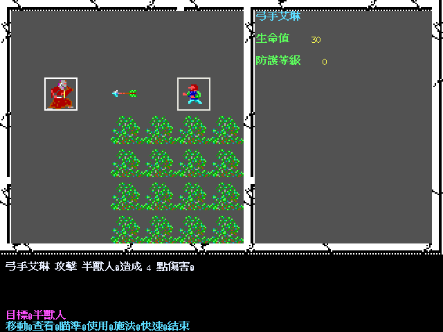

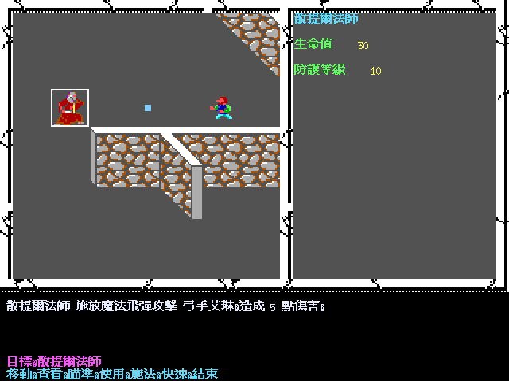

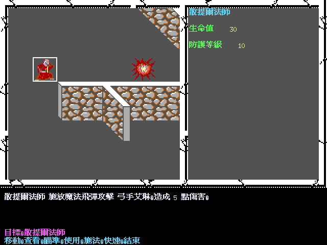

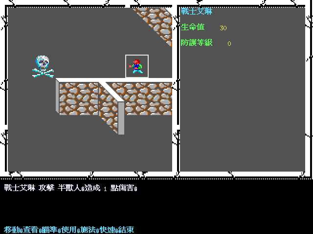

Fireball 已不再是單體 Magic Missile 的改名版本。玩家角色必須真的記憶
`0x2F`，在正常戰鬥回合按 `F`、用方向鍵指定任意地圖中心再確認；規則會以
同一次等級 d6 擲骰波及半徑內敵我雙方，各自進行 Spell saving throw，並按
原版影片順序逐名播放 impact／傷害／必要時死亡：


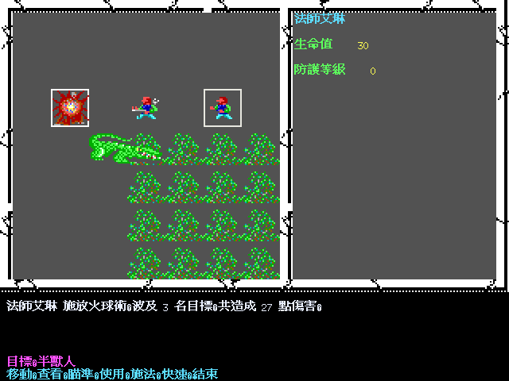

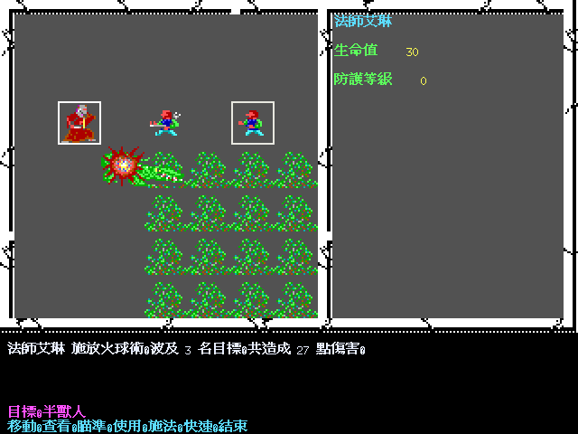

弓箭現使用原版 COMSPR `0x00/01/02` 與方向 variants；Magic Missile
travel 使用原版 `0x05/0x85` 四格，命中使用 `0x0A/0x8A` 四格，不再用
renderer primitive。這些 source block、八方向與 flip 已移至 CoAB JSON
game pack，由獨立 Golden Box engine schema 驗證，frontend 不再寫死作品
素材表。`SoundMissile`、hit/miss、magic-hit、death 已依 phase
送出，敵方 AI 也改成一個 action 播完才 handoff。公開 DOS 影片
[`00:42:25.20–25.40`](docs/reference/original-dos/combat-video-oracle.md)
已逐格交叉驗證 generic spell projectile；弓箭 wall-clock cadence 與其餘
法術 timing 仍待 DOSBox／影片補齊，不能宣稱整套戰鬥 pixel/timing exact。
Fireball 的無牆半徑、save、共用傷害骰與逐目標演出已有 code-backed
evidence；牆面路徑阻擋及同距離 tie order 尚待原始 combatant-array／DOS
runtime 驗證。

Lightning Bolt（閃電束）也已走通正常 memorized `0x33` 玩家路徑：戰鬥按
`L` 後用 32×16 tile cursor 指定方向格。它使用同一次 caster-level d6，
路徑上每名角色各自作 Spell save；正交／對角步成本為 2／3，地城
`move_cost=0xFF` 牆會讓電弧反向，離開 footprint 後再穿回同一角色可再次
命中。`VisualEvent.Segments` 依序播放共同施法 travel、目標 impact、後續
電弧與反彈，不再把閃電做成 Fireball：

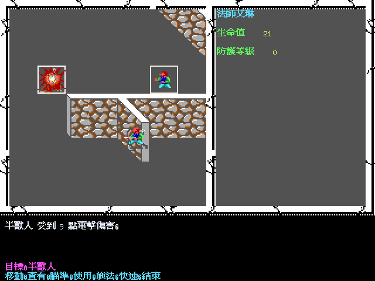

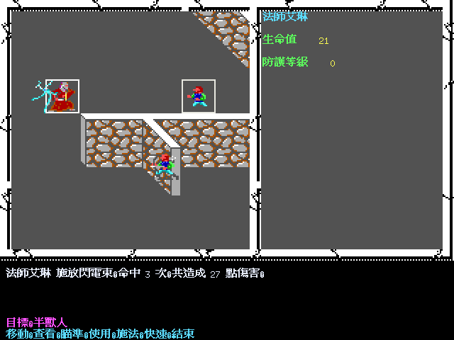

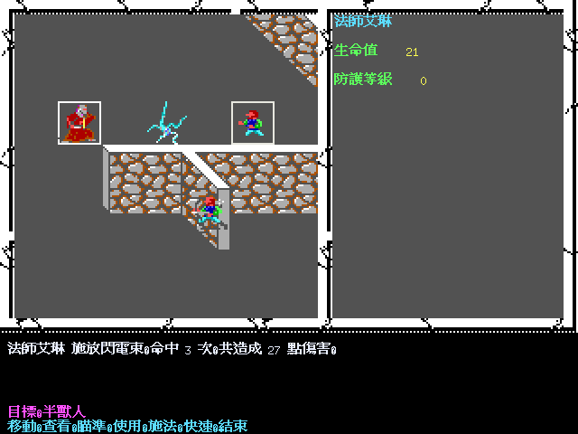

公開 DOS 影片 `07:40:22.50–25.60` 已逐格證明「電弧抵達目標 → damage/save
→ 從命中格繼續前進」，並與 COMSPR `0x06/0x86` 電弧、
`0x0A/0x8A` damage impact 交叉吻合。牆面反彈目前是 executable/reference
code-backed，仍待 DOS runtime 取得同角度逐幀 oracle。

Stinking Cloud（惡臭雲霧）`0x22` 現在也走正常 memorized 玩家路徑：按
`N` 後以方向鍵指定 2×2 雲霧的西北角。四格依原版
`{center,east,south-east,south}` 建立，阻擋格會略過；每個 combatant
footprint 只作一次 Poison save，成功咳嗽一回合，失敗則因噁心 helpless
`d4+1` 回合。雲霧會跨 action／round 留在戰場，多片重疊時各自到期：

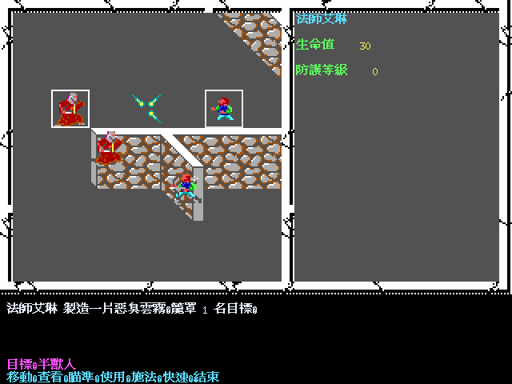

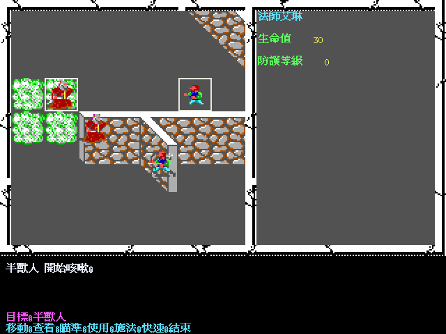

DOS 影片 `00:42:25.20–27.00` 已證明 projectile→建立文字→四格綠白雲→
下一段 action 仍保留；原版 raster 由全域 background entry `0x1E` 解析到
RANDCOM item 4。

Cloudkill（致命毒雲）`0x5B` 也已成為獨立的正常玩家路徑：按 `K` 後指定
3×3 中心。它使用 RANDCOM item 2 藍白雲；HD 0–4 自動死亡、HD 5 作
`-4` Poison save、HD 6 無修正、HD 7+ 不受影響。低於 7 HD 的角色也不能
主動踏入毒雲，且 party／MON*CHA 的原始 `HitDice` 已接進戰鬥模型：

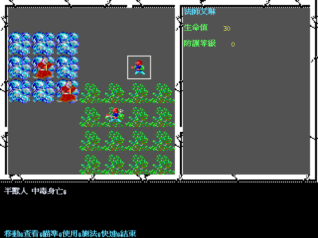

這張是 `material-exact/layout-reconstructed` remake checkpoint；Cloudkill
DOS 動態影片時間碼、魔法保護例外與每回合重複毒雲判定仍未完成。

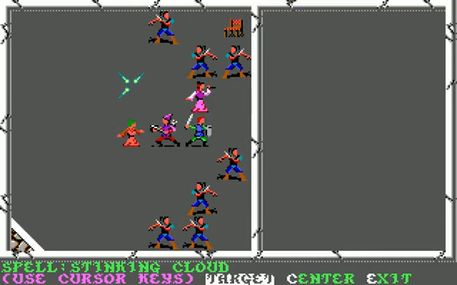

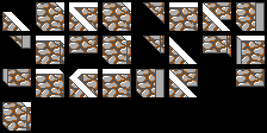

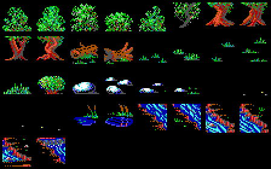


上方 atlas 均由原始 DAX parser 離線重建；實機戰鬥圖中的橘色石牆與桌椅由
GEO dungeon buffer 的 background entry 查回 DUNGCOM／RANDCOM，不是手工 mock。

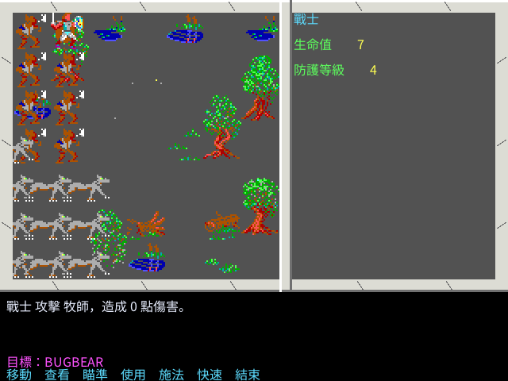

野外戰場以目前 `MapX/MapY` 為中心查 `SetupWildernessFloor` 的 7×7 slice；
樹木、倒木、岩石、草與水岸均由 entry 的原版 tile index 決定。地城／野外
現在依 `Area.InDungeon` 選 DUNGCOM／WILDCOM，不再用章節編號猜測。

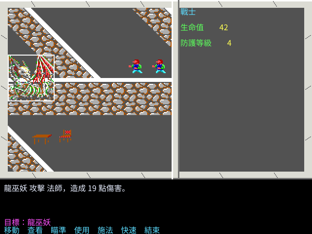

地城桌椅也不再只存在於 map generator：BackgroundTiles 全域 graphic ID
`0x22..0x27` 已接到 RANDCOM `0..5`，先畫 DUNGCOM 開放地板再疊透明物件。
上圖是原始 `GEO2 block 01, center (13,0), seed 1` 的正式 Xvfb 實機畫面。

以下圖片由原始 `curseoftheazurebonds.zip`，透過專案目前的 DAX／GFX／GEO parser 離線產生，證明圖像資料管線已經接通：


舊版 direct-entry 戰鬥圖已由上方原版比例校正版取代；它仍是 headless Xvfb
可重現的 `-encounter` vertical slice，不代表完整玩家流程已完成。

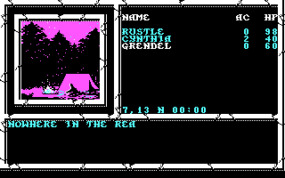

原版實機 oracle 證實 top row 在 native `x=128` 分割：第一人稱區 128px、
roster 192px；狀態列也位於 roster 底部。demo 訊息自稱不是真實場景，因此只用
來量測 GUI／SKY，不拿它推斷提爾佛頓 GEO 牆配置。

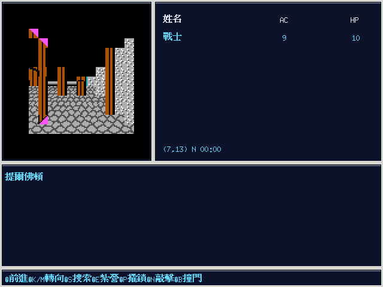

上圖由 `-opening` 走過真實 block `0x01` 後，以 Docker／Xvfb 擷取。第一人稱
面板依原版 128px 放大為 256px，右側 roster 為 384px；其中原版
`Draw3dWorldBackground` 的 sky／地平線／地面是中央 88×88 區，地面直接取自
`SKY.DAX/FC`。WALLDEF stamps 僅接受 row／column `0..10`，並依原 routine 放在
`(column+3,row+3)×8`，已修正舊圖額外右移／上移造成的三片巨牆。素材來自
GEO2/01、WALLDEF2、8X8D2 與 SKY/FA–FC，位置 `(7,13)`、面北；右側為隊伍，
下方與命令列統一使用本機倚天 16×15 粗體，不再依賴系統 CJK TTF。

本重製版以 `640×480` 為固定邏輯畫布：原版像素圖片採 nearest-neighbor
整數倍放大，繁中則以 16×15 倚天粗體作一般正文與緊湊 HUD，不把
320×240 的 8px 英文字格直接套給中文，因此小人仍保留原味、中文字也能清楚排版。
正式 dungeon floor 的原始 24×24 tile 也以 2× 顯示；戰鬥法術與地城操作列
使用獨立 compact line，長中文訊息按 Unicode 字元換行。

目前已完成的垂直切片包括：

- DAX 容器／RLE、ECL bounded VM trace 與跨 ECL1–ECL6 block context。
- `cmd/azure-bonds -entry-smoke` 可逐一 bounded 執行 ECL1–ECL6 每個 block 的五個 initialization entries，保留每個入口的錯誤與 COMBAT／menu／PROGRAM 結果，方便後續反組譯收斂。
- 火刀據點首領房已接通原始 PICTURE 12、手札 11、20 名火刀加 1 名首領的正式戰鬥；
  勝利後依序播放公主解除枷印、手札 54／53 與四張主人面孔的 BIGPIC 夢境。
  2,000 gold、3,000 platinum、8 gems、4 jewelry 與兩件隨機物品只在勝利後入池，
  不會因原 ECL 在 COMBAT 前建立 treasure packet 而提前發放。
- 首領章後已能由 BIGPIC 121 的提爾佛頓城外繼續旅程；衛兵會依放逐劇情阻止入城。
  選擇阿沙本福德山徑會在提爾隘口遭遇八隻使用原始 icon `0x51` 的「鷹馬」，
  戰勝後由原 ECL world bytes 正式抵達阿沙本福德，而非 renderer 假造跳轉。
- 阿沙本福德 PICTURE 80 的旅店、商店、訓練場、神殿與河畔酒館已接入；酒館
  RELAX 會直接顯示手冊 Tavern Tale 28 的繁中內容。離城後可經 Shadow Gap
  擊敗六名偽裝巡邏兵的火刀，抵達立石群並取得灰袍人的主線提示：
  「往南方尋找紅色之人」。
- 立石群已能繼續前往艾森布拉與哈普；`PATROL FOREST` 複合選項不再造成
  顯示與 branch 錯位。往哈普途中會建立三隻原版 MON1 `0x35`「黑龍」與
  icon `0x35` 小人，勝利後恢復同一份 ECL session，以 world value `9`
  抵達哈普村外。
- 哈普村外 `ENTER CITY` 現已正式切入 Area 5／ECL5 block `0x31`，載入
  map pieces `12,FF,FF` 並顯示 640×480 繁中荒村入口。terrain `0x84`
  的民宅會顯示原版 PICTURE 50；玩家可選擇離開或繼續交談，村民逃走後
  返回同一份可探索 runtime，visited flag 不會遺失。
- 哈普 terrain `0x80` 的黑暗精靈巡邏已可玩：正式 ENCOUNTER menu 提供
  戰鬥／等待／撤退／接近；選戰鬥後由 MON5 `0x31–0x33` 產生戰士、法師與
  牧師。本輪可重現流程為三名戰士加一名法師，使用原版 icon `0x31/0x32`；
  勝利會累加 `4C47` 並回到哈普村探索。
- 哈普 terrain `0x88` 的伊弗利特頭目戰已接通：1 名伊弗利特率領 6 名
  黑暗精靈法師與 6 名牧師，全部使用 MON5 原版 record／icon。勝利後取得
  村莊與洞穴地圖、播放 PICTURE 50 解放歡呼，並從長老得知下一站是附近法師塔。
- 哈普 terrain `0x8A` 現可遇見並招募 38 歲、五級魔法師阿卡巴；原版
  MON5 裝備與 11 個已知法術一併載入。中文顯示名與 DOS script name 分離後，
  解放哈普時會正確追加他所知道的法師塔祕密商路。畫面維持 640×480，
  原圖整數倍 nearest-neighbor 放大，繁中正文以 24×24 級字形重繪。
- 解放哈普後可循伊弗利特身上的地圖前往古老熔岩洞（ECL5 block `0x32`）；
  入口伏擊由四隻原版 icon `0x39` 火蜥蜴與三名黑暗精靈組成。跨地圖的 exit
  work byte 已正確清除，戰勝後會留在熔岩洞繼續探索。

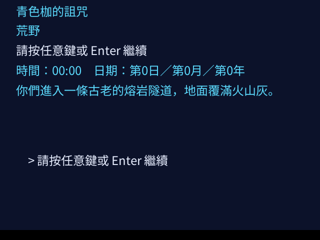

畫面可用 `-lava-tube` 從真實 ECL initial entry 重現。中文直接以 24px 字形
繪製在 640×480 畫布；此圖由 Xvfb 執行正式 Ebiten command、讓程式自動找到
Noto CJK 系統字型後擷取，不是離線 mock。後續戰鬥小人仍使用原始像素並採
整數倍率 nearest-neighbor。
- 熔岩洞內 GEO `(9,10)` 的 terrain `0x8A` 守門巡邏也已可玩：3 隻火蜥蜴、
  3 名黑暗精靈戰士與 1 名牧師。勝利會保存 `4C48` 狀態，並由原 ECL 顯示
  「前方危機重重」的夢境警告，再回到洞內探索。
- GEO `(0,5)` 的 terrain `0x89` 面北會顯示 PICTURE 57 熔岩池，接入四項
  ENCOUNTER。原版 behavior-mode 已正確還原：WAIT／PARLAY 會進入五種交涉態度，
  友善交涉得到克林德拉克警告後離開；COMBAT 才建立 15 隻火蜥蜴。勝利後可
  調查六只防火桶，以 WHO 選擇前往者；沒有耐熱條件的角色會被迫退回，
  流程可安全返回地城。
- 熔岩洞 `(6,15)` 面西會由原始方向 gate 進入 ECL5 block `0x33` 法師塔：
  載入 PICTURE 51 五層庭院、德拉坎德羅斯與塔頂黑龍幻象。WAIT 分支一路
  保留每個 PRINT RETURN，依使用者 Adventure Journal 解鎖完整繁中手札 15，
  原 ECL 再次寫入 `4CFF=1` 並令德拉坎德羅斯的枷印消退，最後停在原版四項選擇。
  第 450 輪已把這段九個故事 pause 與手札兩頁完全移入 CoAB game-pack JSON；
  事件發生後手札直接加入遊戲內 `J` 選單，不必另查 PDF。State 與舊 locale
  的重複中文均已刪除，資料契約見
  [`spec 450`](docs/spec/450-wizard-tower-json-story-journal.md)。
- 第 451 輪再把四項選擇後的龍群離去／定罪、召兵、安全屋頂、龍屍／龍心、
  酸液與雙層屋頂出口十段文字，以及三個法師塔專用選項移入同一 game-pack。
  因此法師塔從入口到離開的作品文字不再依賴 Go switch；詳見
  [`spec 451`](docs/spec/451-wizard-tower-branches-json.md)。

為避免後續功能再把本作中文塞回 Go，第 452 輪新增 AST 資料分離 gate。初始
量出正式非測試 Go 有 1,315 次漢字字串技術債；第 453 輪已把訓練場完整玩家
文字與可學法術名稱改由 locale stable ID 驅動；第 454 輪再將神殿選單與十種
治療項目資料化；第 455 輪又完成酒館、飲品、傳聞、手札 17 與提爾佛頓酒館
事件；第 456 輪再完成商店服務 UI，基線已合計下降 215 次至 1,100。
exact hash baseline 會禁止新增、改字、搬動或重複；每次遷移必須在同一 commit
更新下降後數量。這表示法師塔與訓練場已有資料化證據，但全專案尚未完成零
硬編碼，詳細見
[`spec 452`](docs/spec/452-go-han-literal-data-separation-gate.md)。
- 選擇「攻擊法師」後，黑龍離開人類紛爭；德拉坎德羅斯逃下樓並留下
  1 名伊弗利特、2 名黑暗精靈戰士與 1 名法師。四名守軍均取自 MON5 原始
  record／小人 sprite；勝利後原 ECL 續接「屋頂可安全休息」，再回塔頂探索。
  `-wizard-tower-battle` 可直接重現這個完整主線戰鬥 boundary。
- 選擇「與龍群交涉」會進入原版五態度 PARLAY：傲慢／威嚇導向 14 隻黑龍，
  狡猾／謙卑／友善則說服龍群離去，再匯入同一守軍戰。態度 mapping 完全由
  block `0x33` 的 `PARLAY 1,0,0,0,1` 與後續 branch 決定，不是重製版猜測；
  `-wizard-tower-parlay` 可重現成功交涉的原圖與繁中結果。
- 「攻擊龍群」與「撤退」都會進入同一場 14 黑龍戰；後者在原 script 中確實
  無法逃走。若 `4C61==1`，戰後可選擇剖取龍心：全隊依原 ECL 承受
  `DAMAGE 0xC0,3d4+3,save type 1`，成功後寫入 `4C64=1`，再回安全屋頂。
  direct-entry 戰場可用
  `-encounter -encounter-area 5 -encounter-block 51 -encounter-start 1269 -encounter-monster-member MON5CHA.DAX`
  重現；Area 5 確保使用正確的原版 CPIC namespace。
- 戰後塔頂 `(7,15,E)` 的 terrain `0x01` 出口已接通。原版三項選單可返回
  熔岩洞、經祕道前往荒野，或留在塔頂；選荒野後仍會依原 ECL 再詢問回哈普村
  或離開此區，不會被重製版看到 `WILDERNESS` 字樣便提前跳過第二層選單。
  `-wizard-tower-exit` 可直接重現這個 640×480 繁中出口。
- 塔頂祕道選擇「離開此區」後不再停在 ECL5 block `0x30`：阿卡巴會依哈普與
  法師塔旗標正式告別並由 `DUMP` 離隊；日光會使 item type `0x5E/0x60/0x61`
  的黑暗精靈武器、護甲腐朽。兩段繁中 Continue 完成後才 `NEWECL 0x50`，
  顯示原版 BIGPIC 121 並回到可繼續選擇城市／旅程／紮營的世界流程。
- 回到哈普後選擇 `JOURNEY ON → ESSEMBRA → TRAIL`，現會沿 ECL1 block
  `0x50 +0x149A` 遭遇替德拉坎德羅斯復仇的龍巫妖。引擎會依 spawn ID `0x3C`
  正確跨章載入 MON5 record 與原版 CPIC5 小人（66 HP、AC -6），勝利後正式
  抵達艾森布拉城外，而非誤用目前世界 block 所屬的 MON1 table。
- 艾森布拉的 `BAR → RELAX` 現已保留原版兩層 ECL 城市事件：先進入俯瞰林地
  的露天酒館，再聽見「龐大身影飛越森林、朝南而去」的 Tavern Tale 60。
  `HAVE A DRINK` 也已還原五種酒與 EXIT；選啤酒會依原 script 顯示提示寒冷
  攻擊克制紅袍法師火焰生物的 Tale 44。Continue 可回酒館，EXIT 可回艾森布拉
  六場所選單。這段已接在同一條「新遊戲 → 法師塔 →
  龍巫妖 → 艾森布拉」真實 session 回歸中。反組譯亦釐清手札 18 的灰袍人
  屬於暗影谷酒館，不能因 DAX 字串相鄰而錯接到艾森布拉。
- 主線可再由艾森布拉返回立石群，前往希爾斯法。世界 VM 會忠實由 block
  `0x50` 切到 `0x51`，TRAIL 上擊敗六名偽裝戰士的火刀後，以原始 world value
  `11` 抵達希爾斯法。PICTURE 80 城市入口與六場所已接通；碼頭酒館中，仍帶
  散塔林枷印的隊伍會遭紅羽衛打翻酒水挑釁，拒絕清理後進入六人戰，勝利再回
  同一酒館。Area 1 的 A–N／`0..13` 地點表也已完整收進共用 Gold Box 知識庫。
- 希爾斯法現在可繼續前往尤拉什：TRAIL 上會因散塔林枷印遭十二名紅羽衛指控
  為間諜並開戰，勝利以 `4C9B=10` 抵達尤拉什。入城後由 ECL world `0x51`
  切入 ECL3／GEO3 block `0x10`；廢墟入口、騎士與紫衣女子、紅羽衛檢查哨、
  談判及「跟衛兵去見指揮官」均已繁中。進入 `(0,3,E)` 等候室後向東會觸發
  原版散塔林間諜事件；1 名牧師、8 名戰士與 2 名法師的 MON3 戰鬥已接通。
  勝利後選友善態度，可取得紅羽衛指揮官自由通行、繁中手札 22／52，並由側門
  回到 `(1,3,E)`。主線現可再前往尤拉什 `(11,0,N)`：terrain `0x26` 顯示巨坑
  警告，跨界後由 ECL3/GEO3 block `0x10` 切入 `0x11`。三名死去邪教徒、
  受傷牧師封死入口及死亡敘事均已繁中，最後在 `(0,0,E)` 正式開始
  摩安德之坑探索。第一層 `(1,4)` terrain `0x85` 的愛麗雅絲／龍餌事件也已
  接通：可經談判、友善與坦白故事解鎖繁中手札 3，再由 MON3 `0x16/0x17`
  保留原始裝備、effects 與小人雙 NPC 入隊。
- 摩安德祭壇藏寶後的撤離流程已接通：回到上層 `(0,12)` 會遭遇 10 名教徒、
  5 名蕈人與 5 名蔓生怪的最後阻擊；勝利後由 `(0,11,W)` 離坑，原 ECL 寫入
  `4C5B=FF／7F12=1` 並切回 world block `0x51`。愛麗雅絲與龍餌會以繁中告別、
  從 persistent party 離隊，玩家再回到 640×480 世界選單。
- 主線已從摩安德之坑繼續抵達散塔林堡內城。隊伍可在 `(10,11,N)` 遇見
  奧莉芙・魯斯克特爾，閱讀完整繁中手札 50，選擇跟隨她的密道；真實 ECL4
  session 會由 block `0x20` 切入 `0x21`，在魔法裝置封牆後解鎖繁中手札 51，
  最後於 `GEO4/0x21 (10,6,N)` 取得神殿內操作權。往 `(6,13)` 可再次取得
  奧莉芙的南方牢房提示；在 `(2,14)` 找到迪姆斯沃特後，完整繁中手札 12
  以六頁保留五道枷印與三件神器的小說式說明。接受同行會寫入原 ECL
  一次性旗標，但不會虛構 fighter 或占用隊伍欄。同行後在 `(4,12)` 答應
  兜帽女子帶路，真實 session 會解鎖繁中手札 30／7，演出德克薩姆殺死
  弗佐爾、第四道枷印消退與兩派混戰，再由 ECL4 `0x21→0x22`、GEO4
  `0x21→0x25` 抵達
  眼魔洞穴 `(4,5,N)`。人物、手札、文字 matching 與三張地圖都由 CoAB
  JSON game pack 宣告，未寫進共用 engine。洞穴 `(15,1,N)` 的固定決戰也已
  接通：兜帽女子揭露為梅杜莎，第一戰為梅杜莎 1、眼魔 1、牛頭人 10；
  勝利並取回洛山達護符後，還要迎戰散提爾堡 11 戰士、4 法師、3 牧師與
  1 大祭司，第二戰勝利才回到洞穴操作。兩場遭遇與戰後文字都有真實
  ECL／MON4／GEO4 regression。

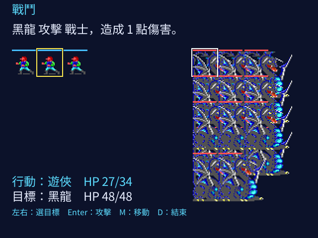

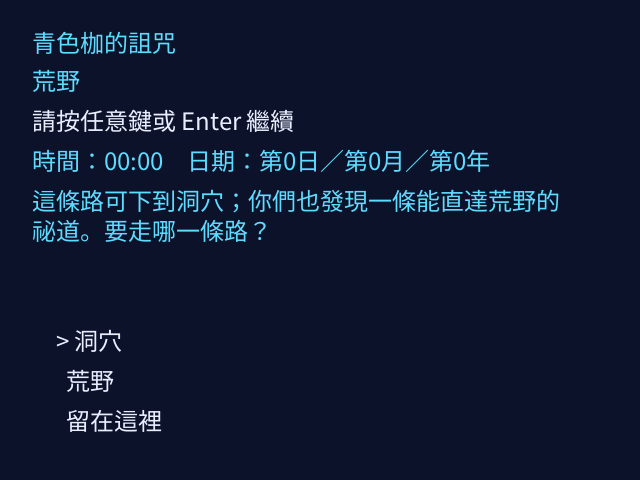

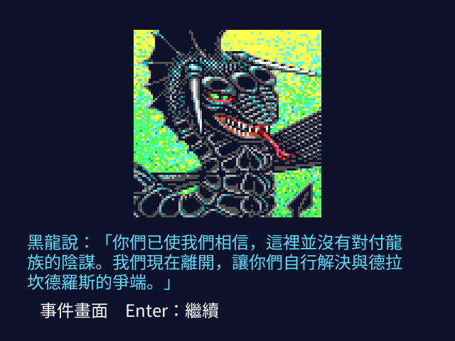

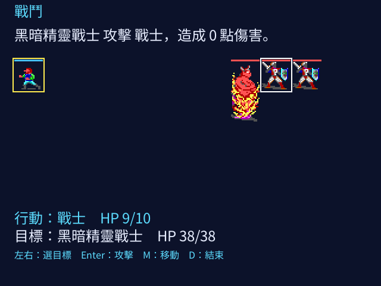

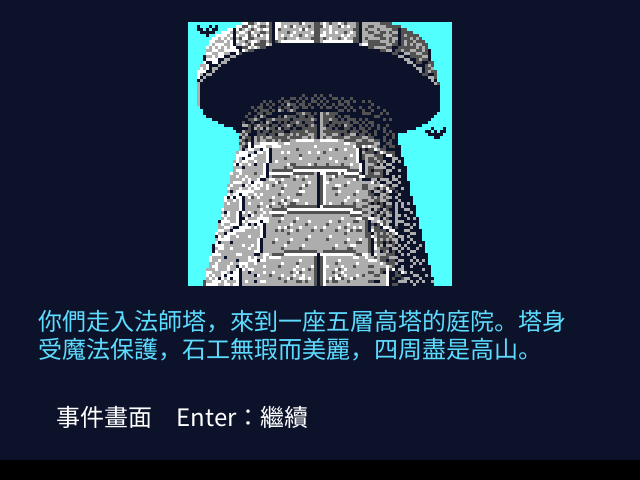

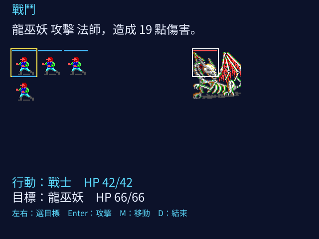
- 原始 ECL1–ECL6 的 25 blocks／125 個 initialization entries 現已納入 real-image regression，全部可抵達正常 EXIT、menu、COMBAT、PROGRAM 或 NEWECL boundary，沒有 unsupported-opcode stop；這仍不代表所有 menu／random 劇情分支已完成。
- `BlockSession` 會跨 `NEWECL` 保留並合併 `LOAD FILES`、`PICTURE`、`SPELL`／`PROTECTION` 等 renderer／state-neutral signals，避免事件換 block 後遺失請求。
- ECL `DAMAGE` 已依公開 CoAB reference 保存五欄 raw request（flags／dice／bonus／save flags）並跨 `NEWECL` aggregation；party target、saving throw、random roll 與 HP mutation 已接入 party／State adapter。
- ECL `PARTYSTRENGTH (0x1D)` 與 `PARTY SURPRISE (0x22)` 已依 reference 消費 word destinations；`ecl.PartyContext` 會由 State 注入 roster／fighter 的 HP、AC、attack bonus、cleric／magic-user／ranger metadata，計算結果寫回 shared ECL memory，並跨 `NEWECL` continuation 保存。完整 AC internal scale 與 multi-class rule table 仍待逐欄驗證。
- ECL `CHECKPARTY (0x1E)` 已接入 `0xA5..0xAC` thief skill、`0x9F` movement 與 `8001` active-affect branches；State context 會寫回 min／max／average／found 四個 destination，未知 selector 維持 unresolved。
- ECL `WHO (0x39)` 現在會在 interactive State 停住並顯示繁中隊伍角色選單；選擇後由同一個 ECL session resume，並保存 selected player ID，不會誤用普通 menu semantics。
- ECL `LOAD CHARACTER (0x0A)` 現在依真實阿卡巴搜尋子程序解碼 zero-based player selector，接回 persistent `partyRoster` 與 selected player ID；bit 7 restore/redraw flag 與完整 DOS record/string side effects 仍保留明確 boundary。
- `LOAD CHARACTER` 後續的 `0x7C00` selected-player name string 已接到 ECL runtime；真實 script 的 `COMPARE`／`IF` 可依 roster 姓名分支，其他 DOS memory regions 仍維持 evidence boundary。
- ECL `FIND ITEM (0x32)` 現在會查詢全隊 persistent roster 的 raw item types，正確設定 `=`／`<>` compare flags；同一 script 的 `DESTROY ITEMS` 後續查詢也會立即反映已毀狀態。
- ECL `FIND SPECIAL (0x3F)` 現在會查目前 selected player 的 active effects；LOAD CHARACTER 與可恢復 WHO 共用同一 selected-player runtime state，並正確驅動 `IF =／<>`。
- ECL `DUMP (0x3E)` 現在依 reference 移除 selected party member，同步 persistent roster／combat fighter，並選取前一位角色；真實 ECL5 Akabar 離隊 opcode 已納入 regression。
- ECL `PROGRAM 0/3/8/9` 已接到共用 State adapter：返回標題、隊伍全滅、勝利全隊恢復／存檔選擇與 CAMP；戰鬥後 continuation 不再吞掉勝利 routine。
- ECL `CALL 0x2E10/0xC01E/0xB200` 已依 reference 接到地城 redraw、無碰撞強制前移（16×16 wrap）與 default sound-A；ECL3 block 16 real CALL 已納入 regression。
- 公會戰的四名 QuickFight THIEF 已標成一次性友軍，戰後不再污染隊伍；後續半身人、犬舍戰、猴籠、訪客簿與黏液門均已繁中化，真實 ECL2 block 2 也能由南側邊界進入 block 3 下水道。
- `State` 現在會一次性保存／消費 ECL `DAMAGE` pending requests，確保事件／選單 pause 不會遺失 script effect；random target／`CanHitTarget` 已接入 resolver，`DamageOutcome` 也會保存 unconscious／dying／dead health state；active combat 會同步 Battle status 並結束勝負流程，`ResolveDeathEffects` 可接入已解出的 recovery／troll regeneration side effects。
- DOS player `saveVerse` `0xDF–0xE3` 與 signed `field_186 @ 0x186` 已保存到角色；ECL `DAMAGE` 的 selected／whole-party／random-target branches 可透過注入骰點寫回 roster／fighter HP，default resolver 已投影 AC 並套用 invisibility -4、action-delay-aware blink，以及 displace consumed-bit；active combat 倒下時會清理已驗證的 combat-only effects、移除戰鬥位置、清空 `CombatAction` 並發出 `DeathOverlay`，team party 另標記 `DownedCorpse` 對應 `Tile_DownPlayer=0x1F`；Cure Light Wounds 現可治療可復原的倒下隊員，但只清除 skull flash、不恢復戰鬥 placement；明確 `CombatHealAllowed` 的 affect_63 recovery 會以保存座標呼叫 `RestoreCombatant` 站起。若是目前 turn 也會清除 State 施法／移動／檢視 selection；`NewBattle` 對 save／encounter 初始 HP=0 fighter 也套用同一正規化，因此不會進入 turn 或佔用碰撞格。Ebiten 已在原座標以原版 `COMSPR 0x8B`／`0x19` 交替顯示九次死亡小圖後轉為 corpse marker，enemy 則完全移除名稱／HP render，另可由明確 context 觸發 affect_63／TrollRegen／dragon-slayer。其他 Death routine 仍保留邊界。
- 繁中開場、暗影谷／阿沙本福德／匕首瀑布城市 routing、荒野／場所狀態、角色建立、可恢復的 remake game JSON 存檔，以及可操作戰鬥 prototype。
- 真實 ECL2 block 3 entry 3 已用 `MON2CHA.DAX` 建立可操作 Battle；`-encounter -encounter-block 3 -encounter-start 688 -encounter-monster-member MON2CHA.DAX` 可重現此 encounter slice。
- 第 419 輪已以 PC-98 primary bytes 關閉原版先攻：shared Player `+17h`
  使用原始 DEX reaction table，`Action.delay = 1d6 + adjustment`；下一名角色
  依建構時 TeamList 原順序全掃描，每個節點（含 delay 0）都抽 `1d100`，先比
  最大 delay、再比最大 roll，完全同值由後掃到者勝出。作品中立實作已移入
  獨立 engine `combat/initiative`；CoAB 不再使用 d20、字串 ID 排 tie，或把
  MON*CHA `+1A5h` 猜成 initiative bonus。第 420 輪進一步接通動態 scheduler：
  頂層 `D` 開啟原版 DONE 子選單，子選單 `D` 寫 Action.delay=1 並在同輪
  重新入列；先前把 `20→19` 視為一般 Delay 的假說已推翻，它屬於尚未接 UI
  的 Quick handoff。surprise-mask writer、DOS 等價性與原版 PRNG 仍是缺口。
- `MON*CHA` 的 raw spell-list slots（`0x33..0x6A`）與 magic-user level-use counts（`0xB5..0xB7`）已保存到 enemy fighter；目前依 reference 接入第一個敵方法術 Magic Missile（`0x0F`），一級單枚、2–5 傷害，施放後回到敵方 physical-turn fallback。
- `MON1SPC`–`MON6SPC` 已依同一 monster ID 載入並掛到 enemy fighter 的 raw `MonsterAffects`；目前只保存九-byte effects，不宣稱已完成隱形／加速／睡眠等規則投影。
- 已依 reference `CanHitTarget` 將 active monster affect `0x19`／`0x47` 投影為目標 AC +4；其餘 `MON*SPC` effects 仍保留 raw-only boundary。
- 已解析 `MON*CHA[0xA1]` monster base attacks count；active Haste `0x27`／Slow `0x2A` 會依 reference 加倍／減半目前 enemy 的每回合攻擊次數（保留至少一攻）。
- 已接入 reference `Player.IsHeld`：active `helpless／snake charm／paralyze／sleep`（`0x1F／0x33／0x34／0x35`）的 enemy 會跳過回合，且被 held target 的攻擊必定命中；中文訊息已接入。
- ECL `CLOCK (0x34)` 已依 reference 解碼兩個 operand（timeStep／timeSlot），跨 ECL session 聚合後接到 State 七-slot game-time adapter；因此 ECL 事件與 REST 共用 effect timeout 時鐘，完整 time-triggered event table 仍待驗證。
- 遊戲啟動會載入 `MON1CHA`–`MON6CHA`；encounter 逐隻依 monster ID range
  選章，ECL namespace 僅作 fallback。這可處理 ECL1 世界 block 直接召喚
  MON5 `0x3C` 龍巫妖等跨章 encounter。
- 已以原始 image 驗證 ECL1 block `0x50` 的 `NEWECL 0x03` 可切換到 ECL2 block `3`；target 後續若遇未支援 routine 仍會保留 transition boundary。
- `TILES.DAX`／`8X8D*.DAX` indexed pictures、`WALLDEF*.DAX`、EGA16 palette 與 `GEO2–GEO6` geometry parser。
- 原版 `SetupWildernessFloor` 的 50×25 野外遭遇戰鬥地面生成規則，以及 background entry → combat tile mapping；它不是世界地圖。
- GEO2 wall／door fields → dungeon background composition → TILES pixel art 的可見 slice（`D` 預覽）。
- dungeon table／chair decoration 已依 GEO `terrain & 0x40` 與原版 seeded dice pass 接入。
- Ebiten 原始 tile gallery、GEO wall viewport 與依 GEO wall bytes 驗證的游標移動。
- 已從 `CPIC1.DAX`–`CPIC6.DAX` 抽出 156 張透明背景戰鬥小人 PNG；完整索引在 [`assets/sprites/README.md`](assets/sprites/README.md)。
- Ebiten 戰鬥畫面已載入 repo 內 CPIC PNG，並依 ECL monster `IconBlock` 顯示敵方小人；無對應 block 時有 deterministic fallback。
- `SPRIT1.DAX`–`SPRIT6.DAX` 的 frame stream 也已解析並抽出 138 個逐幀 PNG，manifest 同時記錄 delay／尺寸／座標。
- 戰鬥 renderer 會依 ECL `SETUP MONSTER` 的 SPRIT block 與原始 delay 循環播放逐幀 PNG，缺圖時退回 CPIC 靜態圖。
- 戰鬥畫面已依當前 active character 套用 CombatMap camera transform；較大的 reference placement 座標會先轉成 viewport 座標再繪製。
- SPRIT manifest 的 frame `x/y` placement 也已接入戰鬥 renderer，播放時會依原始 frame canvas offset 顯示。
- PIC1–PIC6 的 PIC/FINAL-style XOR frame delta 也已解碼並抽出 152 張 PNG；SPRIT 與 PIC 兩種 payload 語意在 parser 中明確分流。
- ECL `PICTURE` request 已接到繁中事件畫面：game state 保存 block、Ebiten 播放對應 PIC frames，Enter 可返回原流程。
- Ebiten remake 的邏輯畫布與預設視窗為 `640×480`；目前權威契約是 88px
  第一人稱／PIC 與 HEAD／BODY 人物各自採 2× nearest-neighbour，304×120
  BIGPIC 採 2×。一般繁中正文使用倚天粗體 16×15；早期 3×／24px 截圖只
  代表歷史 prototype，不再是 GUI 驗收基準。新增高度用於延伸訊息區。
- 火刀據點第一個機關房已由 ECL2 block 4 terrain `0x99` 驗證：旋轉刀刃、
  `闖入刀刃／等待／撤退` 三項繁中選單及安全等待後刀刃消散分支均保留原始
  script index；事件沿用 640×480、24px 中文與整數倍像素圖分層。
- 「闖入刀刃」現會依原始 `DAMAGE 0xE0,8d8,0,0` 對全隊套用同一包無豁免
  8d8 傷害，角色資料與畫面 fighter HP 同步，之後接回刀刃消散 continuation；
  非全隊自動傷害仍保留給選角／豁免／命中判定 adapter。
- 火刀據點 terrain `0x9A` 的定身房也已可玩：`撤退／審問／殺死` 保留原始
  menu index；審問會在火刀恢復行動前繳械並解鎖手札 26，說明入侵牧師為營救
  南方首領房的囚犯而來。三分支都依 `4CFE & 0x40` 成為一次性事件。
- 地城正式加入 `S：搜索`。火刀辦公室 `(14,11)` 首訪只顯示房間；搜索才會找到
  花梨木書桌文件、解鎖圖像手札 9，並取得 500 金幣、500 白金幣、3 顆寶石、
  2 件珠寶與 2 件隨機物品。寶物 UI 結束後正確返回 640×480 地城，而非誤開戰鬥。
- 火刀據點後半 terrain `0x9C–0xA0` 已完整繁中化：煙味走廊、由隱形僕人復原的
  臥室、焚毀圖書館、烈焰摧毀的實驗室，以及標示「待復活／待埋葬」的覆屍房。
  圖書館取得焦屍保住的紙張後才解鎖手札 29，揭露烈焰之主與泰蘭索斯的線索。
- 字型 loader 同時支援單一 TTF/OTF 與 TTC collection；Noto Sans CJK `.ttc` 可直接以
  24px 渲染，不會因 collection parse 失敗退回 ASCII bitmap font。
- 真實 ECL1 JOURNEY ON／STORE 路徑已驗證 `PICTURE → Enter → COMBAT opcode →
  CityShop` continuation；這裡的 `COMBAT` 是原版 engine service dispatcher，不是戰鬥。
- ECL `COMBAT (0x24)` 現在會保存 next-PC；可玩戰鬥勝利後，State 會恢復同一個 ECL runtime，繼續跑原版的文字、menu、picture 或 `NEWECL`，不再丟回 stale wilderness menu。
- 已依 reference `seg044`／`Resource.resx` 保存 9 個 PC WAV sound assets，
  `internal/sound` 建立原版 selector mapping；Ebiten 目前在標題開始、
  荒野／dungeon 移動，以及 State 發出的戰鬥命中、未命中、擊倒、免費反擊
  與已實作法術 intent 播放對應音效。另可由使用者本機 PC-98
  `MSCDRV.EXE` 即時合成 YM2203 背景音樂；正常 stop→800ms→play 與無限
  loop 已還原；PC-98 `GAME.EXE SOUNDFX` one-shot 亦可由本機原始檔重建
  播放，但原機 timing／類比 mixer、DOS PC-speaker／Tandy 與 dormant
  driver FM SFX producer 尚待完成。
- PICTURE block `>= 0x78` 已分流到 BIGPIC 靜態大圖；目前從 BIGPIC1／2／6 抽出 4 張原始大圖並在事件畫面置中顯示。
- 一般場景人物的 `HEAD2–6`／`BODY2–6` 也已抽出並依 reference body `y+5` 合成 30 張 PNG，後續城鎮／事件 renderer 可直接載入。
- PICTURE 的 Area2 head sentinel 分支也已接入：有 head block 時改顯示 HEAD/BODY scene composite，無 head block 時維持 PIC／BIGPIC。
- Area2 `HeadBlockId @ 0x5C2` 已接入 binary codec；載入 raw area 後會自動驅動上述 HEAD/BODY 分支。
- 戰鬥畫面已改用 tile-derived formation placement，並建立 reference 八方向 delta contract；真實 CombatMap position／camera data 仍待解碼，但 active-character camera transform 已接入 renderer。
- `combat.Fighter`／game battle state 已保存 CombatMap position／size；外部真實座標優先，缺少時才使用 deterministic formation fallback。
- 已封裝 reference 的 encounter team origin／facing：`combat.EncounterTeamStart`；實際 `mapDirection`、occupancy 與候選格排序仍待 Area／Player record 解碼。
- reference `try_place_combatant` 的 position formula 已建立可測試 adapter，待 team／occupancy inputs 解碼後即可取代 fallback。
- 已從 `CHEAD.DAX`＋`CBODY.DAX` 合成六組 normal／attack party combat icon，Ebiten party fighter 會依 fighter icon state 顯示小人；合成、透明、方向 flip 規則與跨 Gold Box 知識整理在 [`docs/knowledge/gold-box-graphics.md`](docs/knowledge/gold-box-graphics.md)。
- 新建角色的玩家 icon default 已依原作 race switch 建立：矮人／侏儒／半身人 small，其餘 normal；head／weapon 初值為 block 0。
- Area1／Area2 已知欄位已有 `0x800` bytes binary round-trip codec，未知 bytes 會保留。
- 原始 `ITEMS` 已解析為 128 筆 base-item descriptor；`cmd/azure-bonds -base-items` 可列出裝備欄位／傷害／可用職業與目前繁中名稱 catalog。
- item `NameNumbers` 現依 reference hidden flag 組合已確認的 `+1`、防護、偏移、屠龍者等繁中名稱；未知 name number 保留 raw，不會被 UI 臆測改寫。
- 原始 `ITEM1.DAX`～`ITEM6.DAX` 已載入 treasure item block；ECL `TREASURE` 的 deterministic loot 可解析成 pending item，選定角色後寫入 party equipment，金錢／寶石／珠寶也會保留。
- `TREASURE` 的 `0x80+n` random branch 已依 reference d100 table 接入 seeded resolver；事件畫面會讓玩家選物品與收下角色，未載入素材的 headless path 仍保留 raw request 並繼續 ECL control flow。
- 若原始 ECL 同一結果同時包含 TREASURE 與 COMBAT，現在會先戰鬥、勝利後再恢復 loot menu，不會因 loot UI 跳過原版遭遇。
- 已新增 `Character.FighterWithEquipment`：已知 `ITEMS` descriptor 的 readied 武器／護甲可投影到戰鬥 fighter；舊 party JSON 與未帶 equipment 的角色行為不變。
- party inventory 已有 `EquipItem`／`UnequipItem` contract，會驗證 class usability、雙手／副手衝突與最多兩枚戒指。
- `RemoveItem` 已支援 Count stack decrement、readied protection 與 cursed equipment lock，供後續商店／treasure mutation 使用。
- `UseConsumable` 已支援卷軸 stack、藥水單次移除與魔杖 charge decrement，回傳繁中化 UI／後續法術 engine 可用的 effect signal。
- ECL `SPELL`／`PROTECTION` 已由 bounded VM 回傳 `SpellSearches`／`ProtectionRequests` signal；party ordered lookup 已有 adapter，完整 slot writeback／效果 engine 仍待接入。
- ECL `SPELL`／`PROTECTION` request 現在會由 State 保存並提供一次性 consume API；party／rules adapter 可取得原始順序與位址，但不會被 State 擅自套用未知副作用。
- party roster 已有 ordered `SpellSlots` first-match resolver，且 game bootstrap 會載入原始 `ITEMS`，讓角色建立／party load 的 readied equipment 影響 fighter projection。
- 已加入 bounded DOS player record spell parser：`.SAV`／`.GUY` 的 memorized slots 與 known-spell flags 可接到 `Character.ApplyDOSSpellRecord`；完整 DOS save/import container 尚未完成。
- 已加入 `ParseDOSPlayerRecord`：可將已解壓的單職業 `.SAV`／`.GUY` 核心欄位（姓名、能力、HP、等級、head／weapon／icon_id／size、金幣與法術）投影到 party／戰鬥；`.SWG` inventory、`.FX` effects 與多職業仍待完成。
- DOS party icon 現在依 reference `icon_size` 將 small CHEAD/CBODY raw slot 映射到 `+0x40` block namespace，並在缺少預合成圖時由 extracted CHEAD／CBODY layer 合成；direction-specific placement 與 recolor runtime 仍待完成。
- DOS party attack icon 也會依 reference 使用 normal block `+0x80` 的 attack layer，再由 CHEAD／CBODY on-demand 合成；完整 direction-specific placement、recolor 與 animation cache 仍待完成。
- 戰鬥小人方向現在依 reference `HalfDirToIso={7,2,3,6}` 設定 party／enemy opposite facing，供 normal／attack 水平翻轉使用；完整 CombatMap direction source 與 placement 仍待完成。
- 已加入 `.SWG` inventory 匯入：連續 `0x3F` item records 可接到 `DOSPlayerRecord.Inventory`／`Character.Equipment`，readied 基本裝備可沿用既有 fighter projection；pointer resolution 與 `.FX` effects 仍待完成。
- 已加入 `.FX` effects 匯入：連續 9-byte effects 可保存到 `DOSPlayerRecord.Effects`／`Character.Effects`，並提供常見效果繁中名稱；effect gameplay tick／解除仍待完成。
- `.FX` duration／strength 欄位已依原始格式修正：16-bit 分鐘與 `255=永久`，並提供 `AdvanceEffects` duration tick；effect-specific gameplay 仍由後續 rules layer 處理。
- State 已接入 reference `timeScales` 七-slot clock；`AdvanceGameTime` 會依 slot 換算 elapsed minutes，同時到期 party／active battle finite effects，保留 `255=永久`；Area1 `0x18C..0x198` 七個 raw clock words 也已接回 SAVGAM codec。
- 遊戲一般畫面與荒野地圖現在顯示 reference clock 的繁中 HUD：`時間：HH:MM　日期：第D日／第M月／第Y年`；raw clock 與 renderer-neutral display contract 分離，方便後續 Gold Box 共用。
- remake JSON 存檔版本 6 除七-slot game clock 與 age-cycle overflow，亦保存
  ECL current block、resume PC、共享 work memory、輸入 offset 與持續 PRNG
  continuation。舊版 1–5 仍可載入，但因原本沒有 ECL snapshot，不能恢復
  當時的亂數下一值。
- DOS player `.SAV/.GUY` 的 signed age `0x76` 已接入匯入、slot-6 年齡增加與 SAVGAM player-record writeback；Pool/Rad `0x30` 變體與 age-based ability modifiers 仍待獨立驗證。
- 原版五段 race age bracket 與六項 ability delta 已整理為明確的 `Abilities.WithAgeEffects`；既有 DOS 匯入不會重複套用，角色建立 UI 已接入目前可驗證種族／職業限制。
- 原版 `race_ages` 的 single-class `base_age + dice` 已由 `RollStartingAge` 重現，並在加入隊伍時對 copied character 套用 age ability effects；22 個已驗證單職業選項已接入建立選單，完整原版建立／修改流程仍待擴充。
- 角色建立選單現在列出 40 個由 reference `RaceClasses` 與目前 class validation 驗證的單／多職業組合（含 18 個 multi-class），Ebiten 以五列捲動顯示；多職業完整 rules／alignment／建立副作用仍待接入。
- DOS `.SAV/.GUY` player import 現在也保存 reference `thief_skills[8]`（含 `open_locks`），可供後續 locked-door pick transaction 使用；skill 重算與完整 door action 仍待完成。
- DOS player import 現在接受 reference multi-class IDs `8..16`，保存 `ClassLevel[8]`／`multiclassLevel` 並可回寫；`HasClass` 已接入裝備 class mask、CAMP MAGIC 與 combat spell gate，完整 THAC0／生命骰／高等級 spell table 與 serializer 仍待逐欄驗證。規格見 [`docs/spec/262-multiclass-rules-projection.md`](docs/spec/262-multiclass-rules-projection.md)。
- `cmd/azure-bonds -set-age <signed-int16> -character-record <file> -out-record <new-file>` 現在可安全修改單一 DOS `.SAV/.GUY` 的年齡（`0x76..0x77`）；輸入檔不覆寫、未知 bytes 保留。這是 raw-preserving player patch，不代表完整 SAVGAM slot transaction。
- 新增 `ParseDOSPlayerFiles`：將必要的 `.SAV/.GUY` 與可選 `.FX/.SWG` sidecars 組成可用的 party `Character`，並保存 gold/gems/jewelry；`LoadSAVGAMSlot`／`SaveSAVGAMSlot` 已依 reference 命名載入與回寫 slot，回寫只改已證實欄位並保留未知 `.sav` bytes。
- CLI 可用 `-import-character -character-record <file> [-character-effects <file>] [-character-inventory <file>] -out-party <json>` 將原版角色匯入 remake party JSON；不會修改原始檔案。
- `cmd/azure-bonds-game` 也支援 `-dos-character-record`（及 optional `.FX/.SWG`）直接以原版單一角色啟動 remake；`-party-load` 與此模式互斥。
- `cmd/azure-bonds-game` 支援 `-savgam-dir <dir> -savgam-slot A` 直接載入 reference `savgama.dat` 與 `CHRDATA1.sav`／optional `.fx/.swg` party bundles；此模式與 remake JSON／單角色 import 互斥，且 F5／CAMP SAVE 會回寫同一個 slot。
- imported active Bless／Curse／Blind／Bestow Curse／friendly Prayer effects 會投影到 fighter attack／AC（可確認的修正為 +1、-1、Blind -4/+4 AC、Bestow Curse -4、Prayer +1）；需要目標或戰鬥 phase 的 effects 仍待 rules layer。
- 城市 `INN` 已接成安全休息場所：恢復 party roster 與畫面 fighter 的 HP，並以繁中訊息返回場所選單；CAMP 的 SAVE／VIEW／MAGIC／ALTER／FIX 與 BAR Tavern Tale 窄 service 已逐步接入，買酒價格／其他城市的 rest encounter table 與完整原版日曆規則仍待完成。
- 已建立商店 Buy／Sell／ID 的 party transaction contract：價格由後續 shop stock 提供，ID fee 為 200 GP；目前繁中 Shop Menu 已可購買、販售、鑑定、查看、集中／分配金幣與估價，完整原版 stock／ID result data 仍待接入。
- 城市 `STORE` 已接入繁中 Shop Menu（購買／販售／鑑定／查看／取出／集中／分配／估價／離開）；尚未載入 stock 的 action 會明確提示並可返回選單。
- 已接入 injected shop offers 與 party money pool：可集中／提取／平均分配金幣，並由 pool 購買指定 offer；價格仍由城市／ECL data 提供。
- `STORE → 購買` 現在會列出繁中商品與 GP 價格，選取後扣 pool 金幣並加入未裝備物品；目前 active shop character 預設為第一位。
- `STORE → 販售` 現在可選角色與物品，依 item record 已證實 `Value` 取得 GP；已裝備或詛咒物品會被保護，不會被移除。
- `STORE → 鑑定` 現在可選角色與物品，依手冊收取 200 GP；不臆測尚未解碼的魔法名稱／效果，會以繁中訊息明確標示資料邊界。
- `STORE → 查看` 現在會列出角色 HP／金幣與繁中裝備摘要，選取後可返回 Shop Menu。
- `STORE → 取出金幣` 現在可選角色與 1／10／100／全部金額，更新 party pool 與角色金幣後返回 Shop Menu。
- `STORE → 估價` 現在可選角色與寶石／珠寶，接受外部注入報價後清除財寶並將 GP 加入 party pool。
- APPRAISE 現在會先顯示「接受／拒絕／返回」確認；拒絕報價會保留財寶與 party pool。
- 荒野 `CAMP` 現在會進入繁中 `SAVE／VIEW／MAGIC／REST／ALTER／FIX／EXIT` 選單；`REST` 可返回 CAMP Menu，`EXIT` 返回荒野選單，`ALTER → ORDER` 可重排隊伍順序，`ALTER → DROP` 具二次確認並同步移除角色，`ALTER → RENAME` 可輸入最多 15 bytes 的 DOS 名稱並同步 roster／fighter，F5／SAVGAM writer 會保留角色 ID 與未知 raw bytes 寫回新名稱。
- `ALTER → PICS` 現在可切換怪物遭遇圖片與動畫；圖片關閉會略過事件圖片 renderer，動畫關閉會使用事件／戰鬥動畫首幀。
- `ALTER → SPEED` 現在可調整 1–5 級訊息速度，Ebiten 事件訊息會依設定逐字顯示繁中內容。
- `ALTER → ICON` 現在可選擇已抽出的 CHEAD／CBODY 頭部與身體圖層，並同步角色與戰鬥畫面小人。
- `CAMP → VIEW` 現在可選角色查看職業、HP、金幣、寶石、珠寶與裝備摘要，並可返回 CAMP Menu。
- 已接入已裝備弓／飛鏢的 RuleBook 多次攻擊：ITEMS RateOfFire raw `4/6` 分別投影為每回合 2/3 次攻擊；目標倒下時會依 target cursor 改攻下一個存活敵人。
- 已建立彈藥 transaction：保存武器 raw `AmmunitionType`，由資料層注入 raw code→inventory type mapping 後，CombatAct 會 atomic 扣除本回合箭／弩矢／飛鏢數量；未注入 mapping 時不臆測對應。
- 戰鬥中按 `D` 先開啟原版結束子選單；再按 `D` 可延後至本輪稍後行動，按
  `Q` 則不攻擊、不消耗彈藥並結束目前角色回合。
- 戰鬥結束時 battle fighter 的 HP 會同步回 party roster，CAMP `VIEW/FIX/SAVE` 與原版 slot writeback 不會再讀到戰鬥前的舊 HP。
- 戰鬥結果按 Enter 返回荒野時，會重建繁中 `進入城市／繼續旅程／紮營` 主選單，不會把戰鬥前的 ECL menu 留在輸入狀態。
- `CAMP → MAGIC` 現在提供原版已證實的 `CAST／MEMORIZE／SCRIBE／DISPLAY／REST／EXIT` command menu；`CAST` 已能選施法者、已記憶 Cure Light Wounds 與受傷目標，消耗 slot、擲 `1d8` 並同步 party／戰鬥 HP；`DISPLAY`、`MEMORIZE` 與 `REST` 也已接入，SCRIBE、其他法術與完整 slot／時間規則仍待接入。
- `CAMP → SAVE` 在一般模式寫入 configured versioned remake party save；在 `-savgam-dir/-savgam-slot` 模式則回寫 staged prefix／`.sav`／`.swg`／`.fx` bundle，F5 也使用相同目標；隊伍縮編時會清理該 slot 的舊 `CHRDAT` 檔，並以 backup/rollback 保護替換流程。
- `State.LoadSAVGAMPrefix`／`SaveSAVGAMPrefix` 已將固定前綴接到已解碼的 Area／map state，並保留未知 raw records；`LoadSAVGAMSlot`／`SaveSAVGAMSlot` 再處理已證實的 CHRDAT player fields 與 sidecars，不取代目前 F5 remake JSON。
- `CAMP → FIX` 現在會依已記憶的 Cure Light Wounds 對受傷隊員施放固定 `1d8` 治療，並同步 roster／戰鬥 HP；戰鬥中 S／H／C／W／P／G 會先進入施法目標選擇，左右鍵切換、Enter 確認、Esc 取消，B 進入 Bless 無目標確認，再分別施放 Magic Missile／Cure Light Wounds／Curse／Cause Light Wounds／Protection from Evil／Protection from Good；牧師與魔法師的職業分表 spell ID `7` 會正確分流。
- ECL encounter menu 的 `FLEE` 現在會進入繁中撤退事件並返回荒野；`PARLAY` 會提供 `傲慢／狡猾／謙卑／友善／威嚇` 五種談判策略。戰鬥中 `V` 可開啟不消耗回合的繁中角色檢視。怪物速度、追擊、speaker／reaction 與完整對話 script 仍待反組譯。
- 戰鬥按 `M` 可進入 MOVE，方向鍵移動當前角色一格；目前已同步 CombatMap 座標與 occupancy，移入敵方格會觸發攻擊、離開敵人鄰接範圍會觸發免費反擊；地形、負重與完整 facing 仍待反組譯。
- MOVE 已依 RuleBook 接入護甲移動上限：皮甲 12 格、中／重甲依表限制 9 或 6 格；方向鍵會逐格扣除 allowance，負重、地形與 FLEE 邊界仍待反組譯。
- 戰鬥已接入 missile 近身限制：已辨識的弓／弩／投石索不可攻擊相鄰目標，飛鏢保留 RuleBook 的 thrown exception；完整射程與 line-of-sight 仍待反組譯。
- 攻擊已加入不擲骰的 preflight：無效的相鄰 missile 攻擊會在彈藥 transaction 前拒絕，不消耗箭／弩矢。
- 敵方若有已驗證的多次攻擊 profile，也會沿用相同的 RateOfFire attack sequence。
- 敵方回合現在依 reference `find_target`／`BuildNearTargets` 的 bounded contract，從存活
  party 中以 seeded RNG 選擇目標；同一回合多次攻擊維持同一目標，不再固定攻擊隊伍第一人。
- 玩家戰鬥輸入若違反射程／彈藥／目標規則，會顯示繁中錯誤並留在戰鬥畫面，不會結束遊戲主迴圈。
- ECL `ADD NPC` 已修正為 ID＋morale 兩 operands，並依 `load_npc` 從 chapter-local
  MON*CHA／SPC／ITM 建立 NPC、指派 icon slot、control morale 並加入 roster／fighter。
  真實 ECL1 block `0x52` demo 現可加入 RUSTLE、CYNTHIA、GRENDEL，播放完整展示序列；
  11 段原文已逐行翻成繁中。reference 證明此 block 僅供 demo，不會加入正常玩家隊伍。
- 正式角色建立完成後會 reset 到 global ECL block `0x01`，顯示繁中「小房間醒來、
  裝備與記憶消失」及 PIC 0x0A 的青色印記事件；圖片後的 Continue menu 不再遺失。
  沒有隊伍時在標題按 Enter 會直接開角色建立，完成後自動進入這條正式流程。
- 正式 block `0x01` 的第二次 Continue 後已依真實 `EXIT` 進入提爾佛頓室內 GEO1；
  script 寫入的 `0xC04B/0xC04C/0xC04D = 7/13/1` 會還原起點 `(7,13)`，並將
  half-direction `1` 轉成 renderer 的東向 `2`，不再返回 remake 自造選單。
- 正式流程會自動打開 GEO／WALLDEF／8X8D 3D 畫面，不需再按 `D` 進 debug preview；
  ↑ 前進、K/M 轉向。成功前進會同步 `C04B..C04F` 並依序執行 per-turn／SearchLocation
  ECL entries，讓地點文字、選單、圖片與戰鬥回到原版 lifecycle。
- 提爾佛頓地城按 `E` 會先執行原版 PreCampCheck 再開 CAMP；安全起點可休息，unsafe
  cell 會依 script 的 `1/100` 在第一小時中斷，執行 CampInterrupted 皇家巡邏事件，
  Continue 後返回原 3D 座標。一般繁中事件已改為 24px 五行自動換行。
- 正式起點轉身往西一格，GEO2 selector `0x86` 現會經原版
  `GETTABLE → ON GOTO` 進入 Windlord's Inn：顯示原始 PICTURE 3、兩段繁中旅店對話，
  並在劇情提到 Journal Entry 31 時，直接把 PDF 手札的中文全文解鎖到遊戲內 `J` 手札；
  Continue 完成後返回同一個地城格，不必另外翻閱紙本說明書。


上圖由 `-inn` 重現正式角色建立後的序幕，從 `(7,13)` 往西走一格，經原版
GEO／ECL dispatch 抵達旅店。事件人物由 HEAD3／BODY3 原始素材合成，依 DOS
實機證據在固定人物舞台以 2× nearest-neighbour 顯示，並保留原版黃色裂紋
內框；不再用場景 `cover` 放大裁掉手臂。繁中正文使用 16×15 倚天粗體。
- GEO2 `(6,5)` selector `0x8A` 的賢者菲拉妮事件也已接回正式 ECL。PICTURE 5
  顯示 HEAD5／BODY5 原始人物；回答「是 → 如實相告」會執行原版 `ROB 1,50,0`，
  將全隊 Copper／Silver／Electrum／Gold／Platinum 各自減半，再把 PDF/TXT 的
  Journal Entry 38 繁中全文以三個 24px 手札頁解鎖，最後返回同一地城格。


這條主線可用 `-filani` 重現；原始像素人物維持整數倍 nearest-neighbor 放大，
繁中對話在 640×480 畫布獨立以高解析字型排版。
- GEO2 `(2,12)` selector `0x84` 的「科米爾武器店」已接回正式 ECL：
  PICTURE 4／YES 後由 `COMBAT` opcode 依 `EnterShop` 旗標進入原版 CityShop，
  商品取自 `ITEM2.DAX` block 5。價格、角色五種硬幣優先付款、共用金幣 fallback、
  購買 clone 且庫存不耗盡，以及離店後續跑原 ECL 都依 reference 重現。


上圖可用 `-weapon-shop` 從正式序幕 transaction 重現。HEAD4／BODY4 原始像素圖採
nearest-neighbor 整數倍放大；繁中以 24px 字型直接畫在 640×480 畫布，因此不會把
低解析英文字格硬塞成難辨識的中文字。
- GEO2 `(0,7)` 的剛德祭壇已接通 PICTURE 6 → EnterTemple → Temple service。
  十種治療依 reference 使用固定價格、原版 healing dice／effect 清理，以及角色五種
  typed coins 優先付款；離開後恢復同一條 ECL 並返回原地城格。


這個事件證明 HEAD／BODY selectors 並不必同號。素材產生器建立可擴張畫布，
先放 HEAD，再讓 `y+5` 個原始文字列（40px）的 BODY 肩頸覆蓋頭部下緣；renderer
則依 game-pack 的 native anchor／clip 以 2× nearest-neighbour 放進人物舞台。
人物與一般 PIC 場景已分流，中文正文維持 16×15 倚天粗體。
- GEO2 `(5,2)` 的訓練場已接通 PICTURE 4 → `PROGRAM 0` 特定場所服務。角色會依
  DOS `0x127` 的 32-bit XP 與六職業原版門檻判定，確認後由該角色支付 1000 GP，
  提升 class level 並按 hit die／Constitution 增加 HP；一般 `PROGRAM 0` 仍返回標題。


原始人物像素維持 nearest-neighbor 整數倍放大，中文提示則以 24px 字型直接重繪；
訓練流程已由正式角色建立一路驗證到同格返回；高等級 fixed HP、種族／職業等級上限
與多職業 Constitution 計算也已依 reference 接通。dual-class 會在新職業尚未超過
舊職業等級時抑制 HP 成長，超過後恢復。魔法師與 9 級以上遊俠升級時，會按原版
spellCastCount 容量列出尚未學會的繁中法術，選一個寫入 spell book。
- GEO2 `(6,10)` 的真實酒館流程已接通：喝檸檬水後可追查繫紫色腰帶的女子，在側巷
  找到華麗火焰形匕首，事件發生時才把原 Adventure Journal 的插圖線索整理成遊戲內
  「手札條目 17」。


事件模式使用獨立的 640×480 版面，避免日期 HUD 與 3× 人物圖重疊。原始 88px
HEAD／BODY 合成圖採 nearest-neighbor 放大；中文則在輸出畫布以 24px CJK 字型重繪，
保留未來改用約 16×15 緊湊字級的空間，不受原版 8×8 英文字格限制。
- GEO2 `(1,10)` 的高階祭司主線已接通。玩家說明青色枷的遭遇後，祭司施展移除詛咒
  仍遭印記的藍焰反擊；此時才解鎖使用者提供 Adventure Journal PDF 的手札條目 19。


事件字幕已改成每行 22 個 Unicode 字元，不再沿用 34 個英文字元的寬度假設；24px
繁中可完整留在 640px 畫布內，原始人物像素仍保持 nearest-neighbor 3×。
- Tilverton 主線現在能從 Weaponers、Filani 與第一次城門警告，正式觸發皇家馬車。
  國王聲音令青色枷強迫隊伍攻擊，接著建立五名皇家衛兵的真實 MON2 戰鬥；勝利後可
  投降、入獄，由盜賊歸還裝備並帶往 Thieves' Guild，最後切換到 ECL block 2。


`-carriage` 並非直接指定圖片：bootstrap 會在同一 resumable ECL memory 跑完必要場所
與第一次 gate state，再停在第二次 PICTURE 11。馬車原始像素採 nearest-neighbor 3×，
繁中敘事維持 24px／每行 22 Unicode 字元。
- Thieves' Guild 開場戰已解出原版的混合陣營迴圈：4 名 THIEF 是我方
  `QuickFight` 友軍，敵方則是 2 FIRE KNIFE 與 11 THIEF。勝利後公會首領留下
  下水道地圖，遊戲內立即解鎖 Adventure Journal Entry 4。


戰鬥小人維持原始 24×24 素材並以 nearest-neighbor 放大為 48×48；藍線是我方、
紅線是敵方，黃框標示目前行動者。角色名稱與 HP 移至下方 24px 中文資訊列，
不再把十八組文字疊在懷舊小人上。`-guildmaster` 仍會完整跑過 Weaponers、Filani、
皇家馬車、衛兵戰、投降與牢房，並非直接拼裝測試戰場。
- 正式流程現已繼續進入 ECL2 block 3／GEO2 block 3 的提爾佛頓下水道。入口會顯示
  低矮、濕滑環境的繁中說明；抵達 terrain `0x81` 火刀檢查哨後可拒絕投降，與
  5 名 FIRE KNIFE 作戰，勝利後藏起屍體並回到同一份 ECL 探索狀態。
- 檢查哨戰後可在 `(13,10)` 遇見迷斯卓諾騎士。三個效忠選項已繁中化；選擇
  「娜卡西亞公主」會得到「別殺拿戰鎚的牧師」提示並建立原版友善／已訪狀態，
  重訪同一 terrain 不會重播事件。
- ECL1 的 14×4 世界目的地圖已改由 game-pack JSON 宣告。集齊三名枷印主人
  線索後，玩家可在 Standing Stone 看見提朗瑟克斯揭露身分，依正常
  Journey On→Myth Drannor→Wilderness→Enter City 操作進入 ECL6／GEO6
  Burial Glen block `0x40`；完整 AREA 行程、遺跡事件與結局仍待完成。
- Burial Glen 現會採用 ECL 寫入的 `(2,15,E)` 出生點，而非沿用前區域座標。
  從入口按原始 GEO 牆面走東一步、轉北一步，可遇到 PICTURE 72 的精靈幽魂；
  向它致意會在遊戲內解鎖繁中手札 25，得到紅色蛛網與通關詞
  `Krrkik` 的提示。玩家可再沿 GEO 通道走到紅網，使用真正可輸入、退格、
  依 ECL 最大長度限制並可同 PC 續跑的字串欄位；原腳本其實不檢查
  `Krrkik`，而是任何回答都讓網變亮後返回選單。ENTER／HACK／RETREAT、
  四隻蜘蛛、幽魂揭露 rakshasa、第二戰及完成旗標已有原始 ECL 回歸；
  正常玩家路徑現在也會以真實 MON6CHA 敵人完成四蜘蛛勝利、續跑同一 ECL、
  揭露羅剎妖、完成第二戰、寫入 `4CBFh` 並返回地城，重踏紅網不會重播。
  手札所稱「獲得強大力量」是陷阱話術；實際 ECL 沒有角色能力加成。
  紅網北方的 terrain `04h` 墳墓事件也已接入：正常移動與原始 RANDOM
  可遇到 2 隻巨型蜘蛛、3 隻相位蜘蛛及 1 名 thri-kreen；勝利後可重新
  安葬骸骨，使偏移好感 `4CBAh` 加一，或搜刮墳墓使其減一並取得一件珠寶。
  純珠寶 TREASURE 現在會進入寶物 service，不再誤顯示零怪物戰鬥。
  從墳墓再沿原始 GEO 九步通道可正常抵達 terrain `03h` 的黛米爾公主幽魂。
  她會依 `4CBAh` 顯示祝福或寬恕提問；ACCEPT／REJECT／KILL／FLEE 四分支、
  一次性 `4CC0h`、認可度 `+5／-10` 與 `4CBBh=02h／FEh` 原始寫入均有
  real-image ECL 測試。第 390 輪再由原始 ECL 證明每個戰鬥入口會執行
  `SAVE [4CBBh]→[7F71h]`；PC-98 Borland type table 與 IDA 證明
  `7F71h` 是玩家側 signed attack-roll 暫存，命中公式會加入
  `+2／-2`，戰後則清零。該規則已由 engine `combat_modifiers` 與 CoAB
  JSON 驅動，Battle 不改寫角色基礎 AttackBonus，避免下一場重複累加。
  戰敗路徑、蜘蛛毒素／羅剎妖／thri-kreen 完整規則、黛米爾效果離開
  Myth Drannor 後的清除 writer 與 Burial Glen 後續仍待完成。

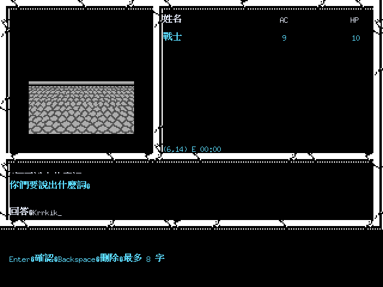

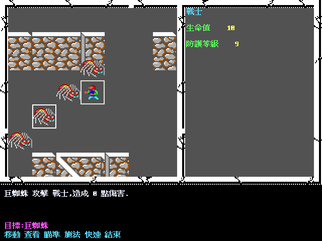

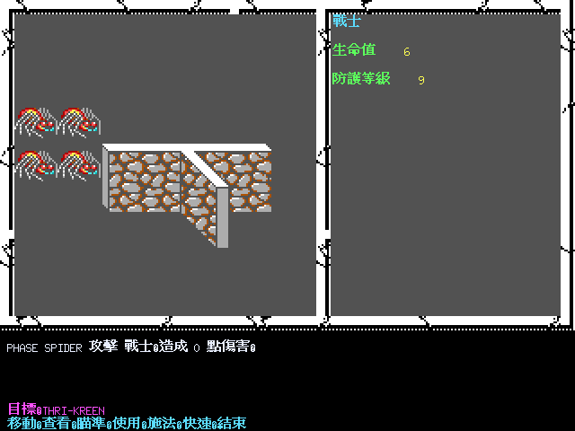

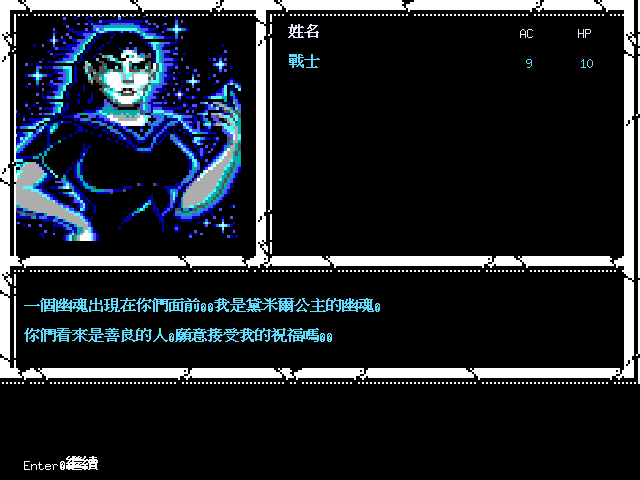

黛米爾之後的正常 GEO 路徑也已繼續接通：往北五步抵達 terrain `0x93`
時，十隻相位蜘蛛會從實心牆中湧出；勝利後再走四步，terrain `0x94`
會出現八隻發著幽光的相位蜘蛛。兩場均使用真實 `MON6CHA 0x41`、
原始 pause→combat→victory continuation，並分別以 `4CCD／4CCE`
防止重播。繁中敘事由 game-pack stable ID 驅動，完整證據見
[`spec 392`](docs/spec/392-burial-glen-phase-spider-walls.md)。

第三道防線 terrain `0x95` 也已接通：隊伍會在 `(14,10)` 遭遇六隻相位
蜘蛛，勝利後決定要「搜刮／放回墓穴／不予理會」牠們守護的骸骨。三條原始
ECL 分支均已驗證；搜刮會降低黛米爾好感並取得一顆寶石，放回墓穴則提高
好感。繁中事件文字與選項均來自 game pack，沒有在 Go 測試或 frontend
複製繁中顯示文案；測試中的英文片段只用來核對原始 ECL bytes。完整 bytes
與玩家路徑證據見
[`spec 393`](docs/spec/393-burial-glen-phase-spider-bone-pile.md)。

繼續深入後，terrain `0x8E／0x8F／0x90` 的螳螂人防線也已依正常 GEO
路徑接通。營地 `0x90` 會依前兩道防線的 `4CC8／4CC9` 決定是否再出現兩波
六人增援；不是寫死的三連戰。完整正常路徑會先擊敗十二人、六人，再進營地
擊敗十二人，最後取得 9500 gold、4 gems、6 jewelry 與一件隨機物品。
財寶介面現在會保留原 ECL 的繁中「你們收起了一些值錢物品」，完整證據見
[`spec 394`](docs/spec/394-burial-glen-thri-kreen-defense-waves.md)。

terrain `0x91／0x92` 的蜘蛛陵墓也已接入同一條玩家路徑。第一座陵墓有八隻
巨蛛；第二座會依黛米爾好感決定幽魂是否先警告。好感足夠時可選「否」安全
離開並稍後重返，選「是」才會看見蛛卵並迎戰四隻取得敵方命中 `+2` 的巨蛛。
繁中警告、YES／NO、旗標時序與低好感直接開戰分支均有原始 ECL 回歸，詳見
[`spec 395`](docs/spec/395-burial-glen-spider-mausoleums.md)。

西側精靈王庭的門口幽魂、魔法盔甲、十四名敵對守衛與王后獎勵也已接通。
友善王后會給 12 gems、8 jewelry 與六筆原始 ITEM6 物品；敵對結果則依
選擇給較少財寶或使高塔崩塌。完整好感門檻、四個盔甲選項與三個完成旗標見
[`spec 396`](docs/spec/396-burial-glen-elven-court.md)。

王庭並非章節出口。正常玩家現在可從王后所在地沿 19 步原始 GEO 路徑抵達
terrain `0x05` 的紅羽戰士，解鎖由原版手冊核對的繁中手札 33。答應同行會
觸發羅剎妖的兩次 `1d6+6` 箭擊，再迎戰六隻相位蜘蛛與一隻羅剎妖；勝利後
回到精靈骸骨處置選單。事件提示、三個決定與手札都由 game-pack JSON
驅動，詳見 [`spec 397`](docs/spec/397-burial-glen-red-plume-trap.md)。

同一路徑現在也會繞到 terrain `0x0C`，從無名人物口中解鎖經原版手札
印刷頁 23–24 核對的繁中手札 56。紅羽戰士戰後可正常走到 Burial Glen
東界，選擇「沿小徑／穿越樹林／回頭」；沿小徑會依 ECL register 進入
block `0x42` 的 `(0,12)`。terrain `0x07` 則確認是沒有完成旗標的可重複
蜘蛛／羅剎妖墓穴，未擅自改成一次性。完整證據與限制見
[`spec 398`](docs/spec/398-burial-glen-journal56-and-more-ruins-exit.md)。

外圍遺跡入口旁的 terrain `0x01` 也已接入同一條正常玩家路徑。玩家可聽
提爾雪雅講述羅剎妖賭局與倉庫作弊案，解鎖完整繁中手札 5，先攻打五隻
地獄犬與五隻石像鬼，再選擇與提爾雪雅並肩對抗貝爾哈的十二名隨從。
原 ECL 以固定 combatant index `8` 把第一隻羅剎妖設為臨時盟友；remake
現已修正成不受 active party 人數影響，也不會把怪物誤塞進永久 roster。
詳見 [`spec 399`](docs/spec/399-outer-ruins-tirsheya-alliance.md)。

結盟後可繼續沿原始 GEO 通道走進倉庫。`4CD1` 會讓已擊敗的入口守軍保持
清空；若未結盟，也可選擇不逃跑，直接迎戰六隻地獄犬與六隻石像鬼。倉庫
普通踏入只顯示物資堆，必須執行真正的「搜索」才會取得 9,500 金幣、
8 顆寶石、8 件珠寶與 ITEM6 `82h` 的兩件裝備；`4CD2` 保證財寶只能取得
一次。繁中敘事、原始旗標、邊界 transaction 修正與 Standing Stone 起始
玩家路徑見 [`spec 400`](docs/spec/400-outer-ruins-storehouse.md)。

同一條玩家路徑已繼續接通逃亡男子事件。玩家可救援他並迎戰六隻地獄犬，
從 `HEAD6／BODY6 40h` 的臨終對話得知東北廢墟藏寶；若袖手旁觀，仍可
選擇追擊犬群或留下屍骸。只有取得線索後在 terrain `06h` 主動搜索，
才會找到一枚 electrum、`+2` 護手、`+1` 腰帶與 `+5` 長劍；取得後無法
重複領取。零碎 electrum 的 100 copper 餘值也不再被整數 GP pool 丟棄。
詳見 [`spec 401`](docs/spec/401-outer-ruins-fugitive-cache.md)。

同一路徑現已再向神殿方向推進：terrain `07h` 會以原始
`HEAD6 43h／BODY6 46h` 顯示無名者的北方警告；terrain `08h` 則以小孩／
半身人作為誘餌。救援會先殺死一隻地獄犬，隨即遭屋頂石像鬼以 `2d8`
落石襲擊，再迎戰五隻地獄犬、五隻石像鬼與一隻羅剎妖。原 ECL 還會在
同 block 把隊伍移到 `(11,10,S)`，remake 現已在 `CALL 2E10h` 重繪前同步
座標，玩家可正常向南走到 terrain `09h` 的血跡灌木。拒絕救援、兩個
一次性旗標、繁中敘事與完整玩家路徑見
[`spec 402`](docs/spec/402-outer-ruins-nameless-brush-ambush.md)。

接著的羅剎妖居所可用高傲態度交涉，解鎖依原手札 PDF 翻譯的完整
手札 57；其他交涉態度會引發十六敵人戰鬥。石像鬼門廊陷阱則造成全隊
`3d10` 坍塌傷害，並只改寫 X 與方向，把隊伍推到 `(10,2,N)`；這促使
`CALL` adapter 正確支援「部分座標提交」，同時以 Filani 對話反例阻止
無方向的 scratch values 移動玩家。賭局房可迎戰八隻石像鬼與六隻羅剎妖，
勝利取得 11,200 gold、15 gems、9 jewelry 與一件 ITEM6 `81h` 隨機物品。
最後，下水道柵口會經兩次確認正式切換到 ECL／GEO `43h` 的昏暗廚房
`(15,15,N)`。十七段繁中、raw ECL 分支與 Standing Stone 起始玩家路徑見
[`spec 403`](docs/spec/403-outer-ruins-rakshasa-rooms-and-sewer.md)。

內部遺跡的合法玩家路徑已再延伸至 `(10,12)`。豪華臥房可選擇是否搜刮；
答應後取得 30,000 gold、12 gems 與 15 jewelry。廚房與辦公室的兩段繁中
也已資料化，但完整前置支線分別會由 block `42h` 與 `40h` 先寫入相同的
全域 `4C06／4C05` one-shot 位址，因此原作在這條路徑會讓兩段敘事靜默。
remake 忠實保留這個跨 block 旗標碰撞，不用自動清零掩蓋原始行為；raw
branch、writer 位址、GEO 路線與財寶見
[`spec 404`](docs/spec/404-inner-ruins-kitchen-office-bedroom.md)。

私人禮拜堂也已由同一條正常玩家路徑完成：一名大祭司與四名班恩祭司會
包圍隊伍，戰勝後可繼續走到 `(7,10)`。犬舍的十隻地獄犬與活動雕像房的
十隻石像鬼也已由 raw ECL 完整驗證並繁中化。第 405 輪當時仍停在
terrain `83h` 前；其原始怪物記錄與逐 pause 行為見
[`spec 405`](docs/spec/405-inner-ruins-kennel-statuary-chapel.md)。

目前 Standing Stone 起始正常玩家路徑已正式向南進入 terrain `83h`，完整
走過提朗瑟克斯控制枷印、無名者假扮祭司、三神器失而復得與臨終密語事件，
並從使用者提供的 Adventurer's Journal PDF 解鎖完整繁中手札 48。提朗瑟克斯
逃走後留下兩名大祭司、六隻地獄犬與六隻石像鬼；戰勝後 `4C00h=1`，相鄰
`84h／85h` 不再重播儀式。玩家隨後沿合法 GEO 路線完成西翼活動雕像與犬舍
兩戰，沒有 direct-entry 越過主線 gate。

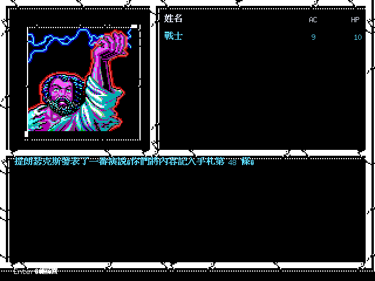

六個原版 PICTURE、十三段 ECL pause、十四人敵軍、羅剎妖協議旗標對照與
正常玩家路徑證據見
[`spec 407`](docs/spec/407-inner-ruins-final-ritual-west-wing.md)。

第 408 輪再由犬舍沿十五步合法 GEO 路線抵達樓梯，進入二樓 `(2,5,N)`，
再走十步抵達東北角 terrain `9Ah`。原始 ECL 證明真正終戰是 28 隻
MARGOYLE、提朗瑟克斯本人與 8 名 HIGH PRIEST，共 37 名敵人；正式 combat
scheduler 戰勝後，同一 ECL continuation 立即呼叫 `PROGRAM 8`，進入原版
勝利存檔選單。途中盟友已清除的 minion encounter 會留下真實零敵人
COMBAT，現在只在有完整 dungeon ECL session 證據時立即續跑，不會把其他
未知零敵人事件一律吞掉。房間、樓梯、旗標、完整路線與限制見
[`spec 408`](docs/spec/408-inner-ruins-upper-floor-final-battle.md)。

第 449 輪另以正常 block 初始化、原版樓梯 transaction 與上述十步路線建立
可重現終戰畫面。下圖啟用截圖專用的提朗瑟克斯觀察鏡頭，因此能直接看見
原始 37 人陣形；正式遊戲鏡頭仍依 RuleBook 跟隨目前主動角色。觀察鏡頭只
改變 renderer transform，沒有搬動敵軍、跳過 ECL 或改寫 AI。

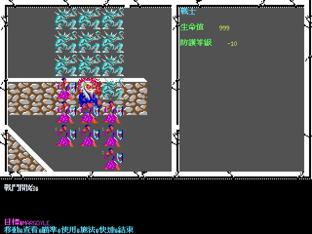

這表示 Standing Stone 起始的累積長回歸已完成迷斯卓諾章節與終戰 handoff；
它仍不是「全新角色從開場一路通關」的證據。提朗瑟克斯、祭司與石像鬼的
完整法術、特殊能力、AI、死亡動畫、音效及 DOS 動態演出也仍未完成。畫面
證據等級、預覽隊伍限制與鏡頭修正見
[`spec 449`](docs/spec/449-tyranthraxus-final-battle-camera-checkpoint.md)。

第 410／411 輪開始逐項還原這場終戰的真實怪物效果。PC-98
Borland 紀號、IDA 與 raw bytes 已證明 `MON*SPC` 天生能力不能被
raw byte 4 的零值停用；提朗瑟克斯的 `18h` 現會偵測隱形，`6Ah`
則以 15% 為基準，套用 `base+(11-施法者等級)×5` 後抵抗
Magic Missile。骰子順序是先擲傷害、再擲 d100；成功時傷害歸零，
但法術格與戰鬥 continuation 仍正常消耗／進行。第 412 輪已解出 36 段
TPOV resident entry／fixup，`6Ah → entry 100 → local 2404h` 因而升級為
`exact`。同一證據鏈也靜態關閉 `4Fh` 2d10 fire、`70h` 防火、`84h`
施放 Lightning Bolt 與 `87h` 防電；第 415 輪已接入怪物閃電 vertical slice，
但原版目標候選、終戰牆面反彈逐幀 oracle 與精確時間仍未完成。證據與限制見
[`spec 412`](docs/spec/412-pc98-tpov-entry-stubs-and-tyranthraxus-effects.md)。

第 413 輪已把其中 `70h` 防火與 `87h` 防電接入正常玩家的 Fireball／
Lightning Bolt 路徑。真實 MON6 提朗瑟克斯會保留 HP，visual timeline 仍
播放命中 transaction，並由正式繁中 JSON 顯示元素防護抵消次數。怪物
`84h` 閃電術 AI 及 saving throw／防護的原版 RNG 時序仍未完成；範圍見
[`spec 413`](docs/spec/413-tyranthraxus-fire-electric-protection-runtime.md)。

第 414 輪再由 PC-98 IDA／raw bytes 關閉 `4Fh` 的實際攻擊 caller：前兩個
物理攻擊槽命中且目標在物理傷害後仍存活，便對同一目標追加 `2d10`
Fire＋Magic。重製 runtime 分開保存武器傷害、火焰擲骰與實際傷害；即使
防火效果抵消傷害，兩顆 d10 仍會消耗，避免後續亂數漂移。真實 MON6
提朗瑟克斯與正式繁中訊息均有回歸；原版火焰動畫、音效與精確時間仍待
影片／DOSBox oracle。證據與限制見
[`spec 414`](docs/spec/414-pc98-post-hit-effect-4f-runtime.md)。

第 415 輪由 PC-98 overlay 9／22 證明 effect `84h` 在一般攻擊前的 type-14
階段執行，且只在原版 `ROUND < 4` 時施放 spell `33h`。初始目標格先獨立擲
`16d6` 並完成 Spell save，後續 range 10 直線／反射再擲另一份 `16d6`；不能
誤用玩家 Lightning Bolt 的單一共用傷害。重製排程已沿用資料化 COMSPR
Lightning timeline、真實地形 callback、元素防護與正式繁中 stable IDs。
Standing Stone 起始長路徑載入真正 MON6 提朗瑟克斯，終戰會排入怪物閃電
並仍完成 `PROGRAM 8`。原版 target range／LOS／tie order 與敵方逐幀影片
時間碼仍待補，詳見
[`spec 415`](docs/spec/415-pc98-monster-lightning-runtime.md)。

- 下水道 E2 `(8,15)` 已接通原版 boundary sentinel 與 `NEWECL 4`。正式流程會由
  ECL 自行調整到 GEO2 block 4 `(6,1,S)`，載入 `LOAD PIECES 1,2,4`，並顯示
  「你們進入了火刀據點」；不是 renderer 直接指定下一張地圖。
- ECL `LOAD PIECES` 保存三個 selector；可重用 engine 的 `graphics` package 解析
  indexed picture／WALLDEF／8X8D、global symbol offset 與 wall stamps，
  CoAB 只把 DAX blocks 轉成 `ID → bytes` 並由 JSON 指定資源檔名。
- 正式地城依 party facing 執行 Far／Mid／Near GEO traversal，按照 reference
  draw order 展開 8X8D stamps；16×16 wrap、牆壁碰撞、門狀態與 2× camera
  已接入。尚待收斂的是 door／roof 專用 overlay 與斜向視角的逐像素 DOS 比對。
- dungeon preview 方向鍵現在會依 GEO 雙側 wall collision（含 wrapped edge）移動 map position，Q/E 依 reference 八方向順序轉動 facing，並重建 floor／Far/Mid/Near wall view；正式 Area camera、scroll、movement cost 與 encounter 仍待完成。
- remake game save 自 version 4 起保存 dungeon `(x,y)`、八方向 facing 與
  reference map wall cache；version 6 再加入 ECL session／PRNG continuation。
  v1–v5 仍可載入並採各版本相容預設，F9／啟動載入後會重建 floor 與 wall
  view。完整 UI／戰鬥中途 frame save 尚未完成。
- dungeon preview 已依 Area1 `outdoor_sky_colour`／`indoor_sky_colour` 與 GEO roof high bit 選擇 reference EGA sky background，raw wall stamps 會疊在 sky layer 上；完整 roof geometry／door overlay 仍待完成。
- dungeon preview 會顯示目前 facing 的 reference `WallDoorFlags`／GEO `x3 detail` evidence；P/K/B action 已能解鎖雙側 GEO door，door symbol overlay 與完整 graphics 仍待完成。
- dungeon preview movement 已辨識 GEO detail `1` 的 unlocked doorway；detail `2/3` 會開啟 locked-door menu，並依 party capability 提供 Pick／Knock／Bash；完整 DOS 視窗樣式與劇情 entry 仍待完成。
- `CAMP → REST` 現在提供 `REST ADD SUBTRACT EXIT`，`REST_START` 依 reference 推進 slot-1 game time（每小時 60 分鐘），先處理 finite effect timeout，再每 24 小時不間斷休息自然恢復 1 HP；一級法術記憶會先檢查「4 小時最低準備 + 每個法術 15 分鐘」。地城休息已套用 ECL 設定的 period／percentage 遭遇檢查；完整高等級記憶時間仍待反組譯。
- `城市 → BAR` 現在可逐則閱讀前六則繁中 Tavern Tale，按 Enter 回到酒館再離開返回場所選單；買酒價格、城市條件與完整 ECL tale trigger 仍待反組譯。內容整理見 [`docs/manual/tavern-tales-zh-TW.md`](docs/manual/tavern-tales-zh-TW.md)。

執行遊戲需要原始素材與可顯示繁中的 TTF／OTF／TTC 字型。可用 `-font`
明確指定；未指定時會依 Linux、macOS、Windows 常見系統 CJK 字型路徑自動尋找：

```sh
go test ./...
go run ./cmd/azure-bonds -base-items
# 建議：倚天原生 16×15 明體，執行期水平加粗 1px
go run ./cmd/azure-bonds-game \
  -eten-font /home/anr2/cht/etan_font/stdfont.15

# 若已從 ET353S.iso 取出 SPCFONT.15，可讓全形標點也保持倚天字形
go run ./cmd/azure-bonds-game \
  -eten-font /home/anr2/cht/etan_font/stdfont.15 \
  -eten-symbol-font /path/to/SPCFONT.15

# 也保留一般 TrueType/OpenType fallback
go run ./cmd/azure-bonds-game -font /path/to/chinese-font.ttf
# 可重現正式序幕／Windlord's Inn 640×480 繁中 vertical slice
go run ./cmd/azure-bonds-game -font /path/to/chinese-font.ttf -opening
go run ./cmd/azure-bonds-game -font /path/to/chinese-font.ttf -inn
go run ./cmd/azure-bonds-game -font /path/to/chinese-font.ttf -filani
go run ./cmd/azure-bonds-game -font /path/to/chinese-font.ttf -weapon-shop
go run ./cmd/azure-bonds-game -font /path/to/chinese-font.ttf -temple
go run ./cmd/azure-bonds-game -font /path/to/chinese-font.ttf -training
go run ./cmd/azure-bonds-game -font /path/to/chinese-font.ttf -tavern
go run ./cmd/azure-bonds-game -font /path/to/chinese-font.ttf -high-priest
go run ./cmd/azure-bonds-game -font /path/to/chinese-font.ttf -carriage
go run ./cmd/azure-bonds-game -font /path/to/chinese-font.ttf -guildmaster
go run ./cmd/azure-bonds-game -font /path/to/chinese-font.ttf -sewers
go run ./cmd/azure-bonds-game -font /path/to/chinese-font.ttf -wizard-tower
# 直接載入原版 slot；F5／CAMP SAVE 會回寫該 slot
go run ./cmd/azure-bonds-game -font /path/to/chinese-font.ttf -savgam-dir /path/to/save -savgam-slot A
# 例：選擇原始 GEO3 block 0x10 作為目前 map preview
go run ./cmd/azure-bonds-game -font /path/to/chinese-font.ttf -geo-set 3 -geo-block 0x10
# 重新由本地原始 ZIP 產生 sprites 與 README 截圖
go run ./scripts
```

遊戲內快捷鍵：`Enter` 開始、`C` 建立角色、`J` 冒險手札、`T` 圖塊預覽、`G` GEO 預覽、`D` dungeon floor 預覽、`F5/F9` 儲存／載入 remake game。

第 421 輪依 PC-98 `GAME.OVR` 的非破壞性 IDA 報告，補上戰鬥的
`QUICK／GUARD／BANDAGE／SPEED` 命令狀態。Guard 會維持到角色下一次行動，
敵人進入鄰接格時依 TeamList 順序觸發一次反應攻擊；Bandage 只把第一名
`Dying` 隊員改為 `Unconscious` 並停止流血；Speed 保存原版 `0..9` 值，依
`speed+3` 比例調整動畫時間。快捷鍵 `Q` 交給電腦控制目前角色、空白鍵收回
可手動控制的我方角色，`D` 子選單新增 Guard、Bandage 與 Speed。原始位址、
bytes、推論等級及尚未接通的 `ALT+Q／ALT+M` 見
[`spec 421`](docs/spec/421-pc98-combat-quick-guard-bandage-speed.md)。這是命令
機制的垂直切片，並不代表完整戰鬥、敵方 AI 或逐幀畫面已還原。

第 422 輪進一步接通 `ALT+Q`：目前角色以原版 delay `20→19` 交給 AI，並
依 TeamList 將全體切成 Quick。自動戰鬥的每個攻擊仍經既有視覺時間軸交回
前端，因此播放中按空白鍵可在當前動作結束後收回玩家角色，不會一路同步跑到
戰鬥結束。IDA 另證明 `ALT+M` 旗標會 gate 玩家 Quick AI 的完整法術選擇器；
因候選優先序尚未還原，目前明確保留未實作，不提供只有文字、沒有真正作用的
假開關。證據與缺口見
[`spec 422`](docs/spec/422-pc98-combat-all-quick-interrupt.md)。

第 423 輪修正一項會污染後續法術與 AI 的基礎資料假設：PC-98 原始 spell
records 與 Quick consumer 證明角色存檔採全域法術 ID。牧師 Protection From
Good 是 `07h`，Magic Missile 是 `0Fh`，不是兩個職業共用 `7` 再由程式猜測。
camp 顯示、法術記憶與戰鬥分派現已一致；原始 bytes、位址、推論等級及仍未
開放的 ALT+M 邊界見 [`spec 423`](docs/spec/423-pc98-global-spell-id-namespace.md)。

第 424 輪正式接通 `ALT+M`：Quick AI 依原版 `1d7` priority tiers、每層三次
隨機已記憶 slot 搜尋，資料由 game-pack `combat_ai_spells` 提供。Magic Missile
`0Fh` 已在正常 Standing Stone→Myth Drannor→紅網玩家路徑由 ALT+M＋ALT+Q
施放、播放既有視覺並消耗 slot。非零 MinRange 的 area safety 與當輪尚未接通
的延遲施法明確 fail-closed；延遲 handoff 已由第 425 輪接續，因此這仍不是
完整法術 AI。證據見
[`spec 424`](docs/spec/424-pc98-alt-m-quick-magic-missile.md)。

第 425 輪接通非即時施法的同輪 action handoff：PC-98 原版將 raw
`CastingTime/3` 從目前 `Action.delay` 扣除（最低為 1），保存 spell ID，待
scheduler 再次選到角色才真正施法。Quick Bless 的 raw `10→3` 已接通，
Magic Missile 的 raw `1→0` 仍維持即時；其他法術、手動 CAST 與中斷規則仍
未完成。證據見
[`spec 425`](docs/spec/425-pc98-quick-bless-casting-delay.md)。

第 439 輪接通第一個 terrain-aware Sleep 手動玩家路徑：`Z` 選擇睡眠術
中心，方向鍵移動後 Enter 施法。目標順序來自目前戰場原始一基底 TD、65 筆
PC-98 TDEF、選定格中心與原版 `SCAN`，不是依距離自行猜測或以施法者為中心；
地形投影錯誤時不會消耗法術格。睡眠閃爍、音效、解除／存檔、Quick AI 與
PC-98 固定戰場動態仍未完成，故這是可玩的規則垂直切片，不是完整 Sleep／
完整戰鬥聲明。證據見
[`spec 439`](docs/spec/439-pc98-sleep-selected-cell-tactical-map.md)。

第 440 輪再由 PC-98 overlay 23 的 `PUTDAMAGE → REMOVEFX → SPELLOFF`
連續指令與 resident `DS:159Eh..15B1h` 原始表格證明：動態 Sleep `35h`
受到至少一點傷害會解除，零傷害不會。所有 combat 正傷害入口都經同一
`Battle.applyPositiveDamage`，現已接通這項醒來規則；duration 遞減、存讀檔、
文字、閃爍與音效仍待證明。證據見
[`spec 440`](docs/spec/440-pc98-sleep-damage-wake.md)。

第 441 輪關閉 Sleep 的正常到期：Borland `TIMEUNITS`、resident
`MAXCOUNT DS:6804h` 與 `CLOCK_` overlay 20 證明 `EFFECTREC+1` 是 duration
tick，turn／hour／day 等單位依 `10／6／24／30／12` 逐級換算；duration 零
不會到期。引擎新增 `combat/effecttime`，戰鬥每個新 round 扣一 tick；正常
level 3 手動 Sleep 從 15 tick 經 handoff 到 14，總第 15 tick 解除 held。
證據見 [`spec 441`](docs/spec/441-pc98-effect-duration-clock.md)。

第 442 輪接通 Sleep 的原版生命週期與呈現順序：effect `35h` 加入、受傷移除
及自然到期都經 `CLEARACTION`，且受傷喚醒不會重複消耗 pending spell slot。
成功入睡者依原版 target 順序各播放四格 `TWINKLE` 與 `SPELLHITFX`；魔抗者
不播放，醒來 callback 也沒有虛構文字／聲音。PC-98 `GAMESPEED=4` 的
delay-only 時間為每人 1,440ms。四格 24×6 幾何有 IDA bytes 證據，目前
palette／圖元仍標為 `layout-reconstructed`，待實機擷取升級。
證據見 [`spec 442`](docs/spec/442-pc98-sleep-action-clear-and-twinkle.md)。

第 443 輪將 remake JSON save 升至 version 7，首次可恢復 active combat：
完整 Fighter／effect／Action、stable TeamList、dynamic scheduler selection、
回合、持續區域、戰鬥修正、待處理中斷與戰鬥 PRNG continuation 都會保存。
正常手動 Sleep 在 TWINKLE 第一幀前存檔後，讀檔可完成相同 handoff，並在同一
第 15 tick 自然解除；另一分支由正傷害喚醒且不重複消耗法術格。尚未擁有
第 443 輪當時因 renderer elapsed 未歸 State 而讓 mid-animation save
fail-closed；此限制已由第 446 輪解除。證據見
[`spec 443`](docs/spec/443-active-combat-save-sleep-continuation.md) 與
[`spec 446`](docs/spec/446-mid-visual-combat-save-resume.md)。

第 447 輪將 remake JSON save 升至 v8，保存 stable BGM track ID、七聲道音序列
machine、YM2203 FM／SSG phase、resampler remainder、Timer B、800ms pre-roll及
pending PCM。Ebiten 的實際 audible frame與 decoder 預讀點之間的 PCM 也會由
bounded history補回，所以載入從第一個尚未聽見的 sample續跑，不是從曲首重播。
engine `f06493f` 提供作品中立 ymfm／resampler snapshot。本機完整 MSCDRV 缺失，
十二首真實曲目的 save/load runtime oracle 仍待補。
證據見 [`spec 447`](docs/spec/447-pc98-bgm-sample-continuation-save.md)。

第 448 輪再把 remake JSON save 升至 v9：仍在播放的 DOS WAV 與 PC-98
software-speaker 短音效，會保存 backend、stable selector／event、音效啟用狀態
及 44,100 Hz audible sample frame。多個不同音效可同時從原位置續跑；自然結束、
停用與舊版未保存的音效不會復活，backend／asset／seek 不一致則先停止舊聲音並
失敗即關閉。這是 remake player 的續跑能力，不是原版 SAVGAM audio 格式聲明。
證據見 [`spec 448`](docs/spec/448-active-one-shot-sample-continuation-save.md)。

第 444 輪把 save v7 接入真實 campaign：從 Standing Stone 世界旅行至
Myth Drannor，沿 GEO6 合法路徑經精靈幽魂與紅網字串輸入，在四蜘蛛第一戰的
正常 party-turn 邊界存檔。全新 State 由玩家自備 ECL／MON／ITEM 資料載入後，
Battle 與 ECL session snapshot 完全相同；後續只用 loaded state 完成蜘蛛戰、
羅剎妖第二戰、繁中事件、`4CBF=1` 與地城返回。測試英雄高數值只用於縮短
長路徑，不冒充原版 encounter balance 已完成。
證據見 [`spec 444`](docs/spec/444-red-web-campaign-combat-save-continuation.md)。

第 445 輪再驗證混合陣營存檔：outer ruins 提爾雪雅事件選擇攻擊貝爾哈後，
原 ECL 將一隻羅剎妖設為 party-side `QuickFight／TemporaryAlly`，對抗 12 名
敵人。第二戰開局 save v7、全新 State 載入後，Battle／ECL 與臨時盟友逐欄
相同，永久 roster 仍只有英雄；loaded state 戰勝並寫 `4CD1=1` 後，runtime
party 與 roster 都沒有盟友污染。證據見
[`spec 445`](docs/spec/445-tirsheya-temporary-ally-combat-save.md)。

第 446 輪解除 save v7 的戰鬥動畫中段限制：visual elapsed 改由 State 保存，
Ebiten 載入後以保存位置加上新的縮放時鐘續跑，第一幀不再重置。Sleep
`TWINKLE` 700ms 與一擊致死弓箭 death frame 都能同幀 round-trip；已送出的
CAST／SPELLHIT 或 ARROW／HIT／DEAD 不會在載入、同幀重入或 handoff 重播。
損壞的超時 elapsed、越界 phase marker 會失敗即關閉。播放器 PCM sample
offset 已由 spec 447／448 分別補上 BGM 與 active one-shot，但實體裝置 loopback
及原版 SAVGAM audio仍未完成，不能冒稱所有音訊輸出 cycle-perfect。證據見
[`spec 446`](docs/spec/446-mid-visual-combat-save-resume.md)。

## 尚未完成

完整 ECL opcode／routine、三城市各自的副本與城鎮 floor／tile mapping、完整場所與劇情、AD&D 全規則、音效音樂，以及原版 DOS save/import 仍在反組譯與實作中。戰鬥小人素材、CHEAD/CBODY party icon、SPRIT frame timing 與 frame offset 已接入目前 Ebiten combat slice，但方向-specific placement、八方向 placement 與完整戰鬥 UI 仍未完成；設定 `Area.InDungeon` 後，ECL `LOAD FILES` 能驅動 GEO map preview。現有 remake save 已能恢復已實作的 game state，現在也包含 dungeon preview 位置／方向；`SAVGAM?.DAT` 已有 prefix、slot load、已知 player-field writeback 與縮編 stale-file cleanup，但未知欄位／多職業與完整原版 player serialization 仍未完成。

眼魔洞窟主線現已可完成德克薩姆／散提爾堡部隊雙戰，並由原版 boundary
terrain `0x93` 播放奧莉芙、迪姆斯沃特與遠方騎士的離場事件，最後切回
ECL `0x51` 的暗影谷世界選單。戰鬥規則不等於視覺完成：目前弓箭飛行、
Magic Missile 施放／命中、一般受擊與逐動作敵方回合仍待 spec 354 的共用
Combat Action Timeline 實作。

目前地城 preview 已提供 locked-door menu，以及 P 撬鎖、K Knock、B 撞門：依 detail 2/3 與隊伍能力過濾選項，成功後對 GEO 門雙側解鎖；完整 DOS 視窗樣式、door graphics 與從劇情抵達門的流程仍未完成。

更多證據與規格請見 [`CONTEXT.md`](CONTEXT.md)、[`docs/spec/`](docs/spec/)、[`docs/manual/`](docs/manual/)、[`docs/knowledge/`](docs/knowledge/)；可跨 Gold Box 沿用的 ECL 指令集整理見 [`gold-box-ecl-command-set.md`](docs/knowledge/gold-box-ecl-command-set.md)，存檔欄位與年齡修改邊界見 [`gold-box-save-format.md`](docs/knowledge/gold-box-save-format.md)，remake session transaction 見 [`gold-box-remake-save-session.md`](docs/knowledge/gold-box-remake-save-session.md)，以及 [`docs/history.md`](docs/history.md)。
