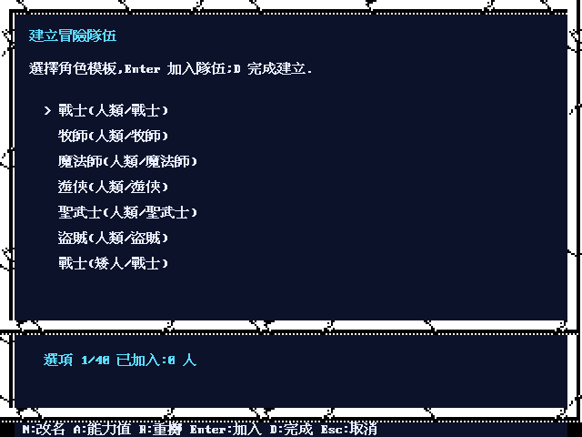

# 《青色枷的詛咒》繁體中文化／Remake

這是 SSI《Curse of the Azure Bonds》的資料驅動重製專案。目標是讓玩家以繁體
中文從開場遊玩到結局；目前仍是可執行的多垂直切片 prototype，尚未宣稱完整
通關或完整還原原版。

本 repo 負責 CoAB 的 game pack、翻譯、原始素材轉換、攻略與整合測試；可重用的
ECL／DAX／GEO／戰鬥／存檔引擎位於獨立的
[golden-box-remake-engine](https://github.com/wicanr2/golden-box-remake-engine)。
劇情、座標、物品與翻譯資料不寫死在共用 engine。

## 目前可以看到什麼

已接通的正常玩家路徑包含提爾佛頓開場、城市設施、城門／盜賊公會、下水道前段、
火刀戰後的 Myth Drannor handoff，以及部分 Burial Glen／外圍遺跡／眼魔洞窟戰鬥。
地城移動、ECL continuation、繁中手札、資料驅動選項、戰鬥效果與 640×480 原版
風格畫面已有多個可重播切片；角色建立現在也使用原版裂紋石框與倚天粗體 16×15
密度；本輪並將 12 個既有玩家戰鬥法術的 CAST 入口、目標
模式、施法時間與訊息 ID 接到 engine＋JSON；路徑仍會在後續區域遇到未完成的功能。

最新完成度與驗證邊界請看
[專案成果盤點](docs/project-status.md)。第 531 輪完成角色建立的原版石框／中文字級
版面基線；第 532 輪將開場、荒野、讀檔、紮營返回與世界地圖預覽的選項顯示統一
交給 game-pack `option_rules` 與 engine resolver，測試以 stable ID 取得期望值；
第 533 輪以 P0-2 raw audit 補出 PC-98 `MOVEPARTY` 的前置 gate、B／P／K helper
與四個 set-writer caller；第 534 輪再由中文說明書確認 `Move characters where?`
是《光芒之池》／《青色枷的詛咒》／《幽城寶藏》之間的角色轉移，不是秘密門；
第 535 輪又以攻略核對 `(13,10)` 騎士事件與 E2 火刀據點出口，將
`(13,10)→(8,15)` 的工作方向改成外部地圖邊界轉場；第 536 輪以原始 GEO2 block 3
重生出中間 `wall=09/detail=0` 的唯一候選橋接，並核對手冊確認原版 `SEARCH` 是
持續開關、`LOOK` 才是單次搜尋；第 537 輪已把兩者分離接到 engine＋JSON，並由
正常玩家路徑通過 wall=09、E2、火刀 E1 回下水道，另驗證首領勝利後世界地圖
與 save/load 重訪的固定首領 fixture。wall writer 與 E1 座標仍以 `strong inference` 標示；
第 529 輪完成玩家戰鬥法術的資料契約，
不把法術名稱或劇情塞回 Go。詳細證據見[第 534 輪規格](docs/spec/534-chinese-manual-moveparty-character-transfer.md)、
[第 533 輪規格](docs/spec/533-pc98-moveparty-helper-gate.md)、
[第 532 輪規格](docs/spec/532-option-rule-localization-boundary.md)、
[第 531 輪規格](docs/spec/531-character-creation-original-frame-density.md)、
[第 537 輪規格](docs/spec/537-search-look-e2-fire-knife-normal-route.md)、
[第 536 輪規格](docs/spec/536-tilverton-sewers-e2-search-route.md)、
[第 535 輪規格](docs/spec/535-walkthrough-tilverton-sewers-e2-boundary.md)、
[第 529 輪規格](docs/spec/529-combat-player-spell-data-contract.md)、
[第 528 輪規格](docs/spec/528-pc98-moveparty-action-transaction-boundary.md)、
[第 527 輪規格](docs/spec/527-pc98-moveparty-action-writer-boundary.md)與
[反組譯工作清單](docs/knowledge/golden-box-reverse-engineering-worklist.md)。

第 540 輪完成原始 ECL1–6 的 25 block／125 entry parser／控制流稽核、16 個原始
GEO block 的 game-pack identity 宣告，並接上 ECL 戰鬥開始／隊伍全滅的 semantic
音效 intent。這些是資料覆蓋與生命週期基線，不等於完整 ECL、全地圖、完整戰鬥或
原機音效完成。第 538 輪再由同一個正常開場 session 逐格走完 E2 block 4 到火刀首領戰前；第 539
輪修正以倚天字形實際字寬換行／裁切造成的中文溢框，並用 Docker／Xvfb 重新產生
下方代表畫面。這些畫面證明目前版面的可用性與原版風格基線，不代表整作已通關或
所有戰鬥／地圖狀態已逐像素還原；請以[工作清單](WORKLIST.md)的未完成項目為準。
規格見[第 540 輪 ECL／GEO／音效邊界](docs/spec/540-ecl-map-combat-audio-corpus-closure.md)、
[火刀正常路徑](docs/spec/538-fire-knife-normal-leader-route.md)與[中文 GUI 寬度契約](docs/spec/539-cjk-gui-width-clipping.md)。

第 541 輪完成 ECL 外部 routine 的 engine／CoAB adapter 分層：共用 engine 保留
有序 `CALL`／`NEWECL`／`PROGRAM` boundary、資源 selector 與 typed side-effect
request，但沒有把 CoAB 的 `0x2E10`、`0xC01E`、`0xB200` 地址語意硬編成跨作品
規則。同輪以原始 ECL1–ECL6 執行 `moonsea.overland` 全部 14 個世界點位的
arrival entry，並驗證從 Tilverton 可達 JSON directed adjacency 全部節點；這是
世界路網／抵達基線，不是所有城市事件、地城房間或整作通關。詳見[第 541 輪規格](docs/spec/541-ecl-external-routine-engine-boundary.md)。

E2 路徑的唯讀 GEO 稽核工具為
[`tilverton_e2_route_audit.py`](scripts/research/tilverton_e2_route_audit.py)；它只列出
原始 record 的普通圖與 `wall=09` 候選圖，不會把未證實的秘密門語意寫入遊戲。

## 畫面預覽

以下是目前 remake 的代表性畫面。2026-08-12 已在 Docker/Xvfb 重新產生、逐張檢視
並替換舊圖；石框／88×88 場景是原始素材證據，640×480 中文延伸與完整戰鬥畫面仍是
`layout-reconstructed`，不能據此宣稱整作完成。細節與畫面雜湊見
[第 549 輪規格](docs/spec/549-dos-character-creation-and-screenshot-polish.md)。

更多地圖、人物舞台、戰鬥時間軸與素材圖在[截圖目錄](docs/screenshots/)；原版忠實
theme 與日後美化 theme 分開維護。

## 玩家文件

- [繁體中文攻略入口](docs/guide/README.md)：目前可玩的主線、分區攻略與無雷提示。
- [繁中遊玩手冊](docs/manual/curse-of-the-azure-bonds-zh-TW.md)：按鍵、戰鬥、紮營、
  手札與遊玩說明。
- [給中文玩家的 Gold Box 重製說明](docs/knowledge/golden-box-remake-for-chinese-readers.md)：
  將原本需要查紙本手冊的資訊整合到遊戲內與文件中。

## 開發與研究文件

- [目前工作清單](WORKLIST.md)：compact 後的第一入口，列出已完成基線、剩餘工作、
  反組譯範圍與完成門檻。
- [專案狀態](docs/project-status.md)：目前已完成、未完成與驗證方式。
- [正常玩家路徑](docs/knowledge/golden-box-normal-player-path.md)：只記錄真正由輸入
  抵達的路徑；座標輔助會明確標示。
- [Gold Box engine 知識庫](docs/knowledge/)：ECL、圖像、戰鬥、音訊、存檔與 UI
  的可重用知識。
- [反組譯工作清單](docs/knowledge/golden-box-reverse-engineering-worklist.md)：
  只追查會改變遊戲可玩結果的資料流，不逐行翻譯無關函式。
- [格式規格索引](docs/spec/README.md)：每份規格都標示 `READY`／`DRAFT`、證據與
  `exact`／`strong inference`／`hypothesis`／`unknown` 邊界。
- [歷輪 README 報告](README-history.md)：保留原本的長篇里程碑與研究紀錄，僅作
  歷史查閱，不作目前狀態的權威來源。

## 執行原則

1. 先讓正常玩家路徑可走，再補 fidelity 與非必要的深層逆向。
2. 遊戲文字、選項、物品與事件由 CoAB JSON／locale 提供；Go／engine 保留可重用
   機制，不複製劇情常數。
3. 反組譯只做到支撐一項可玩功能所需的最小證據；原始位址、bytes、位址空間與
   推論等級都保留，沒有玩家影響的 function 不列入深挖範圍。
4. 每個重大、可展示的里程碑才集中 commit／push；兩個 repository 分開提交。

## 目前明確未完成

完整 ECL／外部 routine、開場到結局的所有正常路徑、全地圖、完整 AD&D 規則、
戰鬥 AI 與所有法術演出、音樂音效、完整原版存檔、全量繁中校對，以及 Windows／
Linux／macOS 發行包仍未完成。因此目前不製作正式三平台 release 或宣傳片，待可玩
整合達到驗收門檻後再安排。

原始遊戲、手冊、圖片與音樂的權利仍屬各自權利人；本專案保存研究證據與新撰寫的
繁中資料，不重新散布未授權的原始遊戲映像。
