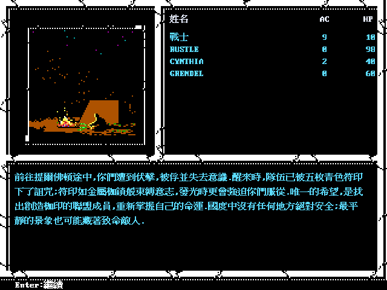
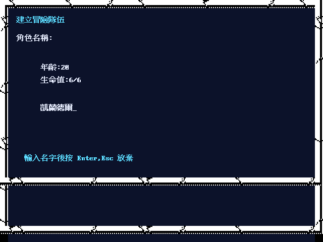

# 《青色枷的詛咒》繁體中文化／Remake

SSI《Curse of the Azure Bonds》的資料驅動重製專案。目標是讓玩家以繁體中文從
開場玩到結局。**主線已經從開場走到結局**（同一條 session 的端到端測試，見下表）；
⚠ 那是規則層走完，**不等於拿鍵盤從頭玩到結局**——輸入層推得動主線的每一個
檢查點，一條連續的按鍵路線目前走到巫師塔：提爾佛頓 → 盜賊公會 → 下水道 →
火刀據點 → 世界地圖 → 哈普村 → 古熔岩洞 → 巫師塔（ECL 段 `0x01`、`0x02`、`0x03`、
`0x04`、`0x50`、`0x31`、`0x32`、`0x33`），246 格、200 句話、0 句落回原文
（[spec 1197](docs/spec/1197-keyboard-playthrough-door-and-route-replay.md)）。

本 repo 負責 CoAB 的 game pack、翻譯、原始素材轉換、攻略與整合測試；可重用的
ECL／DAX／GEO／戰鬥／存檔引擎在獨立的
[golden-box-remake-engine](https://github.com/wicanr2/golden-box-remake-engine)。
劇情、座標、物品與翻譯資料不寫死在共用 engine。

## 目前狀態（2026-08-24 實測）

| | |
|---|---|
| 反組譯覆蓋 | 2,874 個函式全部進台帳，**待解讀 0**（已解讀 2,137／不阻塞 162／邊界碎片 575）|
| 規格 | 1,180 份 `docs/spec/*.md`，各自標證據等級與「明確不宣稱」邊界 |
| 程式 | 471 個 `.go`／133,595 行；`internal/game` 沒有區域或劇情專屬檔 |
| ECL 文字 | 控制流可達 1,022 頁，**未接上 0** |
| ECL 副作用 | 可達 14,177 條指令，**只讀掉運算元 0**、部分完成 **168**（opcode：`done` 60／`partial` 1）|
| 戰鬥法術 | 可宣告 **73／73** 全部有 handler、視覺與音效 |
| 命中判定 | 與原作同一式：FIRE KNIFE 自己打自己，原作與 remake 都要 **d20 ≥ 18** |
| 第一人稱畫面 | 17 張地圖、**1,474 張**與原版逐格比對：1,461 張完全相同；剩下 13 張的成因已找到並修好，連同修法一度弄壞的 29 張共 42 張逐張重驗 0 格 |
| 全滅 | 隊伍全倒會**結束遊戲**、落到全滅畫面再回標題，與原作的 `DS:4FC7h` 同一個結局 |
| 存檔 | 角色記錄 422 bytes：decoded 299／documented 123／**unknown 0** |
| UI 詞條 | game pack `zh-TW` 1,588 條、`assets/locale/zh-TW.json` 1,144 條 |
| **主線** | **開場到結局同一條 session 跑得完**，拆成 23 個段 subtest，每段結束的快照都存得下去讀得回來 |
| 主線分段 | 25 段全部可直入（`-segment ECL{成員}/0x{block}`）；47 條 `NEWECL` 邊逐條交接；段入口有中文劇情 22／不出文字 3 |
| 戰利品 | `1Ch CLEARMONSTERS` 連同**還沒領走的戰利品**一起丟掉（spec 1145）；corpus 唯一走得到那條路的是提爾佛頓火刀首領的重打迴圈，少了它重打一次就多領一次 |
| 遭遇距離 | `0Ch` 擺距離、`0Dh APPROACH` 走近、`29h` 重設（spec 1146）。⚠ `APPROACH` 的減一是**演出**——`29h` 進門會把它蓋回去 |
| 遭遇選單 | `29h` 的三句旁白依**距離**挑（spec 1144）：20 處逐句對過譯文，玩家演得到的 20 句**全部接上**（`cmd/ecl-encounter-text`）。⚠ 距離本身還是拿上限近似——原作由地圖座標算 |
| 段內支線 | 全遊戲對照表 **328 個場景對到格子**（`cmd/ecl-cell-events`，17 個有地形分派的 block）；逐格實測 **288 個分派索引**（`cmd/cell-sweep`），**276 格中文、落回原文 0 格**，12 格沒演出來全部歸得了因（四種盤點限制，還沒歸類 0）|
| 世界地圖 | 路段編號 `4C9D ＝ 出發地 × 4 ＋ 方向`（spec 1143）；從 13 個地點各掃一次、**762 個分支**，敘述與選項**落回原文 0 條**（`cmd/route-sweep`）|
| 跨段不變量 | 經驗值不倒退、隊伍變動位置宣告好；**裝備／記憶法術／效果**在 23 個段界存下去讀得回來且沒有變動（`SEG-31`）；選曲逐格對回 PC-98 原作的 selector 表（`SEG-33`，spec 355）|
| 怪物資料 | `MON*ITM` 的物品鏈已進 `Fighter.MonsterItems`（六章 44 個區塊全部帶物品）；⚠ 怪物換裝的規則側卡在「換武器之後傷害怎麼算」——13 隻的記錄傷害與武器都非 0 卻不一樣（spec 1120）|
| 手札 | locale 宣告 **64 則**，全部由 48 條內容規則的 `journal_message_ids` 解鎖；⚠ 手札 59 的地圖 renderer 未做 |
| `24h COMBAT` | 199 處逐處分類：**153 處真的要打、46 處走服務分派**（`cmd/ecl-combat-sites`）|
| 跨段不變量 | 整條主線 260 句話**落回原文 0 句**；同一角色的經驗不倒退、隊伍變動位置宣告好；22 個段界都有曲子 |
| 走訪可達性 | 288 個分派索引裡**走得到 287**（走路的上限也是 287）；沒達成的 1 格是幾何上斷開，而逐格實測站上去演得出來 |
| 地圖圖集 | 18 張第一人稱地圖逐張畫成「事件在哪一格、從哪幾格離開」（`cmd/map-atlas`，`docs/reference/maps/`）；宣告的出口逐個對回 GEO 的移動遮罩 |
| 全套測試 | `./tools/go.sh test ./...` 全綠 |

### 已接通的正常玩家路徑

同一個新遊戲 session 可從開場一路打到結局：提爾佛頓開場 → 城市設施 →
城門／盜賊公會 → 下水道 → 火刀據點至首領 → 戰後世界地圖 → 阿沙本福德 →
立石群 → 艾森布拉城外 → Hap／熔岩洞／巫師塔 → 散提爾堡 →
眼魔洞穴（手札 59、Dexam 雙戰）→ 猶拉什 → 希爾斯法 → 立石群的灰袍男子 →
密斯卓諾墓園（紅網、黛米爾公主）→ 外城遺跡 → 內城遺跡 → 儀式與爪牙戰 →
二樓東北角 → **擊敗提朗瑟克斯的結局選單**。

路徑之後的區域仍會遇到未完成的功能。

### 角色建立

原版的四段選單（種族 → 性別 → 職業 → 陣營）已完整重現，資料全部取自原作
資料段並轉成 JSON：

- 六個可選種族——原作的顯示迴圈沒有收半獸人的分支，所以建角選不到它，
  但編號仍維持原作的 1..7 不重新連號。
- 職業選項由種族查表；陣營選項再由職業組合查表（聖騎士只有守序善、
  遊俠只有三個善）。
- 屬性擲點是 `3d6 + 1`、每個屬性擲六次取最大，加上七個種族各自的屬性調整。
- 多職角色的 HP 是八個職業槽各擲一次生命骰、逐槽體質加值後除以職業數。
- 名字支援中文（退格按字元不按位元組），`Save <名字>?` 答 `N` 角色不留。

另有一套範本流程供快速開局，兩者並存。

## 畫面預覽

以下是目前 remake 的代表畫面，皆在 Docker／Xvfb 產生並逐張檢視。石框與 88×88
場景是原始素材證據；640×480 的中文延伸與完整戰鬥畫面仍是 `layout-reconstructed`，
不能據此宣稱整作完成。







### 法術演出的四種通道

原作不是「一支法術一套圖」。下面每一格都是從遊戲檔案直接取出來的原始素材，
由左到右是四種通道：


| 通道 | 圖 | 說明 |
|---|---|---|
| 共用施法投射物 | `COMSPR 05`／`85` | 在分派到各支 handler **之前**就播，所以每一支法術都有 |
| 閃電電弧 | `COMSPR 06`／`86` | 沿線逐格播，全表唯一 |
| 魔法傷害命中 | `COMSPR 0A`／`8A` | 對每個受傷的目標各播一次 |
| 持續區域格 | `RANDCOM 04`（綠＝惡臭之雲）／`02`（藍白＝致命毒雲）| 寫進地圖格，效果活著就一直畫 |
| 產生器／投射物 | `COMSPR 09`（睡眠）／`00`（弓箭）| 睡眠由參數合成；弓箭有八個方向 |

判讀見 [spec 1126](docs/spec/1126-spell-visual-slots.md) 與
[spec 1128](docs/spec/1128-cloud-areas-are-the-obstacle-terrain.md)。
兩種雲同時是戰術地圖的**障礙格**（地形碼 `1Eh`／`1Ch`）——低階角色繞開毒雲、
七級以上的老手硬闖。

這五張的產生指令與雜湊在
[`docs/screenshots/manifest.json`](docs/screenshots/manifest.json)，由
`cmd/screenshot-audit` 驗；近期修掉的圖層對齊錯誤見
[spec 1130](docs/spec/1130-screenshot-layer-alignment.md)，第一人稱牆面的
第 0 段符號與洋紅透明鍵見 [spec 1131](docs/spec/1131-wall-symbol-group-zero.md)。

第一人稱那一張是**與原版逐格比對過的**：同一格、同一個朝向，把原版 DOS 版
在 DOSBox 裡跑出來的畫面與 remake 的畫面各取 88×88 可見區，EGA 量化之後比
16 色索引。全作 17 張地圖共 1,474 張畫面比完，1,461 張逐格完全相同。原版擷取與
索引收在 [`docs/reference/original-dos/first-person/`](docs/reference/original-dos/first-person/)，
重跑比對是一行 `python3 tools/fp-oracle-compare.py …/index.tsv`；
方法與剩下那一格見 [spec 1134](docs/spec/1134-original-first-person-oracle.md)。

更多地圖、人物舞台、戰鬥時間軸與素材圖在[截圖目錄](docs/screenshots/)；原版忠實
theme 與日後美化 theme 分開維護。

## 從乾淨 clone 開始建置

可重用的 engine 是**獨立的私有 repo**，而 `golden-box-remake-engine/` 與
`workplace/` 都不在本 repo 的版控裡，所以剛 clone 完要先把相依準備好：

```sh
git clone https://github.com/wicanr2/Curse-of-the-Azure-Bonds-cht.git
cd Curse-of-the-Azure-Bonds-cht
tools/engine-bootstrap.sh      # clone／fetch engine，打包 go.mod 鎖的那個 commit
tools/go.sh test ./...         # 全套測試，Go 工具鏈跑在 docker 裡
```

`tools/engine-bootstrap.sh` 只認 `go.mod` 鎖住的版本，不動 engine 的工作區。
編譯一律走 docker（`tools/go.sh`），主機不需要裝 Go。

## 玩家文件

- [繁體中文攻略入口](docs/guide/README.md)：目前可玩的主線、分區攻略與無雷提示。
- [繁中遊玩手冊](docs/manual/curse-of-the-azure-bonds-zh-TW.md)：按鍵、戰鬥、紮營、
  手札與遊玩說明。
- [給中文玩家的 Gold Box 重製說明](docs/knowledge/golden-box-remake-for-chinese-readers.md)：
  把原本需要查紙本手冊的資訊整合進遊戲與文件。

## 開發與研究文件

- [`AGENTS.md`](AGENTS.md)：**工作規則的單一入口**（完成定義、證據標準、Git 紀律、
  驗證門檻、compact 恢復流程）。
- [剩餘工作盤點](docs/knowledge/coab-remake-todo.md)：逐項可執行的 TODO，
  含現況實測數字與建議順序。
- [共用 engine 抽取盤點](docs/knowledge/engine-extraction-review.md)：`internal/combat`
  逐檔對「作品中立」界線比一次，標出該搬、要參數化、以及不該搬的部分。
- [完整度矩陣](docs/knowledge/coab-re-coverage-matrix.md)：全遊戲 RE／重建完整度的
  單一權威矩陣（`R1` 原始定位 → `R5` 玩家驗證）。
- [`WORKLIST.md`](WORKLIST.md)：反組譯盤點階段的執行順序。
- [`CONTEXT.md`](CONTEXT.md)：現況與已被推翻的斷言；歷史分冊在 [`docs/context/`](docs/context/)。
- [格式規格索引](docs/spec/README.md)：每份規格標示 `READY`／`DRAFT`、證據與
  `exact`／`strong inference`／`hypothesis`／`unknown` 邊界。
- [歷輪 README 報告](README-history.md)：長篇里程碑與研究紀錄，僅供歷史查閱，
  **不是目前狀態的權威來源**。

## 執行原則

1. 先讓正常玩家路徑可走，再補 fidelity。
2. 遊戲文字、選項、物品、事件與原版資料表由 CoAB JSON／locale 提供；
   Go／engine 只保留可重用機制，不複製劇情常數，也不 hardcode 原版資料表。
3. **先盤點後語意**（2026-08-13 起）：兩平台全模組先建庫盤點，每個函式都要進
   覆蓋台帳，再依玩家可見性排序做語意閉合。不再「遇到問題才反組譯那一段」。
   口徑見 [`AGENTS.md`](AGENTS.md) §2.5。
4. 每份結論都要能回指到哪個模組、哪個位址、哪幾個 byte；IDA／decompiler 的輸出
   本身不是證明。規格要寫明「明確不宣稱」的邊界。
5. 驗收採分段：每段用 `-segment <id>` 直接進入（`-segment list` 列出全部），
   但每段都要走到該段的正常結束狀態，而且**段與段之間的狀態交接本身也要
   列成一段驗**。
6. 每個重大、可展示的里程碑才集中 commit／push；兩個 repository 分開提交。

## 目前明確未完成

- **主線的段內支線**：開場到結局同一條 session 已經跑得完
  （`TestRealNewGameRunsToTheEnding`，23 個段 subtest），但**段內的支線還沒走完**
  ——墓園的盜墓者、內城的臥房／辦公室／廚房／犬舍／雕像室／禮拜堂、外城的
  下水道口在主線的段界快照上已經逐格取樣過（9 段、123 格、落回原文 0 格），
  剩下的是把它們接進主線的正常路線。驗證方式是**分段**：一個 ECL block 一段、一條 `NEWECL` 邊
  一段交接，計畫見
  [`docs/plan/mainline-segmented-verification.md`](docs/plan/mainline-segmented-verification.md)。
  轉移機制已查清（spec 1141）：25 個 block、47 條出邊。25 段都能用
  `-segment <id>` 直接進入，逐段一條測試；段的邊界狀態存得下去讀得回來，
  47 條 `NEWECL` 邊也逐條有交接測試。接線的現況量過了：22 段的入口有中文劇情、
  3 段的入口不出文字（是被別段帶進來的段落）、**沒有一段落回原文**。
- **戰鬥回合生命週期**：回合開始那一段已收完（spec 1135／1136）——先攻算式、
  選誰動、DELAY／GUARD／QUICK、定身與機會攻擊都與原作相符，突襲遮罩判定為死碼。
  面向、動作計數與累計轉向三個欄位也接上了（spec 1138），背後攻擊的三道條件
  是字面移植，第二個 AC 的算式已解出並拿 81 筆 `MON*CHA` 驗過（spec 1000 §七）。
  離開接觸的機會攻擊接上了 180° 面向閘（spec 1002／1010），
  AC 與命中的刻度也與原作對齊（spec 1139）。
  離開接觸的機會攻擊四道閘全部解讀並接上（spec 1010），隊員的命中與 AC
  也改吃原作的職業／等級表與力量／敏捷調整表（spec 1140／694／697）——
  整條派生鏈用原版存檔逐項驗過，五個欄位全中。
  **剩下的**：原作 `+09h` 的幾何意義刻意留白（兩個寫入端互相矛盾），
  以及 ECL 的 `24h COMBAT` 那 199 處仍只做了分派。
  （法術那一半已經收斂：可宣告 73 支全部有 handler、視覺與音效。）
- **ECL 剩 1 個部分完成 opcode**，共 168 條指令（`CALL`）。
  下面這段是逐支收斂的過程紀錄，保留是因為每一支的證據位址還用得到：
  `PRINT RETURN`、`TREASURE`、`DAMAGE` 等。`PROGRAM` 已經收掉（spec 1154）：
  打通關現在看得到原作那段五頁的結局過場，先前直接跳到存檔詢問。其中 `PRINT RETURN`（120 條）已逐條讀完
  （spec 1147）：它是硬換行，連續兩條會空一行——缺口在 UI 的行模型，不是 ECL VM。
  `PICTURE`（199 條）已收掉（spec 1148）：`0FFh` 是關閉，關閉訊號接進畫面、`4FBAh`／`4FBBh` 的不重繪旁路也建了模型。
  `COMBAT`（199 條）的三選一順序已照抄原作（spec 1149）：場上有怪就直接打，
  商店旗標排在後面——remake 原本反過來。`CALL`（168 條）七支分派逐條讀完
  （spec 1150）：corpus 用到四個運算元，`6803h` 是圖片序列的下一格、`B200h`
  的第二個音效走不到。`TREASURE`（63 條）也讀完了（spec 1151）：戰利品池是覆寫、
  物品鏈是前插所以清單反序，隨機表的區間 bug 已修，隨機那一路也接上了原作的
  造物品常式（spec 1036），開出來的東西帶得出加值與名稱修飾。`DAMAGE`（24 處）也讀完了（spec 1152）：旗標最高位元清空時
  整個 byte 是「連打幾下」，每下隨機挑人擲命中——正式路徑先前只結算全隊那一種，
  現在三種目標形式都算得出來。`CLEARMONSTERS`（206 條）已逐條讀完
  並跟上（spec 1145），只剩 `7603h := 8` 的語意未解讀。每一支 handler 的位址與
  條數在 [`docs/audit/ecl-opcode-handlers-dos.md`](docs/audit/ecl-opcode-handlers-dos.md)。
- **存檔**：角色記錄還有 24 bytes 未解讀；跨遊戲角色轉移未做。
  存讀檔本身已有「讀回來還走得動」的閘（23 份段界快照逐份讀回來真的走一步），
  ⚠ 只比欄位抓不到這一類缺口——存檔沒保存的執行期上下文在讀回來的那一份是零值，
  欄位全對，玩家按下一步才卡住。
- **表現層與音訊**：畫面逐張對照、每個場景與戰鬥 phase 的音效綁定。
  第一人稱已有全作逐格對照（1,474 張、17 張地圖，spec 1185），天空色也包含在
  比對範圍內：它由該段 ECL 的載入時常數寫入決定（`eclBlockLoadTimeWrites`），
  pack 的宣告值只是沒有存檔時的底值、隨後會被同一組寫入蓋掉。SPRIT 畫布相對於戰場格的錨點仍未量（現在只在沒有
  CPIC 時才會走到那條路）。
- **戰鬥佈陣**：`SETUP MONSTER` 的距離與 occupancy 表還沒解，兩隊的編制格位置
  仍是本作自訂的 fallback（現在至少會避開站不上去的格）。
- **按鍵重放**（使用者 2026-08-24 指示先暫緩）：12,000 幀走過 137 格、走到過
  `0x01 0x02 0x03 0x04 0x50` 五段，但**最後一次有新東西在第 1,437 幀**，
  之後 11,271 幀停在世界地圖。下一個瓶頸是世界地圖那一層的選單策略，
  不是幀數也不是走法。跑法與現況記在 [`WORKLIST.md`](WORKLIST.md)。
- 三平台發行包。因此目前不製作正式 release 或宣傳片。

逐項狀態與建議順序見[剩餘工作盤點](docs/knowledge/coab-remake-todo.md)。

---

原始遊戲、手冊、圖片與音樂的權利仍屬各自權利人；本專案保存研究證據與新撰寫的
繁中資料，不重新散布未授權的原始遊戲映像。
