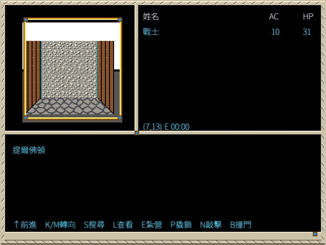
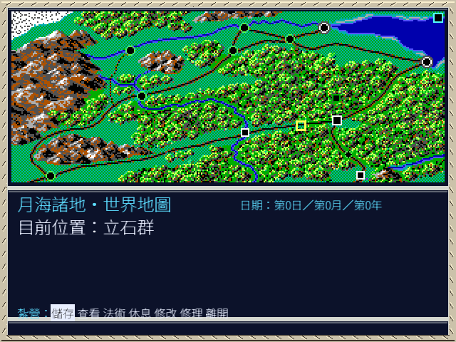
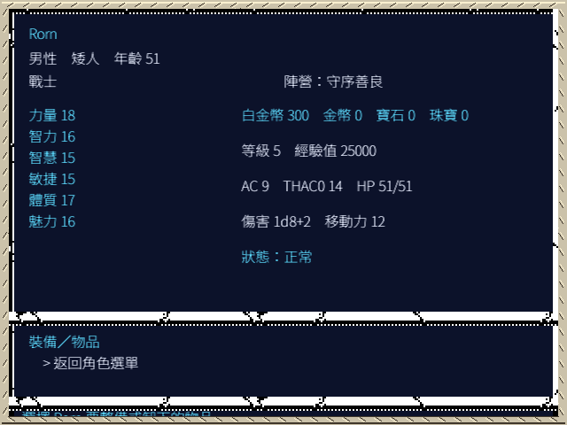
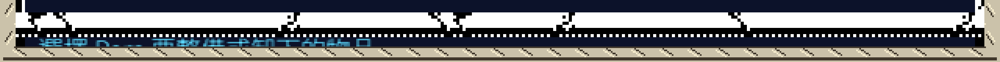
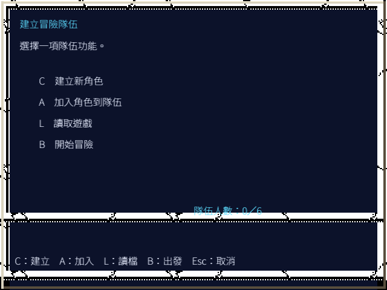
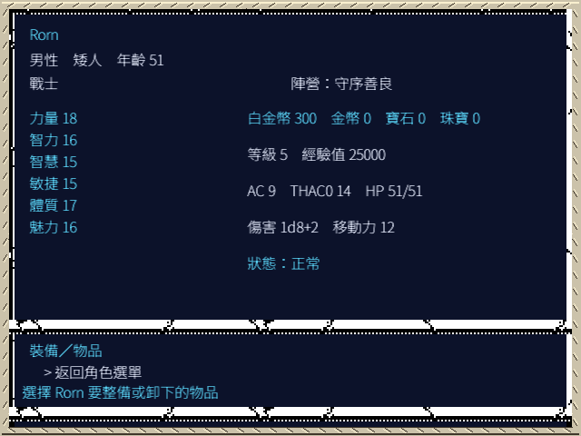
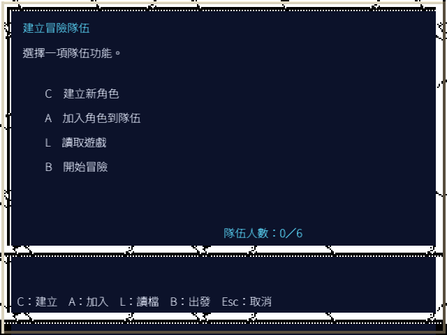
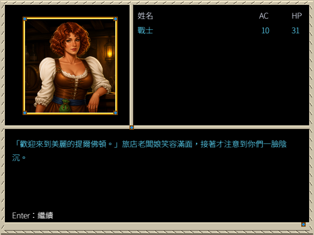

# 1.0.4 完整版 AppImage 驗證與其中發現的版面缺陷

日期：2026-09-04  
受測產物：`dist-all/1.0.4-20260904/full-local/azure-bonds-remake-1.0.4-20260904-x86_64.AppImage`  
截圖：[`appimage-verification-20260904/`](appimage-verification-20260904/)

## 結論

1. AppImage 本身沒有問題。內容物齊全、可解可執行，直入四個遊戲狀態全部跑得起來，
   產生的畫面與同一份原始碼在容器內跑出來的**逐位元組相同**。
2. 驗證過程中發現三行文字被框蓋住，出現在角色 VIEW 與建隊外層選單。這**不是打包
   造成的**：原始碼版與 AppImage 版的截圖雜湊相同，AppImage 只是忠實重現。
3. 缺陷的成因是這兩個畫面用了另一個框的文字基線。已修，並以 spec 1252 立約、
   以測試把關。修正後三個對照畫面逐位元組不變。

## 建議

1. 這一類缺陷不要再靠逐張人工檢視攔截，理由見「有效性威脅」的建構效度那一項。
   新增版面時，基線一律對著該畫面實際使用的框驗證。
2. macOS 兩件仍只有交叉編譯與封包，沒有真機證據。要結案得有人在 Mac 上實跑。

## 假設

- 容器內 Xvfb 800×600×24 的算繪結果等同於玩家桌面的算繪結果。遊戲以固定
  640×480 邏輯畫布繪製再輸出，不隨視窗尺寸改變版面，所以這個假設對版面驗證成立；
  對顯示卡驅動差異、縮放模式與字型 hinting 不成立。
- `-character-view` 等旗標走的是正常玩家路徑的同一組繪製程式碼。旗標的作用是
  建立 fixture 後呼叫公開狀態轉移，不是另寫一份畫面（spec 1246）。
- 原版資料由 `full-local` 封包內自帶的 ZIP 提供，與開發工作區那一份相同。

## 方法

在一次性 Docker 容器（`--network none`、Xvfb :99）內用 `APPIMAGE_EXTRACT_AND_RUN=1`
執行 AppImage 本身，不解壓後跑執行檔，以免繞過 AppImage 的封裝路徑。每個狀態由
`-screenshot` 在該狀態算繪完成時輸出 PNG。

對照組是同一份原始碼在同一個容器映像內 `go build` 後跑同樣的旗標。

| 檢查項 | 驗證方法 | 結果 |
|---|---|---|
| 四件 full-local 產物存在且完整 | Test（逐檔重算 SHA-256 對 `SHA256SUMS.json`） | 四件全數符合 |
| AppImage 可解壓 | Test（`--appimage-extract`） | 成功 |
| 原版 ZIP 隨完整版封入 | Inspection（解開後 `stat`） | 684,735 bytes |
| PC-98 音樂隨完整版封入 | Inspection（計數） | 12 個 OGG |
| 授權四個位置 | Inspection（AppDir 根與 `usr/share/doc/azure-bonds-remake/`） | `LICENSE`／`NOTICE.md` 皆為 RRSAL-1.0 |
| AppImage 能啟動並算繪 | Test（四個狀態各截一張） | 四張全部產出 |
| AppImage 與原始碼行為一致 | Test（截圖雜湊比對） | 逐位元組相同 |
| 修正沒有波及其他版面 | Test（三個對照畫面截圖雜湊比對） | 逐位元組不變 |

## 結果

### AppImage 直入四個狀態

四個狀態都算繪完成並輸出截圖：開場、提爾佛頓第一人稱、營地指令列、角色 VIEW。

營地指令列這張同時確認 1.0.4 修的那個缺陷沒有回歸——七項全在畫面內。

### 發現的缺陷

角色 VIEW 最底下一行只剩上半截：

把該區域裁出來放大 3 倍後，可以確認字確實畫出來了，是被框的像素蓋住：

建隊外層選單的「隊伍人數」則壓在中間分隔帶上：

### 成因

兩個畫面都用 `gfx.ExtendedCharacterCreationFrame()`。這個框 2× 之後有兩條不透明
橫帶，量自素材本身：

| 帶 | y 範圍（640×480） | 驗證方法 |
|---|---|---|
| 中間分隔帶 | 352..361（另有 366..367 的裝飾） | Test（掃描框的 alpha） |
| 底部框帶 | 448..457（另有 462..463 的裝飾） | Test（同上） |

文字只能落在上面板（≤351）或下面板（368..447）。而這三行用的是：

| 位置 | 原本的值 | 落在哪 |
|---|---|---|
| 角色 VIEW 底部提示 | `adventureCommandBaseline` = 478 | 底部框帶內 |
| 建角選項清單提示 | 同上 | 底部框帶內 |
| 外層選單的隊伍人數 | y = 355 | 中間分隔帶內 |

`adventureCommandBaseline` 屬於**冒險框**的延伸指令列內部（y=464..479），那個框的
下緣和這個框不同。既有的 `safeBottomBaseline` 攔不到：它只在 `modern-a6` theme
生效，而且算的是冒險框的下緣 454。

### 修正與驗證

三行改用這個框自己的安全區：提示走 `creationFrameHelpBaseline`（438），隊伍人數走
`creationFramePartyCountY`（340）。438 不是新值——spec 1246 早就為建隊外層頁定過，
只是這幾處沒跟上。

對照組不受影響。旅店這張在修正前後逐位元組相同：

`-guided-creation`、`-inn`、`-camp-row camp` 三張截圖的 SHA-256 在修正前後完全相同。

契約寫成 [spec 1252](../spec/1252-creation-frame-text-safe-area.md)，並由
`cmd/azure-bonds-game/creation_frame_baseline_test.go` 對著框本身驗：掃出框的不透明
橫帶、算出空白區間、斷言每個基線連同下伸部落在裡面。框帶座標不寫死，框改了測試
跟著改。同檔案帶一則正對照，`adventureCommandBaseline` 必須被判為不安全。

## 有效性威脅

- **內部效度**：截圖差異可能來自別的改動而非這次修正。緩解方式是三個對照畫面的
  雜湊比對——它們逐位元組不變，而兩個目標畫面變了，範圍與預期一致。
- **外部效度**：只在 Linux／Xvfb／`modern-a6` theme 下驗過。忠實 theme 與 macOS、
  Windows 真機未逐一確認。框帶座標來自素材本身、與平台無關，但字型算繪可能有差。
- **建構效度**：這是本次最大的威脅。原本的驗收方式是人工看截圖，而這類缺陷的
  表現是「字有畫出來、只是被蓋住」——人眼會把它讀成框的花紋。spec 1246 兩份的
  驗證段都寫過「文字留在框內」，而底部提示當時就是被蓋住的。改由測試量框的
  alpha，量的才是「字會不會被蓋住」本身。
- **結論效度**：截圖比對是逐位元組的二值判斷，沒有統計推論，不涉及顯著性。代價是
  對「畫面有沒有變」很敏感——任何無關的算繪改動都會讓對照組失效，屆時要重新確認
  差異來源，不能直接沿用本輪結論。

## 開放項目

| 項目 | 類別 | 目前估計 | 消除條件 |
|---|---|---|---|
| macOS 兩件真機啟動 | TBC | 交叉編譯與封包完成，未實跑 | 在 Apple Silicon 與 Intel 各啟動一次並截圖 |
| macOS 簽署與公證 | TBD | 未開始 | 取得開發者憑證後完成 notarization |
| 忠實 theme 的同組畫面 | TBC | 框相同，基線應同樣適用 | 以 F2 切換後重拍同四個狀態 |
| 其他畫面是否有同類漏網 | TBC | 已檢查七個畫面，五個正常 | 把基線檢查擴及所有使用非冒險框的畫面 |
